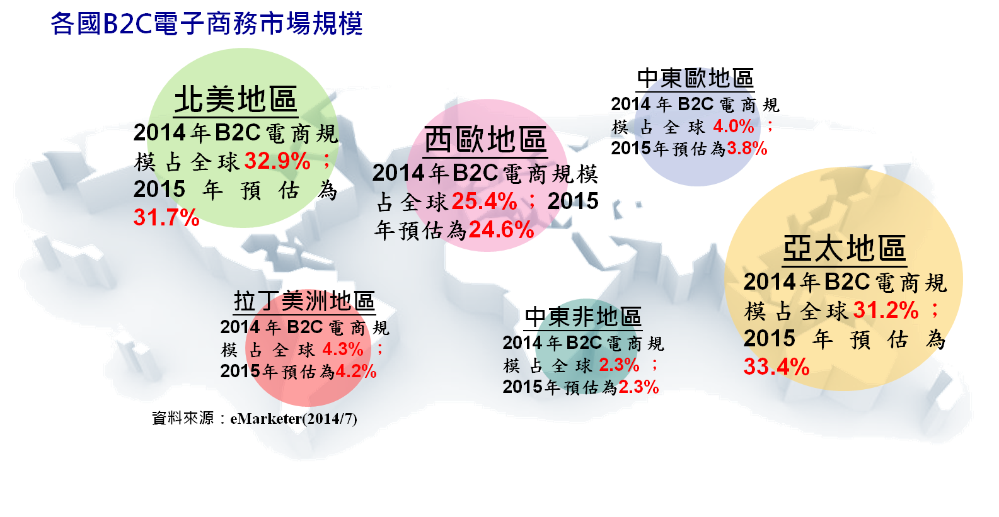
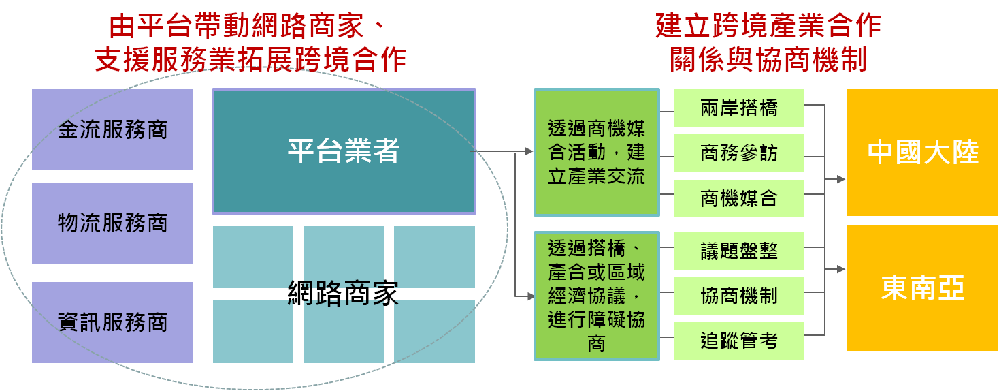
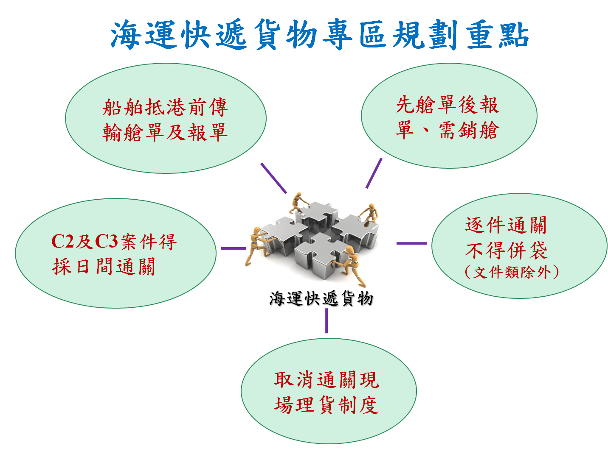
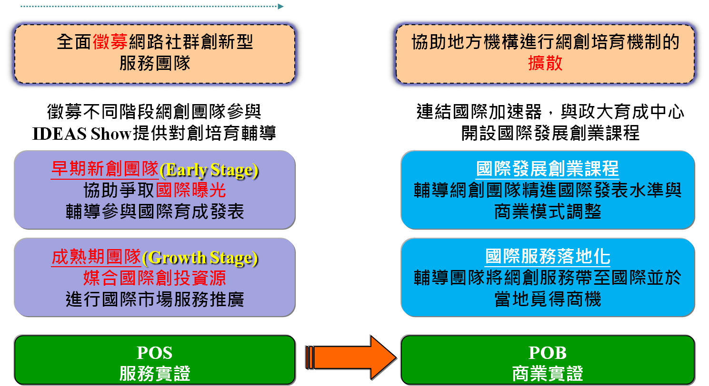

# 電子商務行動計畫

#第一章  背景分析
####網際網路經濟的活絡，讓發展電子商務市場成為全球各國家的經濟推動重點，尤其是電子商務除了對內需市場有增加流通的效果，對外更有跨國交易的作用。
##一、國際趨勢 
####全球電子商務交易熱絡：根據國際市場研究公司eMarketer公布的資料顯示，2015年B2C電子商務全球交易額將達到1.7兆美元，較2014年成長15.6%。隨著全世界網際網路應用走向成熟，2018年的成長率預估為10%左右，交易額將達到2.3兆美元。
####亞太電子商務市場崛起：隨著亞洲新興市場上網人口、行動用戶數激增、物流與支付長足進步，eMarketer預估2015年亞太電子商務規模有機會超越北美，成為全球第一大電商市場，占總體33.4%；而北美占31.7%，西歐占24.6%；這三個區域的規模占全球電子商務市場90%左右。

####區域經濟合作日趨重要：為促進經貿發展，諸多國家推動區域經濟合作，例如跨太平洋策略經濟夥伴協定(TPP)、東南亞區域全面經濟夥伴協定(RCEP)。對電子商務而言，區域經濟協議的簽訂有助降低關稅，並藉由進一步貨物貿易合作，提升商品運送效率與降低成本。跨境租稅的管理及交易糾紛亦可經由協議進行處理。
####創新應用以消費者為中心：觀察Amazon、eBay、Google等公司動態，歸納應用趨勢：「大數據」－運用巨量資料技術分析各式消費數據，挖掘關鍵情報。「智慧化」－藉由智慧化裝置或應用概念，為顧客創造更貼近需求之購物及服務體驗。「行動化」－以行動裝置為商務入口，藉由行動裝置的特性，滿足消費者之即刻需求。

##一、國內現況 
####電子商務將成為新兆元產業：2014年我國B2C交易額為新臺幣5,291億元，較2013年的新臺幣4,511億元成長17.29%；如包含C2C之市場交易額，2014年更達到新臺幣8,909億元。我國電子商務穩定成長，2015年時可望超越兆元關卡。
####電子商務的服務態樣多元活絡：我國擁有眾多上網人口及便利的金流與物流環境，電子商務可應用的行業及其服務態樣也相當多元化，例如網路購物、網路金融、新媒體、虛擬表演、線上遊戲、影音娛樂、食材預購、數位學習、線上旅遊及虛實通路結合等等，有效活絡國內經濟活動發展。
####持續強化適合我國電子商務發展的環境：電子商務業者期待政府完善電子商務發展環境，如網路環境整備、法規障礙排除、跨境市場拓展、電子商務應用推廣，以及創業創新與人才培訓等。對此政府也陸續推動行動寬頻基礎建設、電子商務法規調適計畫、推廣國內及海外華文市場，並整合多項創業、研發及培育措施，提供發展電子商務所需資源。
####行政院成立指導小組作為跨部會協商平台：為推動國內電子商務發展，政府建立行政院層級協調機制，設置電子商務發展指導小組，以指導小組為平台，進行電子商務相關之跨部會協商工作。藉此強化跨部會整合，落實「打造台灣成為亞太電子商務創新及集資的基地、以電子商務產業作為台灣進軍國際市場的動力」之願景。

##第二章  具體目標
####電子商務產業生態系統(Ecosystem)，包含直接經營的核心業者，如電子商務平台服務商，以及眾多的供應商與品牌商；及各類週邊支援業者，如金流服務商、物流服務商、資訊流服務商，共同為消費者提供服務；而種種的電子商務活動，則植基於法規與網路等基礎環境之上。資通訊環境整備及網路金融已另有專章，本章節以電子商務核心業者為主軸，協助健全電子商務產業生態系統，推動目標如下， 
####一、調適電子商務相關法規，促進網路購物蓬勃發展
####二、促進海外電子商務交流，媒介產業跨境商機合作
####三、協助業者落實資安防護，提升電子商務交易安全
####四、強化電子商務生態系，開拓跨境電子商務新藍海
####五、促進傳統產業走向電子商務化，產生跨界營運新風貌
####六、培育創業、創新與電商人才，為產業未來注入新力量

#第三章  推動策略
####為了健全我國電子商務發展環境，政府致力排除業者經營障礙，促進經營國內及海外市場，並建立安心安全的交易環境。在這個基礎之上，進一步對外開拓跨境電子商務市場，對內促進傳統產業走向電子商務化，輔以創業、創新與人才培育，持續為未來播下新種子，與產業共同打造電子商務新藍海。相關推動策略如下：

###一、為達成「調適電子商務相關法規，促進網路購物蓬勃發展」目標，策略如下：
####現階段政府已展開電子商務法規調適工作，檢視第三方支付、網路銷售品項、零售業第三方發行禮券、七天猶豫期適用等相關法令。後續將推動：
####(一)以行政院電子商務指導小組為平台，就網路交易產品限制、網路廣告相關規定等業者建議之議題，進行跨部會協商及檢視辦理情形，協助解決電子商務問題。
####(二)完善經濟部主管之網路實質交易價金代收轉付服務法制、進行法制及消費者保護宣導教育，協助業者遵循相關法制，保障社會大眾權益，促進電子商務網路交易環境健全。
####(三)研修零售業等網路交易定型化契約應記載及不得記載事項，以因應科技化發展消費環境改變，及解決實務操作問題，並辦理定型化契約訪查，加強法制執行進而減少消費爭議。

###二、為達成「促進海外電子商務交流，媒介產業跨境商機合作」目標，策略如下： 
####(一)辦理兩岸產業合作交流，透過議題設定，邀請兩岸重要電子商務業者，包含平台、網路品牌商、金流、物流、行銷導購、行動商務、其他支援服務業者共同參與，促進雙方交流及合作。
####(二)參與APEC電子商務指導小組會議(ESCG)，關注APEC會員經濟體之電子商務相關法規要求及發展情形，作為國內電子商務推動上相關法制之參考，在未來各經濟體相互制度認證的基礎下，有助於排除海外市場之進入障礙。

###三、為達成「協助業者落實資安防護，提升電子商務交易安全」目標，策略如下： 
####為強化電子商務交易安全，政府推動電子商務交易安全規範、臺灣個人資料保護與管理制度(TPIPAS)，並協助業者導入。組成資安輔導團隊，以檢測輔導方式，協助電子商務業者發掘資安管理問題，進行改善措施，以落實電子商務交易安全防護。後續將推動：
####(一)訂定電子商務個資外洩防護參考指引：將電子商務交易過程最常見的資安防護問題整理出防護項目查檢表，業者透過查檢表可自我審視，進而強化資安防護措施，落實整體電子商務交易安全防護措施。
####(二)強化電子商務資安聯防體系：結合政府相關部門以及民間業者的力量，協助電子商務業者掌握資安威脅趨勢，包括：提供資安諮詢專線服務。針對疑似發生個資外洩的業者，提供資安事件訪查與協處服務，協助業者分析資安問題及提供資安技術協助。並發布資安警訊給電子商務業者，提供包括駭客中繼站黑名單、入侵事件案例、網路詐欺案例以及提供防護建議措施。

###四、為達成「強化電子商務生態系，開拓跨境電子商務新藍海」目標，策略如下：
####協助並推動電子商務業者發展中國大陸、馬來西亞、菲律賓等華文市場，促成與跨境市場平台橋接及協助業者跨境上架銷售，同時與中國大陸協商網站連通與ICP臺資持股優惠，促進跨境商機。此外亦積極洽簽經濟合作協定，將電子商務納為合作重點，分別與紐西蘭、日本、新加坡簽署經濟合作協定，創造有利發展跨境電子商務的新契機。後續將推動：
####(一)由平台帶動網路商家、支援服務業拓展跨境合作，建立大帶小服務體系。積極促成我國業者與中國大陸、東南亞或美日等商機媒合案例。加強輔導臺灣平台跨境直送或臺灣網店專區營運，舉辦海外聯合行銷，提升市場銷售機會。####(二)配合兩岸產業合作，以及我國與東南亞等國家進行產業合作等，協助我國電子商務產業爭取優惠。推動國內、國外平台雙向合作，協助國內平台全面拓展中國大陸、東南亞或美日等海外市場，並促成海外設立據點或大型投資合作，或促成國外平台來臺設立經營據點。

####(三)建置海運快遞貨物專區，輔導業者依規定提出海運快遞貨物專區設置申請。辦理海運快遞相關業務之教育訓練及說明會，加強業者瞭解海運快遞貨物通關業務。以及配合示範區推動智慧物流、農業加值、電子商務等相關業務，提供24小時便捷通關，營造便捷、安全之快遞貨物通關環境。

####(四)協助物流業者營運轉型，發展供應商型之跨境供需一站式物流服務及電子商務供貨模式，解決供應商銷售通路庫存管理問題及物流運送問題，發展供應商型流通運籌服務平台，促進商品海外流通銷售資訊之透通，提升臺灣產製商品海外銷售量並強化產業競爭優勢。

###五、為達成「促進傳統產業走向電子商務化，產生跨界營運新風貌」目標，策略如下：

####在行政院電子商務指導小組的指導下，各部會分別檢視主管的產業別及其電子商務服務態樣，包括零售、金融、內容、設計、農漁、教育、旅遊等，進行現況盤點並提出推動規劃，並對需要跨部會協商事項提請討論。後續將推動：
####(一)連結電子商務公協會與傳統產業公協會之力量，推動電子商務平台業者與各產業(例如：生活服務)業者交流，協助傳統產業學習利用電子商務，促成雙方互動與合作，達到推廣效果。
####(二)媒合生產者與國內農業垂直型電商平台、社群及自營購物網站之農漁會合作，以及協助排除國內農漁畜產品電子商務發展之障礙。順暢農產品進入中國大陸市場途徑，協助國內業者拓展臺灣農產品海外直送服務，建立起穩定長期經營之臺灣農產品跨境電子商務渠道。
####(三)輔導旅行業者建置或加入電子商務交易平台，以及鼓勵大型業者電子商務交易平台創新升級，提升加值運用效益。辦理相關從業人員電子商務教育訓練，強化電子商務領域知識。整合及建置我國觀光資料庫，並提供旅遊業者充實電子商務平台內容。
####(四)媒合零售業者運用電子商務平台，透過平台上架/代營運；結合行動商務趨勢，媒合業者至行動商城開店；或是應用資通訊科技，自行建置網站，促成其拓展網路商店通路。
####(五)協助既有電子商務平台業者招商，例如在平台設立特色專區或臺灣商品專區。輔導大型零售業者發展Offline 2 Online (O2O)模式，提升經營觸角。協助加強對電子商務平台之投資，例如提供國發基金案源，提供資源挹注。

###六、為達成「培育創業、創新與電商人才，為產業未來注入新力量」目標，策略如下：
####為培育創業，政府已建立青年創業及圓夢網，整合國內各項創業資源、獎助機制、投資協助方案、資本市場籌資管道等，供創業者依現況及規模選擇合適的創業資源。在創新方面，政府長期以研發補助計畫鼓勵產業創新。在人才方面，教育部已於大學院校電子商務學系培育產業人才，勞動部亦開辦電商相關職前訓練課程與在職訓練課程。後續將推動：
####(一)運用經濟部青年創業及圓夢網之窗口，鏈結找資金、創業空間、創業懶人包、創業個案、創業社群、社會企業專區、創業實現平台等資源，適時提供創業者所需之相關輔導措施。
####(二)培植國內網路社群創新服務產業，推動方向以社群網路(Social Network)為核心價值，運用概念驗證(POC)及服務驗證(POS)之輔導機制，鼓勵網路創業團隊朝向社群化服務作為事業發展方向。

####(三)運用政府或民間創投、研發補助、研發投抵等機制，引導業者因應國際電子商務創新趨勢，例如行動商務或大數據應用，發展電子商務的創新服務或商業模式，藉由政府或民間創投、研發補助、研發投抵等資源挹注，分攤創新風險及加速創新時程。

####(四)建立巨量電子發票資料儲存及分析平台，有效管理、分析、搜尋、儲存及運用電子發票巨量資料，並進行資料挖掘及商業智慧分析作業，提供消費者、企業、政府機關更彈性加值應用，提升資料整合的利用率。
####(五)培訓電子商務優質人才，例如協助網創團隊接受國際發展創業輔導、商業模式調整、英文簡報發表，國際市場分析與行銷策略、資本市場募資相關知識、培訓媒合電子商務業者所需的跨境經營人才等。以及運用IDEAS SHOW競賽，爭取優質人才至國際見習、曝光或市場推廣。
####(六)協助電子商務業者培訓資安人才，規劃資訊安全管理與個資保護並重之課程，協助電子商務業者強化現有人員之資安風險意識，以及資安事件應變處理能力。培訓臺灣個人資料保護與管理制度管理師、內評師、驗證師等，協助訓練產業所需之個人資料保護與管理專才。
