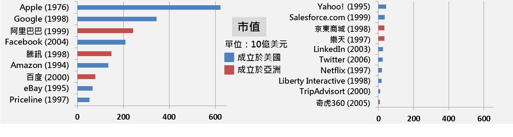
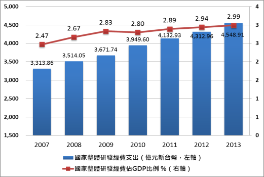
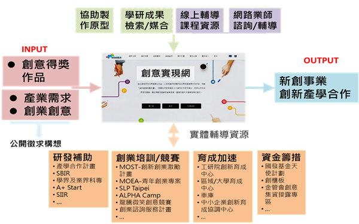

# 創新創業行動計畫

#前言
####隨著網路科技興起，每年不斷增加的上網人口以及日益便捷、廣佈的物流服務，提供網路經濟絕佳的發展基礎。軟實力已是未來競逐市場的關鍵，產業發展面臨與過去完全不同的挑戰。在全球化的浪潮下，市場不侷限於國內而擴張成至全球市場，成長關鍵由技術密集走向創意密集導向，成長模式也由營收評價走向價值評價模式。同時，新創事業營運、行銷成本大幅降低，讓更多有潛力的年輕族群有機會與能力，透過網路科技的運用競逐全球市場。
####另一方面，政府推動電子化，利用網路提供便民服務或是推動政策，已成為趨勢。行政院103年12月8日第 3429 次院會「網路溝通與優化施政」即指示，未來施政必須「透過網路擴大施政成效，並發揮解決棘手問題之創意」。是以，如何透過網路推動或落實創新創業，協助青年運用網路科技創業，以活絡我國經濟，實為當代不可忽略之課題。

#第一章	背景分析
##第一節	網路經濟來臨，創新創業新思維
###一、網路人口增加，網路經濟時代來臨
####根據資策會FIND之研究調查顯示，至2013年12月底，我國經常上網人口為1,109萬人 ；根據創市際市場研究顧問之調查，我國有6成以上之人口會上網，其中越年輕者上網之比例越高。依照Google調查，有近5成之企業，擁有企業官網、具電子商務功能，並活躍於網路行銷活動。
####根據2014全球創業精神暨發展指數(GEDI)，評比創業態度、志向及活動，台灣在全球排名第7，比2013年上升３名，更是唯一擠進排行榜前10名的亞洲國家。然因科技徹底改變消費者行為，線上通路展現前所未有的方便與價格優勢。全球消費市場透過跨境網路行銷，在人力及成本運用較省的情況下，快速且直接展現出台灣產品優勢。
####根據市場分析公司comScore的最新調查，Amazon是全球網購族的最愛， 20.4% 網路購物者在此消費，第二名是eBay（市占16.2%），以貿易商務為主的阿里巴巴占第三名（市占11.3%）。市場研究公司 eMarketer預測全球B2C電子商務銷售額在2015年將成長20.1％，達到1.5兆美元，B2C電子商務的買家規模達到10.3億人。2014年台灣企業透過 ebay平台已銷售產品到170多個國家；台灣企業透過阿里巴巴平台獲得全球前10大採購國家42% 的詢價數。
####這三大平台吸引全球近5成的網購族，只要產品夠原創、有新意，運用國際平台借力使力，不難讓台灣創新能量源源不絕的中小企業站上國際舞台。
###二、	網路經濟時代來臨，思維大轉變
####促進創新創業發展已成為國際趨勢，不僅是歐美各國，亞洲中國大陸、日、星、韓等地，亦積極針對推動創新創業，提供新創事業資金、人才、租稅等方面優惠措施。諸如Google、Facebook、Twitter等均是由年輕人所創辦，且在短時間內改變大眾使用習慣，引領全球創新創業風潮。檢視當今科技領域最有成長潛力、爆發力的公司皆與網路相關(參見圖 1 重點網路公司市值排名)。

####圖 1 重點網路公司市值排名(資料來源：總統府月會簡報)

####世界經濟論壇提到，我國經濟發展進入「創新驅動」時代。即產業模式轉型，由技術密集轉成創意密集，而成長評價模式，由營收評價變成價值評價 。
####「科技革新 + 全球化＝市場變更大與創業成本降更低」。年輕人創業成本大幅降低，更易接近國際市場，區域市場擴大為國際市場，從Stay local 變成 Go global，打破悶經濟的困局，以「創新創業」打通臺灣經濟任督二脈，為臺灣經濟引進源頭注入新的活水，尋找臺灣經濟新定位。
###三、	創業形式轉變與網路經濟發展結合
####網路經濟帶動青年投入創新創業風潮，國內從分散式的宅型SOHO族轉變成與矽谷同步之聚落式共同工作群聚型態(創業輔導園區、加速器、地方創業聚落等)。隨4G行動大頻寬時代來臨，將加速過去固定寬頻上的內容與服務，朝向行動化應用領域發展，未來四年，台灣內容產業必須從人才、資訊、到服務匯流轉型策略方向。
###四、	網路資通訊科技對於創新創業的影響
####網路資通訊技術，不僅可協助擴大與加速政府創業資訊之流通、創業政策之執行與落實，同時，還有助於新興型態之創業的發生，例如：google、ebay、facebook、Twitter等。
####此外，行動載具的成熟與突破，帶來APP產業鏈的蓬勃發展，為加速打造無縫的微型創新聚落，推動我國青年創業風潮。例如：經濟部於101年起成立APP園區，輔導進駐團隊成功創業、精進國內前育成與順利銜接後育成之環境，並與國際市場鏈結，103年起開始發展App Hub全國創新創業支援服務，以虛實整合之服務全力協助各區域創意園區發展，透過打造友善的微型創業環境，促成創業構想成為實際創業行動。
####同時，為加速青年創業，經濟部推動APP創意園區聚焦於前期微創FAST輔導模型(Idea Fight創意激盪、Biz Adjust商模驗證、Tech Support技術指導、Market Test市場測試)，促使團隊創新發展，在最大效益時間點得到創投/募資資源。另外一方面，目前各縣市、學校創新創業蓬勃發展，最欠缺產學研單位資源之整合與國際資源的合作及連結，必須透過整合發展HUB支援服務，才能有效加速各區域之發展。
####因應台灣4 G服務的推動與發展，以打造無縫的微型創新聚落為戰略，經濟部積極輔導進駐團隊(個人)成功創業、精進國內前育成並能順利銜接後育成完整環境，並與國際市場鏈結、打造出高品質、高端的4G+國際商業產品或服務，建立「區域微型寬頻創業聚落──寬頻軟體創新創業園區」，協助區域創意園區，升級成為地方產業發展4G+的創新動力，匯聚成國家整體創新競爭力的躍升。
##第二節	國際趨勢
###一、	多元化與便捷化資金取得管道，網路募資成新趨勢
####近年來，資金取得管道呈現多元化與便捷化，包括降低融資的困難度與便捷化資金取得方式，同時網路募資成為新趨勢。
####(一)	降低融資困難度
提供信用保證機制，排除中小企業申請融資時擔保品欠缺之障礙，如美國、日本、韓國等。透過專案性貸款，以利息優惠等方式，協助中小企業取得專案融資，如美國、英國、德國等。
####(二)	便捷化資金取得
美國總統歐巴馬於2012年4月5日簽署就業法（JOBS Act），提供小型及新興成長型企業便捷籌資機會，接續得以興業茁壯，創造就業，從而協助促進國家經濟。
####(三)	網路募資
美國證管會於2013年10月23日發布JOBS Act第三章─群眾募資(Crowdfunding)施行細則之意見徵求書，就施行細則作公開意見徵求，以做為是否調整該施行細則內容之參考。另，日本於2014年5月通過「金融商品取引法」修正案，將證券商從事股權性質群眾募資之資本額規定，由5,000萬日圓降低為1,000萬日圓，惟金融廳尚未發布相關施行細則。
 
###二、	透過網路創業平臺，實現創業夢想成為潮流
透過網路創業平台，實現創業夢想為潮流，例如透過Quirky平臺與Kick2Real，前者收集民眾創意，團隊或個人僅須提出創意構想，剩餘產品或營運相關細節由Quirky協助實現之；後者以創業和媒合為主，提供創業者提供創意構想及手模原型製作，平臺媒合贊助商進行規格定案、籌資、開模製作及試量產等。
###三、	共同工作空間(co-working space)成為新興型態的工作空間 
####近年來，共同工作空間成為新興型態的工作空間。1995年，位於柏林的C-base開張，為全球第一家hackerspace (以群聚為導向，提供實體空間，使人們可以在此會面與工作)，是共同工作空間最初始的營運模式。
####1999年，Bernard De Koven提出co-working (共同工作)一詞，定義其為透過電腦整合與促進協同工作與會議之作法；2005年，程式設計師Brad Neuberg因應孤僻的(unsocial)的商務中心與不具有生產力的家庭辦公室(home office)於美國舊金山開設第一家共同工作空間；2006年，Hat Factory為第一家full time，且以working space稱其空間者。
####2008年，co-working visa計畫問世，為共同工作空間之間的自由協議，加入該計畫者，其會員可以免費使用其他加入協議者之空間；2011年間，臺灣出現第一家共用工作空間，co-working正式引入臺灣。至2013年7月，全球約有300萬家co-working space營運。
##第三節	國內現況與檢討
###一、	優勢
####高素質的人力資源、優良的硬體製造支援、完整的供應鏈及產業聚落、可少量多樣客製化商品(You name it，We make it!) 臺灣創業能量強烈、創業精神蓬勃、學研機構之研發能量豐富之優勢。
####根據GEDI「2015全球創業指數」，我國名列亞洲第1、全球8，領先瑞士與新加坡；另依據全球創業觀察（GEM），我國於「創業意圖」指標「年輕人視創業為職涯規劃」排名第2，顯見臺灣創業能量強烈、創業精神蓬勃。
####從核定之計畫其及相關資料，可以見證我國學研機構之研發能量豐富，例如：產學大聯盟透過「業界出題、學界解題」投入產業技術研發及人才培育，核定5件計畫；產學小聯盟成立核心技術實驗室，由業界參與組成聯盟，將學界能量擴散到產業界，核定件數92件；創新創業激勵計畫透過龍頭企業支持、矽谷經驗傳承、建構技術原型支援體系等輔助機制促成新創公司數28家。
####同時，近幾年我國整體研發經費投入從新臺幣3313億(2007年)緩步成長至4548億(2013年)，佔GDP比例從2.47 %上升為2.99%(參見圖 2國家整體研發經費投入與佔GDP比重)。在長期研發投入下，台灣在美國專利商標局所獲得的專利數量與密度都居世界領先地位，展現出我國持續累積之技術創新能耐與優勢。

####圖 2國家整體研發經費投入與佔GDP比重(資料來源：全國科技動態調查，USPTO，台經院三所整理，2015年)
###二、	劣勢
####法規不利小型新創成長，法規制度未國際接軌，防弊重於興利；早期擴展資金不足，國內創投較缺乏新興產業知識，國際創投少關注；中小企業因資訊不對稱及財會制度未臻健全等因素，較難取得銀行融資；國際鏈結偏弱，新創企業缺乏全球網絡，較難規模化、國際化。
###三、	威脅
####目前各國皆積極於矽谷建立資金、人才與培育網絡。諸如：韓國三星於矽谷設立開放式策略創新中心並成立創投基金($1.1B)，另成立SparkLabs加速器，篩選新創公司至矽谷育成；日本產業革新機構(INCJ)與美國投資業Wil GP共同成立新創企業育成基金 ($100M)，培育具備國際視野與競爭力的新創事業；中國大陸在矽谷成立中美創業育成加速器InnoSpring，並提供每家創新團隊種子基金 (US$2.5m)；以色列成立政府基金YOZMA，並於矽谷成立UpWest Labs加速器，提供新創公司輔導。此外，許多國家推動相關政策吸引外國人至該國境內創業，例如：英國天狼星計畫，荷蘭、加拿大及韓國推出創業簽證等。
###四、	機會
####我國網路環境成熟與人口數多，根據資策會FIND「2014臺灣消費者行動裝置暨APP使用行為研究調查報告」，臺灣12歲(含)以上的民眾，智慧型行動裝置持有人口近半年增加101萬人，其中12歲(含)以上人口達7成、推估全臺行動族群約有1,432萬人，且同時持有智慧型手機及平板電腦的人口約達527萬人。
#第二章	具體目標
####於網路經濟時代，立基於青年創業專案與創新創業會報策略推動之基礎，政府將以運用網路資通訊科技強化創新創業生態系之運行達成網路應用，活力經濟為目標，並以下列四大策略為主軸，包括：
##一、	政府創業資源分享效率化：
####透過鼓勵青年創業、社會企業創新，及建立創業資源網實整合平臺，達成政府創業資源分享效率化。
##二、	創業支援服務提供便捷化：
####提供創新創業單一窗口及創業教育，協助創新創業者育成及資金取得，達成網路科技創業多元化。
##三、	創新創業與行銷國際化：
####鏈結矽谷、布局亞太新興市場，打造國際級創業群聚，達成創新創業與行銷國際化。
##四、	網路科技創業多元化：
####推動科技創業平台，促成網路科技創業多元化。

#第三章	推動策略
##第一節	政府創業資源分享效率化
####立基於青年創業專案與創新創業會報策略推動之基礎，政府將建立創業資源網實整合平臺，成為青年創業好夥伴，此一平台將包括以下二個部分，分別說明之。
###一、	一站式政府資源網站
####為推動青年創業風氣，經濟部將與科技部、金管會合作，推出網實整合的青年創業服務平臺。在資訊網路的部分，預定於今年改版「青年創業及圓夢網」，使其成為青年創業單一入口平臺，彙整政府及民間創業資源。善用資通訊科技，打造「青年創業及圓夢網」2.0版，匯集政府民間創業資源，並以情境式導引設計入口服務，一次解決創業者的問題。
####網站將以青年創業者需求為重點，並串接整合跨部會計畫能量，透過六大專區：「亮點個案、找資金、找空間、活動看板、懶人包、創意實現網」等，將創業者最需要的資源與資訊彙整於網站上。 
####升級改版以青年創業者需求為主，透過六大專區：「亮點個案、找資金、創業空間、活動看板、懶人包、創意創新實現網」等，依功能別整合並納入科技部創意實現網、金管會募資平台、工業局創新夢工廠等相關政府資源，打造青年創業服務單一入口平臺網站，讓有夢想、要找資源的青年朋友能更快速便捷取得所需資源，助青年創業一臂之力。 
####將以「青年創業單一入口平台，彙整政府及民間創業資源 」為定位。並結合以下特色：
####(一)	結合實體創業諮詢及輔導，讓使用者感受網實整合一站式服務。
####(二)	串聯科技部創意實現網、工業局創新夢工廠及金管會群眾募資、創櫃板資源，激勵民眾從創意創新到創業實踐。
####(三)	以青年創業者需求(如創業資源、常問問題、申請書表下載等)為設計考量。 
####(四)	參考當前網站設計新興主流風格與技術，呈現最佳瀏覽效果。
####(五)	整合跨部會能量，隨時滾動式更新調整。
###二、	一站式實體服務窗口
####政府將建立一站式實體服務窗口--創業服務基地，提供全方位之創業資源與支援服務，並與一站式創業資源網站連結，提供O2O之創業協助服務。此一實體的創業服務基地，將匯集政府與民間創業資源聚，提供具系統性之創業資訊及諮詢服務，吸引國外內創業團隊，紮根台灣，具體達到活絡創業之效能。 
####同時，此一服務基地將善用知識管理概念，運用創業網路服務平台，建立具效率服務及服務後評估機制，提供國內外創業團隊一案到底實體有感服務，並提供創業相關活動，強化社群串聯及支援溝通，例如：引入國際趨勢大師、創業達人及成功企業家經驗，以搭配政府其他部會或民間團體共同舉辦，並會後舉辦商機媒合交流活動，強化國內創業者國際視野，以提升創業者辦視商機之能力； 結合現有政府自有活動及民間機構辦理之相關創業加值活動，例如：共好講堂、創業小聚、Ted Taipei、demoday等，形塑新創事業生態聚集地。
##第二節	創業支援服務提供便捷化
###一、	運用網路科技提供創業教育，提升青年創業之認知與能力
####政府將辦理網實整合之創業課程。就有關創業課程部分，區分為共通性(公約數)課程、特定性(功能面，分行業別)，範圍納入各部會既有開設的課程，並統整為創業大課表 ，而共通性及產銷人發財課程部分，將由經濟部中企處辦理，並整合其他部會資源。此外，勞動部辦理專業課程，培養網路創業知能與技能(如主題式研習課程、數位應用課程)。
####勞動部持續推動「創業諮詢輔導服務計畫」及「微型創業鳳凰貸款」等創業協助措施，協助有意創業民眾解決創業面臨問題、累積創業知能及順利取得創業資金融資。其中，透過提供行銷平臺及辦理專業課程，協助創業者跨足網路購物市場，進而促進整體網路經濟發展。針對熱門、最新電子商務模式、行動應用程式等主題式研習課程，協助創業者有效掌握網路經濟趨勢及商機。另，勞動部自100年起持續辦理「微型創業鳳凰數位課程計畫」，提供網路拍賣及行銷技巧、部落格與社群經營與行銷應用、網路資訊安全等專業訓練課程，培養準備創業者及已創業者之數位應用能力，讓創業民眾靈活運用數位媒體，推廣所創企業及商品，拓展多元行銷通路。
###二、	運用網路科技，提供青年農民迴鄉務農創業支援服務
####為強化青年農民創業成效，將運用ICT整合民間及跨部會資源，協助青年農民募集經營創意、資金與夥伴，擴大經營規模效益，吸引更多年輕人投入農業。
####(一)	服務對象：專案輔導青農、青農交流聯誼會成員、專業從農工作者。
####(二)	重點工作：
####1.	建立青農網路社群、辦理網路Live直播交流，並將整合農地銀行、農民學院、產銷資訊與跨部會資源，建立單一入口網站，提供青年農民土地、技術等資訊 ，提升經營管理體系運作效率。
####2.	培育有意從農青年，辦理專案輔導，以長期性投入資源並擴大參與，持續輔導創業。
###三、	多元化網路科技創業家之資金取得管道
####為營造有利中小企業融資環境，金管會自94年7月起推動「本國銀行加強辦理中小企業放款方案」，以協助中小企業取得融資；在兼顧銀行風險管理原則下，透過差別獎勵措施，提高銀行辦理中小企業放款意願；並鼓勵銀行透過信用保證機制，分散授信風險，有助中小企業取得融資。截至103年11月底，中小企業放款餘額達新臺幣5.1兆元，較方案實施前(94年7月)增加2.7兆元，占全體企業放款餘額55.14%(方案實施前為38.27%)，逾放比為0.52%。
####衡諸國際經濟及金融環境仍充滿諸多不確定因素，104年度金管會將持續實施該方案第十期，在兼顧銀行風險管理原則下，透過差別獎勵措施，提高銀行辦理中小企業放款意願；並鼓勵銀行透過信用保證機制，分散授信風險。同時，訂定有利中小企業融資法令 ，如開放銀行簡易型分行辦理中小企業放款、降低銀行對中小企業放款及信保基金保證債權之風險權數規定，有助中小企業取得融資。
####其次，創新創業貸款部分，經濟部推動「青年創業及啟動金貸款」、「中小企業創新發展貸款」、勞動部推動「微型創業鳳凰貸款」等政策性貸款，鼓勵青年創新創業，協助中小企業以創新與高科技的服務模式促進國際發展。
####第三，政府加強投資方案，經濟部推動「加強投資中小企業實施方案」、「加強投資策略性服務業實施方案」等投資方案，提供直接融資協助，引導創投資金投資中小企業及策略性服務業。
####第四，創意集資資訊揭露專區於102年8月起建立，提供夢想者研提創意向群眾募集資金完成創意，贊助者則能換取提案者承諾回饋之創意產品。 
####第五，創櫃板於103年1月3日開設，協助資本額未逾新臺幣5,000萬元之公司籌措資金，提供「股權籌資」及「免費輔導」二大功能，自開板至103年12月底止，已有60家微型創意企業成功籌資近新臺幣2億元， 使微型創新企業逐步大型化及國際化。 
####最後，我國股權性質之群眾募資已於103年1月3日由櫃買中心籌設「創櫃板」，考量開放符合資格之民間業者辦理相關業務，可增加市場競爭性，使服務提供的方式更加多元化，並可提供微型創新企業更多元化之籌資管道。
####群眾集資模式可分為非屬股權基礎之群眾集資（含捐贈或回饋性質等）及股權性質之群眾募資，前者係屬民法贈與之法律關係，目前國內平台業者即屬此類。至股權性質群眾募資因涉及證券交易法之公開招募行為，故目前僅豁免由櫃買中心辦理。
####是以，我國政府將金管會將研議開放，讓符合一定條件之證券商得從事股權性質群眾募資之業務，並請櫃買中心規劃相關配套措施，以兼顧保障投資人權益。
##第三節	創新創業與行銷國際化
###一、	推動App創意園區，推升網路科技創業
####網路App創新園區透過國內產官學研資源及國內創業需求盤點與彙整，建構App創意創新支援服務中心(Hub)以提供創意實作輔導、產品評測、跨域合作/人才媒合、營運/資金和國際行銷五大線上服務，協助國內區域創新場域的建置、營運及團隊輔導，進而帶動縣市區域產業轉型升級，並鼓勵青年在地創業。目標為：
####(一)	建立App創意園區創業專業服務：建立創意資料庫，成立開放實驗室，整合創新應用，掌握國際市場趨勢、推動國際交流、國內外授權與語文等App商業實務之服務。
####(二)	育成App創意團隊實現構想：甄選App創意團隊，透過創意整合與概念具體化，促成創新模式之產品/服務上市，輔導進駐個人/團隊成立新創公司。
####(三)	建構全國App創意創業服務體系：與各地育成中心合作，整合政府相關政策工具與民間創投機制，建立無縫育成體系，擴散App創業育成效應。
####透過目標的實現，以達成培育國際級的App 團隊，競逐全球App創意經濟之商機、成為App育成機構示範中心，以及國內各育成機構之App專業支援服務中心之定位。 
####此外，也同時匯集國內創新人才與產品，透過同步互動環境與國際創新聚落鏈結，如美國矽谷、法國Lutin、日本Digital Garage、中國中關村及香港CyberPort等國際創新育成聚落，獲取更多國際資源挹注，逐漸發展成為亞洲創新研發聚落與國際新創投資標的市場。
###二、	打造國際創業園區，吸引國際資金與國外人才來台創業
####考量近年新興產業崛起，國內創投對新興產業投資意願不高，且國際創投對臺灣新創事業的關注也相當有限，因而造成臺灣新創事業在早期階段常無法取得成長所需的關鍵資金。同時，我國與國際上各項環節的鏈結有限，一方面無法讓海外的人才、資金、技術流入臺灣，另方面也使得我國創業家缺乏機會培養全球的視野與格局。是以，政府擬打造國際創業園區，吸引國際資金與國外人才來台創業。
####為孕育創新創業生態體系、塑造臺灣創新創業國際品牌形象，以推動臺灣成為區域創新創業中心，依時效性、可擴充性、生活機能等條件綜合評估，目前選定臺北市花博公園會館作為國際創新創業園區，同時蒐集其他縣市適合位址資訊相關作未來推廣參考。
####該園區可望聚集國內外具創新能力的事業，同時並提供多元服務，例如：國內外業師輔導、育成加速器導入、財會法律諮詢及創業相關活動等，欲透過更多成功故事鼓勵創業風潮，提升臺灣創新創業的國際知名度。
####臺灣有完整的供應鏈與產業聚落，而利用此一優勢掌握物聯網的發展契機，並突破代工思維，提高產業的附加價值，實為創新創業發展的重要課題。同時，政府亦將積極協助強化我國創新創業的國際能量，引進國際大型創業活動、選送團隊出國參賽或進駐國外加速器等，將與協同民間豐富的創新精神共同努力整合相關資源，協助新創事業成長茁壯，在全球的創新創業版圖找到臺灣新定位。
###三、	打造國際加速器，推動創新創業國際化
####精選台灣外銷優勢產業，以具潛力並有特色的MIT外銷優質產品，運用多元化網路外銷工具與技能加持，提升台灣品牌國際能見度，創造企業海外商機，包括：
####(一)	厚植跨境行銷專才：從基層扎根，舉辦國際電子商務推廣活動及多層次專才研習，厚實跨境行銷能量。
####(二)	整合跨國電商平台服務：整合國際電子商務平台服務，因應不同跨境外銷需求提供專業協助，加速接軌國際市場。
####(三)	扶植優質標竿企業：導入網路外銷專業顧問，強化網銷能量，型塑成功標竿企業，為其他企業借鏡。
####(四)	串連群聚合作效益：篩選優質領導企業，以大帶小串連產業供應鏈廠商，組成網路外銷群聚，共伴成長發揮連鎖效益，進軍國際市場。
####另外，由標竿育成中心結合相關專業領域服務單位能量組成加速器聯盟， 如A聯盟以資策會為對歐美(美國、英國、荷蘭等)窗口，B聯盟以交通大學對亞洲(日本、中國大陸、新加坡等)為窗口。透過業師輔導(Mentoring) 即透過大企業定向育成，協助中小企業加速打入中大企業供應鏈；資金媒合(Funding)安排天使資金、創業投資及企業集團投資部門洽談，進而促成投資；國際網絡(Networking) 連結國際育成合作平台，加速中小企業取得國際鏈結。用以聚焦新興產業，如雲端運用、物聯網、生技醫療、數位內容及綠能環保等產業領域。
####102年起參考矽谷模式推動新興產業加速育成計畫，每年篩選200案以上潛力案源，聚焦提供50個優質企業3-6個月加速育成服務，並透過國際業師、資金及網絡夥伴資源，強化中大企業定向育成，打造業師驅動的早階投資示範案例，協助企業快速切入國際市場及全球價值鏈，帶動投增資約8億元。
###四、	打造臺灣創新創業中心，鏈結矽谷、布局亞太新興市場 
####目前臺灣雖然有矽谷據點，但主要為人才培訓計畫執行並做行政聯繫，並未具備新創事業及創業投資之功能。是以，依據行政院104年1月7日政務會談專案會議會議指示：今年六月底前，於矽谷設立臺灣創新創業中心據點，專責推動臺灣在矽谷的創業創業，並在臺灣設立快速試製中心，媒合矽谷投資案源與臺灣試製生產，加強實質連結。
####關於臺灣創新創業中心，其工作項目主要包括：(一)臺灣新創培育小組：協助現有新創團隊將目標市場擴展到國際市場，(二)創新技術搜尋小組：系統性監測矽谷技術發展；掌握最新的、即時的破壞性創新技術與反應對策。此中心擬於第二季於矽谷正式掛牌成立。
####關於快速試製中心，其作項目主要包括：(一)藉以鏈結業者，早期參與台矽新創事業，建立夥伴關係，(二)鏈結至系統整合，設計激勵機制，協助建立台灣系統整合系統。此中心擬於第三季在台成立。
##第四節	網路科技創業多元化
###一、	提供App Hub創業平臺，推升網路科技創業
####政府提供網實整合APP服務平台(App Hub)，運用創業加速FAST模型(Idea Fight、Business Adjust、Tech Support、Market Test)，提供創意驗證、商業育成、資源籌措三大類服務，輔導青年創業。
####為打造寬頻軟體開發之無縫創新創業聚落永續孕育的環境，以及帶動大小廠商共創共研之倍數創意創新激發之能量。前者將透過捲動全國4G內容與服務蓬勃發展與區域創新創業聚落場域相輔相成，建構全國布局的創新基地；後者將促成產業出題，創新創業團隊參與共創之創新應用開發計畫，並結合區域特色與資源的寬頻軟體創新創業園區(創新工場)之創新能量，激發產學研整合之創新應用，帶動MIT文創內容自製率倍增。
####(一)	於民國102年至103年，經濟部採示範策略，建構創業典範場域—─大安APP創意園區及App Hub創業平台，提供場地、設備、網路及企業導師，培育App創業團隊及培育/發掘人才；104年至106年整合全國創業園區資源，擴散營運制度及創業服務，打造全國創業生態圈，運用寬頻環境鼓勵區域產業聯盟投入，並鼓勵產業參與，拓展至少10縣市、5都擴散，建置4G軟體創新創業園區，培育人才、團隊與產品。
####(二)	地方創業園區輔導成功案例有五大遊戲公司聯盟經營創業，以行動強連線遊戲、多媒體互動創作為創業輔導主軸。結合地方政府實體場域3800坪(新北新店捷運站)、大型企業投資1.5億元(樂陞、橘子、昱泉、華義、網銀等五家大廠)，共同推動成立在地特色4G寬頻創新創業園區典範：創夢市集創業平台。
####(三)	供商業通路、群眾募資及投資、開發技術支持、專案顧問等服務，預計未來將帶動3億元以上遊戲商業營收、投資募資、核心創意IP授權產值。
####二、	打造創意實現網，協助青年透過網路創業平臺實現創業夢想
####創業為國家重要經濟根源，各國政府亦致力於推動創業協助政策，除設立創業投資基金、貸款信用保證、創新獎勵與補助等創業資金取得措施外，亦提供租稅減免誘因，鼓勵新創事業發展及投資新創事業，另成立創業育成機構及支援機制、鼓勵大企業參與新創事業培育以及強化創業教育，於學校開設創業相關課程等。
####過去青年有創意，沒資金。企業有資金，但是沒創意，因之科技部為實現青年創意夢想，開闢企業營運創新，故而於青年創意與圓夢網提出新增創意實現平台。
####根據《天下雜誌》2013年5月所作的創業調查顯示，高達73％的民眾有過創業念頭，一般民眾想要創業的原因主要是「累積更多財富」以及「不想待在企業，想做自己的主人」。當中多數想創業的民眾資金僅有100萬元以下，創業趨勢較偏向「微型創業」。
####根據一項2013年6月公布的網路創業趨勢調查結果，網路商店創業者以31歲至40歲居多，其中創業後獲利比就業時期多者僅佔25%、「賺大錢」者也僅佔5%。因此，好的商品必須不斷創新、掌握時下趨勢，提供獨特、客製化產品及服務，持續滿足消費者需求，強化其購買意願，才能在競爭激烈的網路購物市場中穩定獲利並成長。
####科技部擬規劃「創意實現平台」將以協助青年透過網路創業平臺實現創業夢想為目標，該平台將著重於以下幾項重點工作，包括：
####(一)	收集創意點子並媒合創意得獎作品。
####(二)	協助製作原型，媒合需求廠商製作創意原型，每件補助10萬元。
####(三)	推廣宣導、網站經營、創意評選。
####(四)	每件補助創業第一桶金25萬，共100件。

####圖 3 創意實現網規劃與運作示意圖(資料來源：科技部)
####三、文創咖啡廳網路媒合平臺，加強創意商品化
####「文創咖啡廳媒合平臺」是一個鏈結文創創作者與資金、通路、輔導、育成等各方資源，成為文創工作者發表創意與成就夢想的新園地。特色為：
####(一)	政府資源投入：提供專業輔導顧問及媒合創意所需之通路行銷、創投資金及商業模式輔導等服務。
####(二)	資源轉介 : 優質提案提供國發基金投資機會；具人氣之提案推薦至Flying V (群眾募資平台)進行群眾募資。
####(三)	辦理徵件活動，並提供工作坊及一對一客制化服務。
####(四)	不涉及金流。
####「文創咖啡廳媒合平臺」未來將持續辦理下列重點工作項目，以持續推動創新創業，包括：
####(一)	文創咖啡廳平臺維運與功能調整，吸引創意提案及強化服務。
####(二)	持續辦理創意提案競賽，鼓勵創意展現及商品化。
####(三)	深化專家輔導，提供一對一輔導服務協助逐步建立商業應用模式。
####(四)	擴大媒合機制，協助創業者取得投、融資及各項資源。
####(五)	辦理相關工作坊及課程，補強文創業者商業化與營運知能。
###四、	 打造有利創新創業之租稅環境
####我國營利事業所得稅稅率自99年度起，由25%調降至17%，已較鄰近之日本(25.5%)、韓國 (22%)、中國大陸 (25%)為低，與新加坡相同，租稅負擔率僅12%，已具國際競爭力。 
####(一)	技術作價入股租稅優惠：中小企業發展條例第35條之1，已提供智慧財產權作價入股緩課所得稅租稅優惠。 
####(二)	為強化國內公司攬才留人及協助公司引進外部新技術提升競爭力，針對我國現行獎酬員工股份基礎給付(員工分紅入股、員工現金增資認股、限制員工權利新股、認股權憑證、庫藏股)及專利權或專門技術作價入股，研擬於產業創新條例提供緩繳所得稅5年租稅優惠。
####(三)	行政院業已於103年10月8日將「產業創新條例部分條文修正草案」送請立法院審議。

