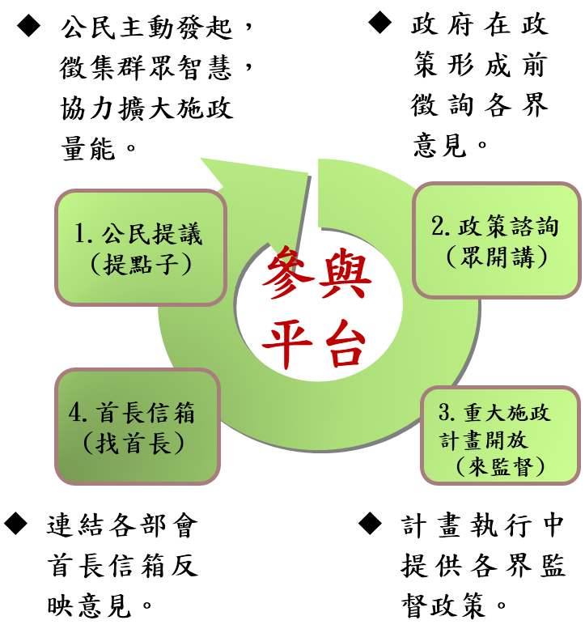

# 公共政策參與行動計畫
本行動計畫係依據學者專家意見修正

#第一章　背景分析
####公民參與的過程中，公民如能先針對議題充分瞭解，可方便有效進一步向政府表達政策意見，發展成政府與公民的良性互動溝通環境，為達到公民充分瞭解，最重要的基礎是政府資訊公開、資料開放透明。
####世界各國政府推動電子化政府，均將公民透過資通訊科技的政策參與(E參與)列為政府創新應用服務的關鍵指標，以聯合國電子化政府調查指標之E參與(e-participation)為例，包含資訊透明(E-information)、意見諮詢(E-consultation)及決策制定(E-decision-making)等3面向次指標。
####電子化政府的願景係打造為民服務的數位政府平台，以增進政府服務品質、深化民主、以及促進組織變革，過去各國政府致力於電子化政府的服務創新，期以「資訊通訊科技」（Information and Communication Technologies, ICTs）來改善民主回應性。惟電子化政府不應只是一種促成「好的治理」（Good governance）的管理工具，其政策成形過程中亦需要民主正當性。

##一、國際趨勢
####公民參與係民主制度建立與民主深化的重要關鍵，聯合國於1975年即發表「公眾參與發展的決策」(Popular participation in decision-making for development)報告中指出「公民應有機會參與推動及享有社會發展」，於2013年發表「強化公共參與以永續發展：對話、爭論、異議、商議」，報告中建議透過資通訊應用強化擴大參與互動的範圍，2014年聯合國電子化政府調查，持續將E參與指標列入重要的評估指標。
####美國總統歐巴馬於美國白宮【We the People】請願網宣示「建立透明、公眾參與和協作的系統」，並強調此種開放性政府將「鞏固我們的民主、提高效率和有力的政府。」 在全球性社會發展環境變遷中，各國政府紛紛採取作為，以開放多元管道，匯聚外部意見，強化公共治理效能。分析國際網路參與之做法，分述如下：
###(一)政府資訊公開
####政府網站提供的服務及政府資訊公開，為政府與公民互動的第一類接觸。
###(二)社群媒體的運用
####社群媒體(Web 2.0)互動應用是最佳的社會網絡(Social Networking)實作工具，各國政府均將Web 2.0的發展列為政府施政策略及措施。
###(三)網路參與平台
####如新加坡公民參與平臺【REACH】、韓國公民線上陳情及討論入口網站【E-People】、美國白宮請願網【We the People】、英國國會電子請願【e-petitions】等。

##二、國內環境
####依國家發展委員會103年個人/家戶數位機會調查顯示，我國12歲以上民眾78%有使用網路的經驗，71.4%有行動上網經驗，高達81.4%的網路使用者曾使用社群網站進行雙向互動，參與各式網路討論區的也有23.9%，約有23.7%曾在網路上發表對當前政治、社會或公共政策看法。隨著電腦及上網普及率逐年提升，當愈來愈多民眾透過網站或社群網路媒體討論公眾議題，網路民意資料大量成長，促使政府朝向網路透明、參與、政策溝通方向發展。
####國發會為推行自由經濟示範區，除於示範區官網([http://www.fepz.org.tw/](http://www.fepz.org.tw/))公布資訊外，並藉由社群媒體Facebook粉絲專頁 、Youtube 、Flickr 及簡要簡報「懶人包」等，以創新政務推動的模式來推廣政府施政。經貿國是會議亦運用網路論壇、網路直播等既有網路平臺與民眾互動，且邀請公眾共同參與、協作共筆等方式進行意見交流，並綜整意見調查結果彙整分享，以回應社會多元意見。
####行政院已於Youtube平臺進行院會後記者會網路直播，同時，為方便公民即時掌握行政院網路直播和活動消息，利用Youtube影音平臺開設「行政院開麥啦」頻道，提供網友訂閱。
####綜上因應社會網絡的發展趨勢，我國在電子化政府的發展策略，亦由早期的普遍網站建置，提供政府施政資訊，推演至導入與應用社群媒體作為政府徵詢民意參考措施。展望未來，仍有下列問題待改進:
###(一)政府公開之資訊或資料的質量，與民眾所需尚存差距
####政府所提供的施政資訊內容，民眾不易解讀，惟有資料的充份公開揭露，及資訊易於判讀，公民參與才能在事實的基礎上建立共識。
###(二)網路與實體之多元溝通管道，仍未普遍落實及串連
####仍有部分政府機關尚未建立與公民互動的社群媒體管道，縱然已有社群媒體亦未充分善用。經貿國是會議已採用網路直播、實體會議活動等工具與管道蒐集民意，惟除此之外，其他機關及政策的應用仍屬少數。
###(三)公民意見如何有效列入政府決策參考機制，仍待克服
####公民參與管道已日趨多元，但民眾意見如何有效進入政府施政決策參考，相關機制與作為，包含法規作業規定的調適，意見回應作業流程等，仍待努力。

#第二章　具體目標
####為達到透明公開、全民共治新局，政府必須建構全民網路參與環境，並且凝聚眾人力量發展多元主動服務。面對網路發展，應持續以新思維的角度及抱持開放的態度，積極運用網路與民眾發展為互信合作夥伴。目標如下:
##一、	減少公民與政府的溝通成本
####加強政府資訊公開與資料開放質量，使政府資訊能更充分正確被揭露及傳遞，縮短政府與公民的溝通成本。
##二、	擴大多元討論及諮詢環境
####在資訊有效傳遞的基礎上，善用社群媒體（Web 2.0）加強與民眾溝通互動，作為政府與民眾溝通的互動橋樑，提高政策執行效益及品質。
##三、	完備公民意見回應機制
####盤點相關法規，分年規劃，適度修改調整，建構公民網路參與或連署之有效回應機制，讓公民成為實質的治理夥伴。

#第三章　推動策略
####為了突破長期以來政府與公民之間單向資訊傳遞的情況，公共政策參與的推動策略首重參與互動，除了讓公民瞭解政府目前最新的政策內容，也要瞭解公民的需求與想法。
##一、	制定政府網站內容準則，滿足民眾資訊需求
####（一）	制定網站親和性設計原則，以公民的需求為角度，調整網站提供政府服務資訊的準則，以網站資料化為方向，讓公民更容易取得政府相關資訊。
####（二）	制定政府網站內容提供準則，讓公民更方便取得易於判讀之政府資訊。
####（三）	加強政府資料公開，讓民眾可對政府施政議題充分瞭解，滿足民眾可有效進一步向政府表達政策意見。
##二、	整合網路與實體參與管道，蒐集多元精緻意見
####（一）	為廣納多元意見，舉辦實體政策座談會、諮詢會、說明會、公聽會及聽證會等仍不可少。
####（二）	善用社群媒體的溝通管道，進行網路播放及線上對話、交談，擴大公民參與的地域及層面。
####（三）	與相關社群網絡有效串連，廣泛的蒐集網路上各種社群及民眾的聲音與建議，能被政府有效的瞭解。
####（四）	善用第三方資源主動、互動、分享資訊，開放直播訊源或是由第三方合作直播共同參與，將實體會議全程公開及即時網路轉播（圖文或影音），讓無法親臨現場的公民皆可透過網路觀看、聆聽及參與。
##三、	提供政府施政網路窗口，促進民眾參與及監督
####（一）	善用網路窗口，讓公民更方便找到政府施政決策事前(計畫形成)及中(執行)等階段的相關資訊，更方便的瞭解與監督，實現對公共政策之參與。
####（二）	在政策施行前，於網路徵詢民眾意見，先充分瞭解公民的需求及公眾參與的回饋，可減低公眾與政府的專業不對稱，亦能更切合民眾的需求。
####（三）	政策執行中，開放政府公共政策，提供公民共同監督政府政策及計畫執行之網路參與管道，讓民眾更容易監督政策及計畫。
####（四）	參考美國白宮請願網【We the People】與英國國會電子請願【e-petitions】之作法，建置符合我國政府體制及國情之提議平臺，提供公民主動參與政策的一個簡單管道，透過政策提議、討論的過程，形成共識，進而請政府具體回應納入政策或評估可行性。
####（五）	為實現民眾參與政府施政的網路窗口，國家發展委員會已建置網路公共參與平台([http://join.gov.tw/](http://join.gov.tw/))，功能如圖1所示。

圖1:公共政策網路參與平臺功能示意圖
##四、	完善網路參與程序及法令，有效回應及參採民眾意見
####（一）	盤點現行中央相關法規、行政規則等，凡涉及對民眾傳達相關行政作為，除現有的座談會、諮詢會、說明會、公聽會及聽證會等，均有相對網路參與機制。
####（二）	「行政程序法」為行政機關施政依循標準，於「行政程序法」增加公民網路參與之行為程序，以利各機關有所依循標準，俾適度修改其所屬相關法規。
####（三）	明訂政府機關社群媒體意見徴詢之回應處理機制，協助政府機關同仁可有效回應民眾意見，及可納入政府施政考量之機制。
##五、	檢視相關法規，奠定優質的網路民主基礎
####（一）	因應網路時代公民參與之發展，應考量網路投票連署之可行性，適度修改調整，期能透過網路連署或投票，實現網路民主。
####（二）	盤點適合利用網路提供公民參與之多元管道，適度修改調整現行法規，讓公民參與互動更多元，並尊重多元異質意見的傳遞，提升優質的網路民主。
