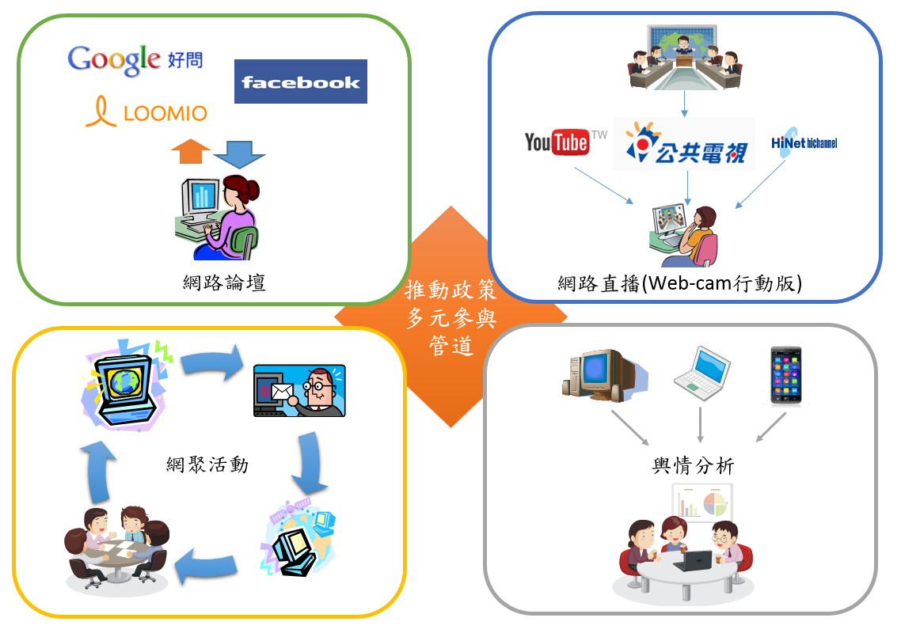

# 公共政策參與行動計畫

#壹、背景分析
####公民參與係民主制度建立與民主深化的重要關鍵，聯合國於1975年發表「公眾參與部門決策」(Popular participation in decision-making for development)報告中指出「公民應有機會參與推動及享有社會發展」。近年來因應資通訊科技的發展，行動網路與社群網路媒體的普及，公民與政府間的關係產生轉變，資訊的可得性與快速擴散性，增加彼此互動，使公民社會中，民眾有更多參與公共政策討論的機會，提高政府對人民的回應性與課責性。 
####依國家發展委員會103年個人/家戶數位機會調查顯示，我國12歲以上民眾78%有使用網路的經驗，71.4%有行動上網經驗。隨著電腦及上網普及率逐年提升，當愈來愈多民眾透過網站或社群網路媒體討論公眾議題，網路民意資料大量成長，促使政府朝向透明、參與、網路政策溝通方向發展，並開始應用社群網路媒體（Social Network，簡稱Web 2.0）改善與民眾互動及提升公共政策服務。有鑑於此，因應內、外在環境快速變遷及民眾需求漸趨多元，資訊科技如何應用到民主政治的公民參與機制，政府應善用網路工具與政府開放的概念，讓政府政策及計畫在形成、執行及評估等階段，民眾可以透過E參與(e-participation)的管道來實現對公共政策之參與。
####世界各國政府推動電子化政府，均將民眾E參與列為政府創新應用服務的關鍵指標，以聯合國電子化政府調查指標之E參與為例，包含資訊(E-information)、諮商(E-consultation)及參與決策機制(E-decision-making)等3面向次指標，描述如下：
####1.資訊公開：政府主動提供資訊給公民，或應公民要求單向傳遞資訊。
####2.意見諮商：公民對政府施政有提供意見及回饋意見的管道，是一種雙向的關係。
####3.參與決策機制：公民積極參與政策議程設定與政策對話，但最終決定的責任仍在政府，是一種雙向的夥伴關係。
##一、國際趨勢
####透過網路表達對時事及政府政策的看法，在民主國家已是普遍表達意見的方式。經由網路集結眾人的力量或是意見，亦為現今時下最常使用管道之一，「網路社群」所形成的公民力量，值得政府持續觀察後續帶來的效應。 誠如美國總統歐巴馬於美國白宮【We the People】請願網所說：「我的政府致力於打造前所未有的開放政府，我們將共同努力，以確保公眾的信任，建立透明、公眾參與和協作的系統。開放性將鞏固我們的民主、提高效率和有力的政府。」 在全球性社會發展環境變遷中，各國政府紛紛採取作為，以開放多元管道，匯聚外部意見，強化公共治理效能。分析國際網路參與之做法，分述如下：
###(一)政府資訊公開
####政府網站提供的服務及政府資訊公開，為政府與民眾互動的第一類接觸。

###(二)社群網絡的運用
####社群網絡(Web 2.0)互動應用是最佳的社會網絡(Social Networking)實作工具，各國政府均將Web 2.0社會網絡的發展列為政府施政策略及措施。

###(三)網路參與平台
####如新加坡公民參與平臺【REACH】、韓國人民線上陳情及討論入口網站【E-People】、美國白宮請願網【We the People】、英國國會電子請願【e-petitions】等。

##二、國內環境
####為增進公民政策參與多元管道，運用資訊及通訊技術，以更貼近民眾方式強化政策參與、溝通及落實政策討論，原行政院研考會於94年因應民眾政策議題網路參與而建置「國家政策網路智庫 」。另為鼓勵全民參與討論政府預定推行或是正在執行中的政策，原行政院研考會也曾建置「公共政策大家談 」專區，揭露現行政策資訊、研擬中政策的討論、機關預定推行政策或規劃中方案的討論及意見徵詢等。
####98年11月19日行政院召開會議，院長指示針對民眾抱怨事項進行十大民怨票選，以作為後續除弊興利施政作為參考。
####103年國發會為推行自由經濟示範區，除於示範區官網(http://www.fepz.org.tw/)公布資訊外，並藉由社會網絡Facebook粉絲專頁 、Youtube 、Flickr及簡要簡報「懶人包」等，以創新政務推動的模式來推廣政府施政。同年，經貿國是會議亦運用網路論壇、網路直播等既有社群網路平臺蒐集民意，且邀請公眾以共同參與、協作共筆方式進行意見交流，並綜整意見調查結果彙整分享，以回應社會多元意見。
####行政院已於103年9月11日於Youtube平臺進行院會後記者會網路直播，以促進各部會能適應直播聊天室的即時回應方式。同時，為方便民眾即時掌握行政院網路直播和活動消息，利用Youtube影音平臺開設「行政院開麥啦」頻道，提供網友訂閱。

####綜上因應社會網絡的發展趨勢，我國在電子化政府的發展策略，亦由早期的普遍網站建置，提供政府施政資訊，推演至導入與應用Web 2.0作為未來政府施政重要策略與措施。展望未來，仍有下列問題待改進:
####1.政府網站公開之資訊內容與量與民眾期待尚有差距
####政府對民眾所提供的網站資訊內容及網站服務操作友善性仍有部分待加強與改善。
####2.各政府機關尚未普遍善用社群網路媒體(Web 2.0)
####仍有部分政府機關尚未建立與民眾互動的社群網路媒體(Web 2.0)，縱然已有社群網路媒體(Web 2.0)亦未充分善用社群網路媒體擴大民眾參與。
####3.尚無單一的網路參與平台
####我國尚未有官方的單一網站徵詢與參與平台。
####4.無法即時了解民意以利回應
####除了一般媒體新聞消息外，網友的意見不易被發掘。
####5.網實多元的民意徵詢管道仍未普遍落實
####經貿國是會議已採用網路論壇、網路直播、網聚活動及輿情分析等工具與管道蒐集民意，惟除此之外，其他應用仍屬少數。
####6.網友對政府施政作為的了解不夠深入
####網友可能因時間或知識領域不同，有時對公共政策的實際內容可能了解不夠深入，而採跟隨意見領袖發言及動作，

#貳、具體目標
####政府必須建構全民參政環境，並且凝聚眾人力量發展多元主動服務。面對網路發展，應持續以新思維的角度及抱持開放的態度，積極運用網路媒體工具了解民眾想法，與民眾發展為互信合作夥伴。短期與中長期具體目標如下:
##一、短期目標
###(一)網站上公開政府重大施政計畫內容，達成政府施政透明及政府資訊公開
###(二)善用社群媒體（Web 2.0）並藉網實多元管道，加強與民眾溝通互動，提升政府施政決策品質
##二、中長期目標
###(一)盤點並適度修改相關法規，實現網路公民行使參政決策權
###(二)提供網友判斷公共政策是否恰當的管道與能力，實踐審議式民主

#參、推動策略
####為了突破長期以來政府與民眾之間單向資訊傳遞的情況，公共政策參與的推動策略首重網路參與互動，除了解民眾的想法與需求外，也要讓民眾瞭解政府目前最新的政策內容。    短中長期相關推動策略如下:
##一、短期策略
###(一)為達成「網站上公開政府重大施政計畫內容，達成政府施政透明及政府資訊公開」目標，策略如下: 
####1.制定網站親和性設計原則，以民眾的需求為角度，作為調整網頁提供服務的準則。
####2.訂頒政府網站檢核指標規範，定期檢測與輔導政府機關網站，作為政府網站服務提升之助力。
###(二)為達成「善用社群媒體（Web 2.0）並藉網實多元管道，加強與民眾溝通互動，提升政府施政決策品質」目標，策略如下: 
####1.透過強化政府治理效能實施要點，利用社群媒體的溝通管道進行政策說明，將可增加民眾參與及互動機制，提高民眾參與、信任，提升政策執行效益及品質。 
####2.多元社群媒體運作，政策傳遞至各目標族群
####(1)依機關特性所選定之服務項目，評估合適之Web 2.0社群網站(如YouTube、Facebook、Twitter等)以政府機關或主題名義，以達政策傳遞及與民眾互動之綜效。
####(2)明訂社會網路媒體營運規範及回應機制，協助政府機關具備公開透明及即時回應能力，並尊重多元異質意見的傳遞。
####3.運用網實多元參與管道
####了解公民習慣使用之主流，運用網路論壇、網路直播、網聚活動等網實多元參與管道，增進民眾對公共政策議題的認識與了解。
####(1)網路論壇
####政府應該轉化以往被動的角色，定期蒐集民間平臺所進行之議題討論等，將各界透過網路進行意見交流列入各機關徵詢民眾意見之管道。
####(2)網路直播
####善用第三方資源主動、互動、分享資訊，開放直播訊源或是由第三方合作直播共同參與，將實體會議全程公開及即時網路轉播（圖文或影音），讓無法親臨現場的民眾皆可透過網路觀看、聆聽及參與，強化與民眾互動與意見蒐集。
####(3)網聚活動
####網路世界具備各項溝通平臺，突破地域限制，促進跨族群意見交流，當網路討論交流一段時間之後，發起網聚活動，透過人與人面對面意見交流與討論，可深化凝聚力。且為延續網路活動參與者的討論熱度，適時以世界咖啡館、社群分享等形式辦理實體網聚，並擇選對議題深入瞭解的人員，共同引導大家進行交流討論。
####4.建置網路公民參與機制單一管道
####因應內、外在環境快速變遷及民眾需求漸趨多元，善用網路工具與政府開放的概念，運用單一管道，讓政府政策及計畫在形成、執行及評估等階段，民眾可以透過E參與(e-participation)的管道來實現對公共政策之參與。
####(1)提供部會政策形成前，徵詢各界意見之網路參與管道
####為了突破長期以來政府單向傳遞資訊給民眾之情況，單一管道平臺應提供政策諮詢互動園地，除透過平臺讓民眾瞭解政府目前最新的施政方向，也期透過平臺提供各部會作為施政前徵詢民眾意見之網路管道，在政策施行前，先充分瞭解民眾的需求及民眾參與的回饋，對於政府施政將有很大的助益，除可減低民眾對政府政策的疑慮，亦能更切合民眾的需求。
####(2)政策執行中，供各界監督政策及計畫之網路參與管道
####依目前我國政府體制，政府政策執行的過程中，雖然已有立法委員監督政府施政，但在網路資訊發達的今日，於單一管道平臺應開放政府公共政策，提供民眾共同監督政府政策及計畫執行之網路參與管道，亦是未來趨勢。
####(3)公民提議，徵集群眾智慧，協力擴大施政量能
####參考美國白宮請願網【We the People】與英國國會電子請願【e-petitions】之作法，建置符合我國政府體制及國情之提議平臺，提供公民主動參與政策的一個簡單管道，透過政策提議、討論、簽署附議的過程，形成共識，進而請政府具體回應納入政策或評估可行性。

####圖：公共政策網路參與平臺建置規劃
##二、中長期策略
###(一)為達成「盤點並適度修改相關法規，實現網路公民行使參政決策權」目標，策略如下:
####清查現行中央相關法規、行政規則等，凡涉及對民眾傳達相關行政作為之座談會、諮詢會、說明會、公聽會及聽證會等，均宜有相對網路參與機制。
####1.清查適用網路資源提供公民參與多元管道，期盼相關機關能適度修改調整現行法規，強化與公民互動參與機制。
####2.「行政程序法」為行政機關施政依循標準，爰建議法務部於「行政程序法」增加網路公民參與之行為程序，以利各機關有所依循標準，俾適度修改其所屬相關法規。
###(二)為達成「提供網友判斷公共政策是否恰當的管道與能力，實踐審議式民主」目標，策略如下:
####除短期可達成之建置網路公民參與機制單一管道以及運用網實多元參與管道外，長期策略可再酌重下列2方面:
####1.加強民眾對公共事務參與之素養
####公民參與公共事務的先決條件為具有相當的領域知識，然而民眾並非每位均是政府事務專家，因此產生民意與專家的爭議。公民參與應以理性訴求為基礎以作為民主政治的責任表現，避免淪為民粹主義（Populism）的激情表現。
####2.運用第三方擔任轉譯與傳遞正確資訊
####透過建立公民網路參與之資訊轉譯志工機制，進行政府與公民社會間的資訊轉譯與傳遞工作，使得政府資訊能保持正確且以合適的語彙邏輯進入網友世界，縮短政府與網友在網路世界的語意表達落差，翻轉公民社會對政府「官腔官調」、「答非所問」等印象。同時轉譯與傳遞網路上各種公民政策意見，供政府據以因應及思考後續決策方向的重要工作，以利促成有效的溝通。

####圖：政策多元參與管道