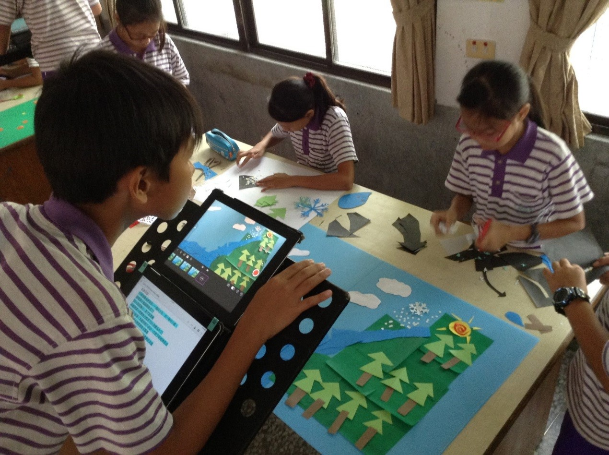

### 您認為國內目前「數位教育」推動上，有那些項目需要再檢討改進? 有那些可以「加強」或「改進」的地方？
<!--  註解掉 原先圖檔，改成 長寬比較小的圖，如下方-->

#####「數位教育」是以網路為基礎，配合先進的資訊技術及工具設備，實現從環境（如校園內網路及資訊設備等）、資源（如課本、講義等）、到活動(如教、學、管理、服務等）的適性數位化教學或學習。我國各級學校數位教育的推動範疇，包括，環境面、資源面、應用面及素養面。
#####一、環境面：建設高品質、超寬頻的教育學術研究骨幹網路；全面設置校園無線網路及優化教室內數位環境；優先佈建偏鄉及離島學校網路及數位學習環境。
#####二、資源面：整合雲端學習資源與服務，支援學校課前、課中、課後的教學與學習實施；提供數位教材，輔助傳統書本的教與學，促進更多元的媒體呈現及互動學習。
#####三、應用面：提供線上學習方式進修課程；發展以「學生為中心」的新觀念數位學習型態；發展學習歷程分析記錄，提供適性化學習；利用數位科技幫助弱勢與偏遠地區學生學習及推動國際化學習。
#####四、素養面：培養教師掌握數位科技之創新教學應用策略能力，營造更符合學生的學習；培養學生具備運用數位工具能力強化學習與未來國民資訊力，以及網路素養與倫理觀念，因應未來社會人才需求。
