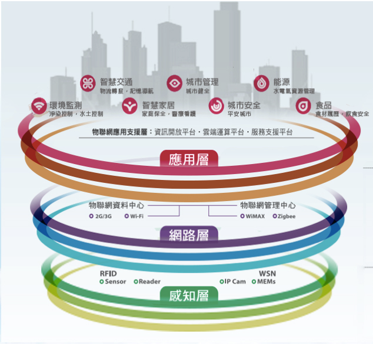

## 如何培育軟硬虛實跨域整合的人才，開拓IoT商機？

(圖片來源：http://www-07.ibm.com/tw/blueview/2011apr/pdf/4_web.pdf ) 
 在世界經濟論壇2014年全球資訊科技報告(World Economic Forum, 2014)中，我國網絡整備度指標與全球146個經濟體運用資通訊科技於經濟發展、創新、開發工作機會、與社會福祉領域上的表現相比，自2013年第10名滑落至第14名，除了落後北歐小國外，也低於鄰近的新加坡（第2名）、香港（第8名）、南韓（第10名），顯示我國在ICT整體競爭力上恐怕存在隱憂，面對ICT未來新應用，特別是物聯網時代軟硬虛實跨域整合的商機時，能否抓住成長機會將是我國社會經濟活動的重大挑戰。 
 我國在資通訊產業雖具全球關鍵地位，但仍以硬體出口為主，過去軟體與硬體皆有相當多的投入和人才培育，然台灣資通訊軟體產業發展相對較弱，未來隨著物聯網的概念加持，各項與行動應用相關的產業及人才需求亦會快速成長，政府的經費投入也應以高度實務需求來考量，期許帶動整體資通人才的有效培育。
