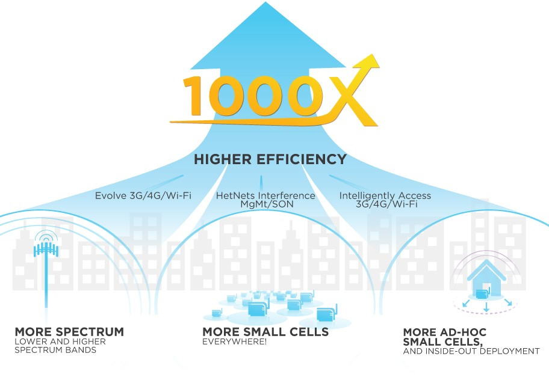

## 如何推動無線寬頻網路建設，以因應行動數據海嘯 (Mobile Data Tsunami)時代來臨?

####隨著網際網路各類應用（視訊、雲端、遊戲、商務等）不斷發展，以及各類智慧型行動終端設備（手機、平板等）技術、功能日新月異，行動上網成長需求急速成長，面臨1000x數據海嘯(Mobile Data Tsunami)之挑戰。台灣到處可見「低頭族」，正說明了民眾對行動上網的龐大需求。
####為了滿足大家對行動上網高速、高涵蓋的渴望，政府與時俱進針對行動通信技術的發展，陸續開放了2G、3G、4G行動通訊業務，業者也努力建設並開發服務、爭取用戶。
####頻譜、技術能力、基地臺及相關固網支援建設（如backhaul網路等）是行動通信發展關鍵，首先，政府將持續參考國際發展趨勢及國內情況，積極開發頻譜資源。其次，有關技術能力部分，因4G技術已發展成熟，藉由開放多家業者充分競爭，提供最佳服務。至於最困難的基地臺及相關固網建設部分，政府已修訂法規，鼓勵業者基地臺共站、共構，以減少基地臺數量，並持續宣導電磁波正確觀念，減少民眾對基地臺電磁波之疑慮。另外也開放政府機關（構）之公有土地建物及管道供業者租用設置基地臺及鋪設管線，有利業者建設。
####除了以上政府辦理項目外，對於無線寬頻網路建設，您是否也有一些看法可與大家共同分享?
