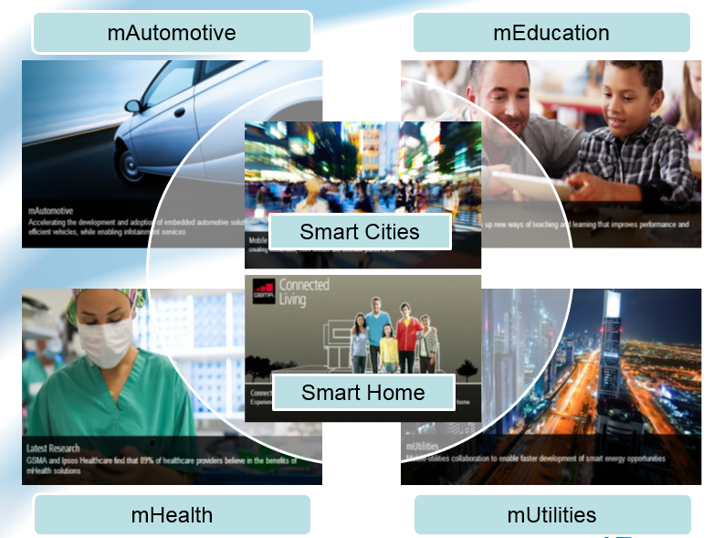

# 書同文 車同軌─接軌國際標準，從「台灣資通產業標準」談起

 隨著雲端運算、物聯網、大數據的應用、穿戴式設備、智慧家庭、智慧城市、智慧生活成為未來顯學，萬物互聯的新世代即將成型。在網路技術因應資訊傳遞的需求與數量極度攀升之下，5G發展勢在必行。而在5G時代，無線通行領域將可能不會再出現類似3G時代TD-SCDMA與WCDMA、CDMA2000、WiMax；4G時代的TD-LTE與LTE-FDD的標準之爭，全球5G技術將有望共用一個標準。 
 資訊、網路、通訊是台灣產業最重要的命脈，且台灣資通訊產業也位居全球重要的地位，在這個關鍵轉折點，如何領先技術，建立產業標準即進行具經濟效益的專利佈局，讓台灣優秀的軟硬體人才，在共通的平台上發揮所長，形成產業鏈，是當務之急。「掌握關鍵智財權、建立產業技術標準、推展國際產業標準」，是最關鍵的策略。 
 經濟部技術處已於本年2月3日推動成立「台灣資通產業標準協會」，對內建立台灣資通技術產業標準制定的平台，對外成為代表台灣對國際組織的單一窗口。也邀請到業界龍頭華碩電腦曾鏘聲副董事長擔任第一屆理事長，藉由產業自主的整合，為台灣建立技術的標準以及相關智慧財產，讓台灣產業在共通舞台上，成為一個產業鏈並進軍國際，為我們的資通訊產業掌握未來及發展契機。希望藉由您發想的寶貴意見，讓台灣的下世代智慧生活更美好。
