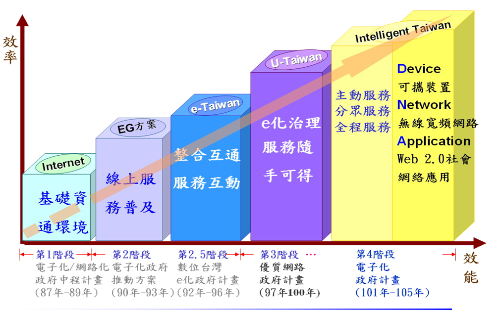
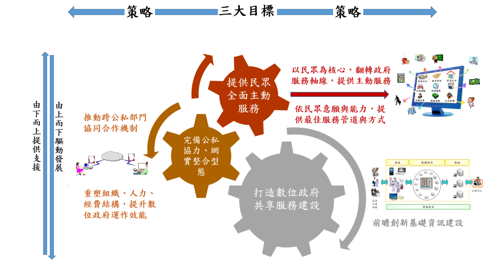

#數位政府服務行動計畫
#第一章　背景分析
####依據Gartner等國際智庫定義，「數位政府服務」的內涵在於建立一個公開、參與以及協力的政府型態，並且強調服務必須持久、可負擔以及跨域整合，以滿足未來資通訊服務需求。本透明治理構面的數位政府服務強調與其他構面合作，建立一個協力型政府資訊服務架構，包括政府機關之間以及政府與民眾之間的協同合作，以最有效運用資源的方式提供最需要的服務。
與世界上大多數先進國家一樣，我國面臨著資通訊經費逐年遞減而民眾需求逐年提高的議題，資通訊技術的發達以及社群媒體工具的普遍使用，讓民眾對政府的溝通管道扁平化，加快建言速度、也加快對回應速度的要求。單一政府或群體的智慧及能力已逐漸無法因應愈來愈多、愈快、愈創新的需求，因此需要以更開放的態度，更有效的技術，優化政府本身資通訊建設及服務，也引入群眾智慧，達到跨部門力量結合的目的。

##一、國際趨勢
####根據國際智庫研究，全球電子化政府發展趨勢已逐步朝向開放政府(Open Government)以及智慧政府(Smart Government)發展，用開放來引進群眾智慧，並提供民眾與政府可負擔的跨域整合服務，以滿足未來資通訊服務需求，而雲端運算、社群媒體、政府開放資料、巨量資料、物聯網等科技也成為政府資訊化發展的趨勢。
####有別於前階段電子化政府的作法，下階段政府服務在資通訊面向的重點是更有效的運用行動科技與雲端力量，傳送政府服務；分析巨量資料並結合社群網絡，以瞭解民眾需求，擴大施政績效；並且橫向連接機關服務與結合群眾智慧，以提供民眾所需，達成治理工作。
####綜觀世界各國發展經驗，目前多未達到開放與智慧政府服務階段，但是部分資訊先進國家已開始著重於下列幾個資訊資源整合工作，以加速發展政府資訊服務：
####(一)	以使用者為中心，優化政府業務流程，對外目標為提升公眾滿意度，對內目標為打破跨機關界限。
####(二)	健全法規，強化資訊公開保障制度。通過立法，保證資訊的有效共享，以及保障公眾獲取資訊的權利。
####(三)	整合規劃資訊服務策略，並且建立合作共享交換機制。以標準化和規範化作為電子化政府的基礎，解決各部門之間資料傳遞和安全問題。
####(四)	設立電子化政府的專門工作小組或設置資訊長，負責資訊服務的政策規劃以及推動工作，同時掌握資訊經費的分配權。
####就個別國家而言，舉新加坡、美國、英國等已在進行中的計畫為例，說明部分先進國家對於達到數位政府服務的策略：
###(一)	新加坡:
####新加坡政府執行中的eGov2015 計畫，提到希望促進民眾、私部門與政府間，以更密切的互動與更密集的共同創造，為新加坡及民眾帶來更大的價值。也將整合對象從政府內部延伸至外界，實現一個協同合作的政府。為實現這個電子化政府的願景，eGov2015中提出三項主要策略:
####1.	共同創造更大的價值
####2.	連結促成主動參與
####3.	催化成為一體政府的變革。
####針對這三項策略，新加坡政府透過資通技術來建置一個能讓民眾、私部門及政府合作無間的運作環境的策略來應對。新加坡政府規劃了涵蓋基礎措施、資通能力、新興服務、行動應用、開放資料、資料分析等計畫，希望借助這些計畫的實施，能成就eGov2015「成為一個緊密結合民眾、共同創造價值的協作政府」的願景。目前與民眾協同創造的部份，仍有改進空間。
####由於新加坡各政府機關資訊主管多由「資訊通信發展管理局(IDA)」統一派駐，因此資訊政策的傳達與連貫性程度非常高，這也是新加坡在國際電子化政府排名(例如世界經濟論壇所公布之調查)長年維持在前兩名最重要的原因之一。
###(二)	美國:
####美國白宮電子化政府與資訊科技辦公室(Office of E-Government & Information Technology)，於2012年所發布的數位政府策略(Digital Government Strategy)描繪了美國政府21世紀的數位政府藍圖，進而設定了三個目標：
####1.	讓美國民眾和日益增加的行動需求可以不限任何時間任何地點任何裝置存取高品質的數位政府資訊和服務。
####2.	確保美國政府可以運用更聰明、安全、可負擔的方式來調適自己，以面對新的數位世界。
####3.	解除政府資料的禁錮，以提供創新應用，並增進為民服務品質。
####為了達成轉型21世紀的數位政府，美國政府遵循四點原則：
####1.	以資訊為中心：作為政府的開放資料中心，目的在於讓民眾可以自由的利用開放資料來分享或者加值使用。
####2.	共享平台：利用共享平台政府可以緊密的跨部門合作，達到降低成本、精簡開發、利用統一的標準和在建立或者交付資訊的時候可以達到一致性。
####3.	以客戶為中心：提供客戶想要或者需要的資料，不管透過任何型態如網頁資料、行動資料、資料集、應用程式等，或者利用任何方式創建資料和管理來提供客戶所需。
####4.	一個安全私密的平台：確保在資訊安全與確保隱私下提供數位服務。
####美國政府資訊化程度很高，資訊決策分級也很明確，包括公共事務總署(GSA)、預算與管理局(OMB)以及聯邦資訊長(Federal CIO Council)都有其對應的角色，因此其資訊政策貫徹程度很高，也願意試驗與創新，因此在國際電子化政府排名也長年維持在前兩名。
###(三)	英國
####英國內閣辦公室(Cabinet Office)與旗下的效率改革組  (Efficiency and Reform Group)在2012年11月公布政府數位策略(Government Digital Strategy)，並於2013年3月14日因應政府施政方向而調整所更新的策略報告，據英國政府統計提供數位服務每年可以節省17億到18億英鎊的政府預算，目前每年花費6億英鎊在ICT上，以確保政府能跟上IT數位的腳步。英國政府因應數位化科技的變化而改進施政方向，主要五項調整行動(Actions)如下所示：
####1.	所有政府機關和事務機構將設立數位領導人的角色(active digital leader)，並建置數位領導人溝通連絡管道(digital leader network)，與政府數位服務政策緊密配合與同步。
####2.	由服務管理者(Service Manager)檢視評估數位化使用的清況。倘若數位化服務交易次數每年超過100,000次，該服務將被重新設計、改善運作及提升使用效能。
####3.	各政府機關和事務部門內部必須具備有數位化架編制和專業技能。
####4.	總理辦公室須支援跨機關的服務，協助改善政府機關和事務部門數位化的程度。
####5.	從2014年4月開始，檢視政府機關和事務部門提供之數位化服務，凡所有需要重新被設計服務的交易流程，均應標準化並且公開。
####雖然目前得知英國數位服務確實節省的經費未達其預期目標，然而其跨出的這一大步仍成為世界各國典範。
##二、國內環境
####我國推動電子化政府近20年，已順利完成政府網路基礎建設、政府網路應用推廣以及數位關懷服務，提供民眾無縫隙的優質政府服務(圖1)。目前重點以「民眾服務」、「運作效率」及「政策達成」三大公共價值為主軸，提供主動分眾的資訊服務，並發展跨部門之全程資訊服務。同時也對於弱勢族群提供資源與協助，達到資訊無障礙，縮短數位落差，進而提升國家競爭力。

圖1:電子化政府推動歷程
####例舉我國電子化政府績效，已達到下列成果:
####(一)	我國稅務網路申報機制領先世界各國，除了營業稅與營利事業所得稅網路申報比例已接近100%外， 102年度綜合所得稅網路申報比例已達85.31％（328萬件），102年度使用綜所稅稅額試算服務212萬件。
####(二)	公務機關公文電子交換可以讓原本需要1天的紙本公文傳遞變成5分鐘內電子公文傳遞，間接提升公務機關為民服務效率。中央政府機關及直轄市政府103年公文電子交換率已達88.1%、交換量約5,289萬件，全國共5,487個機關實施公文電子交換。
####(三)	政府總入口網的建立，讓民眾可以透過單一管道取得政府線上服務。政府入口網申辦表單服務項數104年2月單月3,117筆，介接服務數104年2月底共222項( 98個機關介接) 。
####(四)	中央政府建置之共用電子付費平台，讓各級政府與學校可以介接使用，無須重複開發。網路繳交學雜103年1月至2月累計筆數共達146,852筆、累計金額28.4億元，網路繳交機關規費累計筆數103年1月至2月共達96,448筆、累計金額23.5億元。
####(五)	政府為簡化招標領標程序，並且為達到採購訊息平等公開，已建置政府採購資訊系統。本系統103年共同供應契約電子採購金額達165.37億元，103年機關提供電子領標率99.32%、廠商電子領標數達92.85萬件。
####(六)	中央行政機關室內公共區域提供免費無線上網服務(iTaiwan)讓民眾可以在公家機關公共區域、以及大眾運輸車站，均能免費上網查找資料，提升民眾使用數位服務的便利性。累計至104年2月iTaiwan熱點數達6,482處，註冊人數(含境外旅客註冊人次) 本國人手機帳號2,844,787人、外籍旅客帳號 274,396人次，累計至104年2月28日使用人次85,619,957人次。
####檢討本階段電子化政府計畫執行成果，並參酌各國政府資訊服務發展趨勢，我國推動數位政府服務工作，下列面向仍有待加強推動：
##一、	政府對民眾需求掌握不足:
####政府僅運用部分溝通工具了解民眾需求，並未以更科學的方式掌握民意需求，以及分析哪些服務可以主動提供民眾。例如並未交叉分析不同領域巨量資料、主動篩選需要服務的民眾，而是要求民眾來政府機關申請辦理。也未充分運用我國行動裝置普遍運用的優勢，提供進一步便民措施。

##二、	政府機關橫向資訊整合仍應加強:
####政府資訊流程未全面整合，資料流通也不足，僅能提供民眾片段式的公開資料與線上服務，並未以ㄧ站式服務角度思考與設計服務。而跨部門資訊安全、個資保護與資訊整合等相關法令與規範，也尚未整合交互關係，致使資訊供給與需用機關執行標準不一，增加整合困難度，減緩國家整體資通訊發展進度。

##三、	須強化共用性資訊服務及基礎建設:
####共用性資訊服務完善性與前瞻性仍需改善，讓各政府機關無須再開發並維運相關資訊服務基礎建設，更有效運用整體資訊資源，同時也不會排擠機關內部其他資訊服務預算。

##四、	未善用市場及群眾力量，強化施政能量:
####政府機關目前執行資訊及業務計畫的方式，大部分仍然僅靠政府自身力量提供所有的服務，並未清楚劃分政府、市場與群眾應該擔任的角色並賦予應執行的任務，因此成效往往無法彰顯。

#第二章　具體目標

圖2:數位政府服務目標與策略
####為解決政府當前所面臨之問題，並且提升我國資訊服務量能、增進為民服務效益，數位政府最核心的目標是翻轉業務與資訊服務提供方式，以「主動提供服務」取代「被動等待提供服務」。而要達到此目標，必須完備跨政府及民間的資訊流程與整合協作，並且要有建立穩固的資通訊基礎環境與共用性資訊建設，以支援個別機關資訊服務發展(圖2)。具體目標如下:

##一、	提供民眾全面主動服務
####以民眾意願為本，結合分析技術與調查方式，主動提供適人、適時、適地的服務。
##二、	完備公私協力、網實整合型態
####整合政府、企業與民眾力量，跨域協作治理，以更有效率的方式提供民眾服務，增進公共價值。
##三、	打造數位政府共享服務建設
####結合資通訊新科技發展與我國既有網路身分證與共用行政資訊系統等穩定基礎，以更前瞻的視野，打造完善的數位政府共享服務建設。

#第二章　推動策略
####為了突破長期以來政府與民眾之間單向資訊傳遞的情況，數位政府推動策略首重需求分析。政府資通訊服務的設計要從民眾的角度，認真地去了解線上服務是要解決什麼實體問題，要用更誠懇的態度看待為民服務。短中長期相關推動策略如下:

##一、	短期策略
###(一)	為達成「提供適當網路分身工具，加速並加強民眾獲得政府網路資源」目標，策略如下:
####提供民眾適當網路資源，加速並加強民眾獲得政府網路資源，透過嘉惠資深公民、創業青年、一般民眾等群眾所獲得之迴響，逐漸擴充推動機制，並且擴大推動效益。
####為爭取最短時間獲得民眾迴響，以助益後續擴充推動，將優先推動6大項目：
####1.	推動數位學伴，利用網實整合，提升教育資源教育。
####2.	擴大「銀髮人才資源網絡服務」機制，推動銀髮人力再運用。
####3.	以資通訊社群及技術資源，鼓勵青年農民以務農創業。
####4.	整合政府與民間物價資訊，讓民眾有所參考。
####5.	結合實體創業諮詢及輔導，並善用資通科技，強化青年創業施政效能。
####6.	以健康資料雲概念，推動可攜式個人健康資訊自主管理，讓就醫記錄回歸於民，提升民眾健康意識。
###(二)	為達成「應用巨量資料分析，優化政府施政品質」目標，策略如下:
####因應行動化及雲端運算服務發展趨勢，政府應運用巨量資料分析方法，將各公部門蒐集的資料進行交互分析，協助政府施政應用規劃，並將網路民意資料分析結果導入政府決策分析流程，以回應民意需求，強化政府施政品質。作法如下:
####1.	政學合作加速發展政府資料科學治理能量
####巨量資料分析為未來政府探索民需與輔助決策分析之重要工具，為加速政府機關善用巨量資料分析協助政府施政，初期將透過政學合作模式，分別由下而上「自外界收集巨量資料應用與創意」與由上而下「政府機關運用巨量資料分析優化政府施政」等方式，鎖定具提升公共服務價值之社會安全、經濟發展、環境永續等跨機關複雜性應用議題，引入創新應用學研能量，擴大政府與研究機構或學術單位的合作，除協助政府部門瞭解技術發展與應用趨勢外，並將公部門的資料作有效的整合，加速落實前瞻施政目標。
####2.	完備政府資料科學發展環境
####巨量資料分析與應用為繼雲端運算後，近年來廣為全球各行業所關注與積極導入之資通訊技術之一，然導入應用巨量資料分析技術對一般政府機關而言，並非易事，關鍵在於缺乏跨領域資料科學專才、如何權衡公益與個人隱私保護、資料科學文化融入組織等議題。為解決上述課題，除了持續以跨域合作方式不斷試煉以強化機關人員使用巨量資料應具備的技術與能力外，對於個人隱私保護之法規調適、政府機關資料治理規範訂定等相關議題，亦將隨巨量資料應用需求逐步發展之。
###(三)	為達成「翻轉服務軸線，從被動等待民眾使用服務，轉而主動服務民眾」目標，策略如下:
####應從民眾的生活需求及便利的角度思考，主動將服務送到有需要的民眾手上，使政府的服務更豐富多元且貼近民眾需求，進一步提升政府整體服務品質與民眾滿意度。作法如下:
####1.	推動智慧村里辦公室概念
####結合跨機關電子查驗及資訊服務流程改造，強化數位政府服務，在村里辦公室設置相關資訊設備，提供簡易申辦服務，取代部分區公所或市政府的申辦服務功能，讓民眾就近於住家附近村里辦公室完成簡易政府申辦服務。
####2.	基層公務人員主動服務
####為使政府服務能普及基層民眾，並落實政府照顧偏遠及弱勢族群政策，應透過各基層公務人員主動迅速的提供政府網路便民服務，完成政府與民眾最後一哩的服務連結，並結合跨機關電子查驗機制及服務流程改造，免除民眾需至各機關申請佐證資料之程序，進一步提升政府整體服務品質與民眾滿意度。
####3.	建置安全個人資料自主管理，推升個人資料應用
####分析各國數位政府個人雲發展趨勢，規劃可信賴的資訊服務及資訊安全環境，提供友善及安全的個人雲端儲存服務與系統化管理，並且建構個人資料保護及管理制度、強化跨域隱私保護，讓民眾可以掌握個人資訊，妥善運用資訊達到自主服務目標。
##二、	中長期策略
###(一)	為達成「促進民眾、非政府組織、新媒體及政府協作治理」目標，策略如下:
####政府、市場(企業)、社會(民眾、非政府組織、新媒體)功能的平衡與合作，無法一蹴而就，但採取正確的策略、選擇合適的治理模式，將有利於克服合作治理困境，規避協作治理失敗的風險，從而實現對公共事務的良善治理。作法如下:
####1.	建構有效的政府，以提高協作的機會
####以更注重效能的方式審視政府工作方式，正確處理與市場、社會的關係，正確界定政府的職能，成為有限政府，並運用各方力量來達成目標。
####2.	建設發達的市場，以提高協作的基礎
####完善市場體系、靈活市場機制，不斷壯大民營經濟實力，讓市場有效調節社會資源配置。 
####3.	明確政府、市場和社會職責
####釐清政府、市場和社會在公共事務中扮演何種角色、各自應承擔什麼責任，以形成優良的治理結構。政府、市場和社會的最佳關係應該是各盡所能、各得其所而又和諧相處的關係，使其在各自具有比較優勢的領域發揮著主導作用，同時又互補互強。
####4.	激發政府、市場、社會合作動力
####有效的激勵是驅使合作的動力源泉，要針對不同的治理主體性質採用不同的激勵措施。其次，要建立監督機制，政府要依法對其他治理主體進行嚴格而合理的監督，確保公共治理實現公共利益最大化，而民眾、非政府組織、新媒體也要對政府治理的績效進行監督，提供建議、形成壓力以促進其更好地治理公共事務。
###(二)	為達成「以民眾需求規劃作業流程，提升政府服務效能」目標，策略如下:
####1.	深化政府服務，簡化申辦作業流程
####各機關盤點所提供之公共服務，重新檢視是否有效地解決民眾的需求，必要時應再重新規劃作業流程，以提升政府服務效能，完成以使用者為核心的數位政府服務設計。對於重大投資均應做資訊科技影響評估並編列適當資訊預算，合理化資訊預算、人力比率，以及對單位創新與統合運作影響力。
####2.	橫向整合，提升政府效能
####利用跨機關、跨域流程之資訊互通進行整合，橫向完備政府機關資通環境，縱軸串連跨機關服務作業，提供全程一站式服務，並且盤點整合相關標準規範，檢討規範妥適性與有效性。
####3.	普及弱勢數位關懷，提升偏鄉民眾與企業數位行銷應用能力
####培育原鄉部落族人資訊素養，養成正確網路資訊操作與網路使用安全性，如防詐騙、資訊安全。透過數位關懷據點提供的場地，進行資訊基礎課程訓練、技能發展教育訓練。結合雲端應用服務或管理工具，以使用量付費模式減少企業創業期數位應用成本，並協助企業改善內部營運模式，藉由如雲端POS、CRM、記帳、進銷存等內部數位應用，提升企業經營效率。