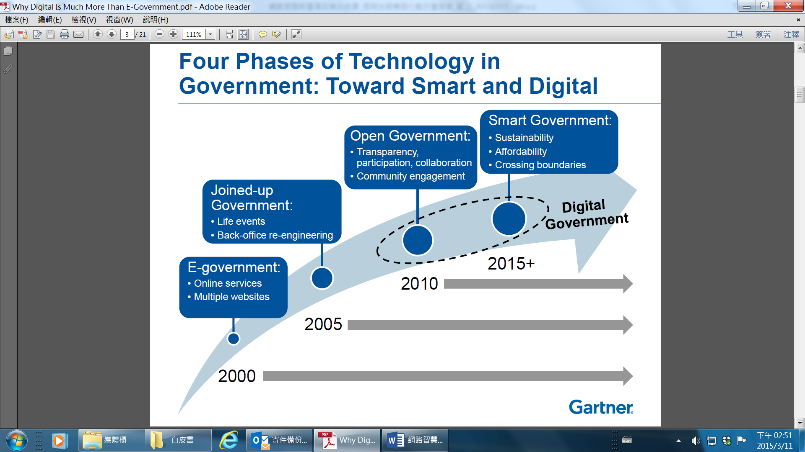

#數位政府服務行動計畫
#壹、背景說明
####依據Gartner等國際智庫研究，電子化政府發展趨勢已逐步朝向開放政府(Open Government)以及智慧政府(Smart Government)發展，這個階段係為數位政府(Digital Government) 階段(如圖1)。

####圖1：Gartner對政府科技應用四階段分析
####有別於前階段電子化政府的作法，數位政府服務在資通訊面向的重點是更緊密的運用行動科技、引入雲端力量、結合社群網絡、以及深化資訊價值，來達成政府現階段的創新 (如圖2)。簡單而言，數位政府包括以更有效的行動科技與雲端力量，傳送政府服務；分析巨量資料並結合社群網絡，以瞭解民眾需求，擴大施政績效；以及橫向連接機關服務並結合群眾智慧，以提供民眾所需，達成治理工作。目前運用行動科技部分，我國已提供政府免費wifi(例如iTaiwan) ，並且以鼓勵資料開放代替政府開發行動服務方式，提升我國政府行動服務量能。

####圖2：Gartner描述政府創新的4項動力
##一、國際趨勢
####綜觀世界各國發展經驗，目前尚未達到數位政府服務階段。但是部分資訊先進國家(例如美國、新加坡等)已開始著重於以下幾個資訊資源整合工作，以加速達到數位政府服務階段：
####第一，設立電子化政府的專門工作小組或設置資訊長，負責資訊服務的政策規劃以及推動工作，同時掌握資訊經費的分配權。
####第二，整合規劃資訊服務戰略，並且建立合作共享交換平臺。以標準化和規範化作為電子化政府的基礎，解決各部門之間資料傳遞和安全問題。
####第三，健全法規，強化資訊公開保障制度。資訊資源共享背後隱藏著利益驅動，只有通過立法，才能保證資訊的有效共享，以及保障公眾獲取資訊的權利。
####第四，以使用者為中心，優化政府業務流程。對外目標為提升公眾滿意度，對內目標為打破跨機關界限。
####此外，2014年世界經濟論壇全球資訊技術報告以巨量資料為主題，強調資料導向及巨量資料發展的重要性，建議公私部門組織應該開始著手進行巨量資料應用，並從這些新產生的龐大資料裡獲取經濟層面與社會層面利益。
##二、國內環境
####我國推動電子化政府近20年，已順利完成政府網路基礎建設、政府網路應用推廣以及數位關懷服務，提供民眾無縫隙的優質政府服務。目前重點以「民眾服務」、「運作效率」及「政策達成」三大公共價值為主軸，提供主動分眾服務，並發展跨部門之全程服務。同時也對於弱勢族群提供資源與協助，達到資訊無障礙(e- accessibility)，縮短數位落差，進而提升國家競爭力。
####本期電子化政府重點以DNA策略發展為方向，民眾可以自定所需服務與取得管道（包括網站、智慧型手機、即時通訊等多元管道），讓政府服務無縫接軌，使政府服務更貼近民眾的需求。應用無線高速寬頻網路，取得互動性更強的政府影音服務，並善用Web 2.0社會網絡增進公民參與溝通效率的應用，進行各項策略形塑以及各項執行計畫之規劃。配合政府組織改造落實資訊改造及流程改造，檢討設計服務流程，調整不同機關內外部權責及營造合作、共有、共享氛圍，鼓勵機關分享所用的資訊，以銜接現有個別機關片段服務；跨機關整合服務流程，串聯中央與地方各級機關服務資源，形成以民眾為中心的整體服務流程。電子化政府服務亦加入社會關懷與弱勢族群的思維，整合地方政府資源，善用民間力量機制，深入及擴散政府服務宅配到家，並提供公益轉換營利模式實現數位機會中心之永續經營，持續創造偏鄉數位學習及社區發展。此外，推動Web 2.0應用讓民眾對相關政策與服務都有更多的參與，並獲悉資料提供的負責單位，彰顯透明、課責、參與及效能的政府服務，建構公平的資訊社會。
####綜整前期電子化政府績效，包括全國各縣市均已提供iTaiwan服務，覆蓋廣及離島、偏鄉和山區，建置逾6,400個iTaiwan無線上網熱點；深化電子化政府服務平臺，推動建立跨機關跨系統之申辦服務與電子查驗機制達221項；統籌整合政府服務網路基礎及應用服務(GSN)，強化政府骨幹網路縱深防禦安全防護；配合組織改造資訊資源向上集中政策，推動政府機房整合；持續推動強化政府績效管理機制相關措施，分別引進跨機關績效管理作法，以發揮合作分工綜效，提升政府施政效能以受惠對象的角度進行思考、發展全程服務及跨部門間之協調。
####    檢討本階段電子化政府計畫執行成果，並參酌各國政府資訊服務發展趨勢，我國推動數位政府服務工作，仍有下列方面有待加強推動：
###(一)	尚未全面橫向連接機關服務，提供民眾所需
####政府橫向連結以及資訊流通不足，造成僅能提供民眾片段式的的公開資料與線上服務，並未以ㄧ站式服務角度思考與設計服務。
###(二)	未善用巨量資料分析等新科技，掌握民眾對政府服務之需求
####服務的提供應該更以民眾的立場出發，而非僅由政府決定服務內容。隨著資訊服務發展趨勢，民眾對政府服務之需求已不同於以往，政府僅運用部分溝通工具了解民眾需求，並未以更科學的方式掌握民意需求，並強化政府施政品質。
###(三)	未善用市場及群眾智慧，強化施政能量
####政府尚未完備與市場之分工，或加入群眾智慧。仍然停留在傳統「封閉而單一」的領域，僅靠政府自身力量提供服務。

#貳、具體目標
####為達到透明公開、全民共治新局，政府必須打造為開放型政府，並且凝聚眾人力量發展多元主動服務。面對網路發展，應積極從民眾角度，與民眾共同發展服務。短期與中長期具體目標如下:
##一、	短期目標
###(一)	提供適當網路分身工具，加速並加強民眾獲得政府網路資源
###(二)	應用巨量資料分析，優化政府施政品質
###(三)	翻轉服務軸線，從被動等待民眾使用服務，轉而主動服務民眾
##二、	中長期目標
###(一)	促進民眾、非政府組織、新媒體及政府協作治理
###(二)	以民眾需求規劃作業流程，提升政府服務效能

#參、推動策略
####為了突破長期以來政府與民眾之間單向資訊傳遞的情況，數位政府推動策略首重需求分析。政府資通訊服務的設計要從民眾的角度，認真地去了解線上服務是要解決什麼實體問題，要用更誠懇的態度看待為民服務。短中長期相關推動策略如下:

##一、	短期策略
###(一)	為達成「提供適當網路分身工具，加速並加強民眾獲得政府網路資源」目標，策略如下:
####提供民眾適當網路資源，加速並加強民眾獲得政府網路資源，透過嘉惠資深公民、創業青年、一般民眾等群眾所獲得之迴響，逐漸擴充推動機制，並且擴大推動效益。
####為爭取最短時間獲得民眾迴響，以助益後續擴充推動，將優先推動6大項目：
####1.	推動數位學伴，利用網實整合，提升教育資源教育。
####2.	擴大「銀髮人才資源網絡服務」機制，推動銀髮人力再運用。
####3.	以資通訊社群及技術資源，鼓勵青年農民以務農創業。
####4.	整合政府與民間物價資訊，讓民眾有所參考。
####5.	結合實體創業諮詢及輔導，並善用資通科技，強化青年創業施政效能。
####6.	以健康資料雲概念，推動可攜式個人健康資訊自主管理，讓就醫記錄回歸於民，提升民眾健康意識。
###(二)	為達成「應用巨量資料分析，優化政府施政品質」目標，策略如下:
####因應行動化及雲端運算服務發展趨勢，政府應運用巨量資料分析方法，將各公部門蒐集的資料進行交互分析，協助政府施政應用規劃，並將網路民意資料分析結果導入政府決策分析流程，以回應民意需求，強化政府施政品質。作法如下:
####1.	政學合作加速發展政府資料科學治理能量
####巨量資料分析為未來政府探索民需與輔助決策分析之重要工具，為加速政府機關善用巨量資料分析協助政府施政，初期將透過政學合作模式，分別由下而上「自外界收集巨量資料應用與創意」與由上而下「政府機關運用巨量資料分析優化政府施政」等方式，鎖定具提升公共服務價值之社會安全、經濟發展、環境永續等跨機關複雜性應用議題，引入創新應用學研能量，擴大政府與研究機構或學術單位的合作，除協助政府部門瞭解技術發展與應用趨勢外，並將公部門的資料作有效的整合，加速落實前瞻施政目標。
####2.	完備政府資料科學發展環境
####巨量資料分析與應用為繼雲端運算後，近年來廣為全球各行業所關注與積極導入之資通訊技術之一，然導入應用巨量資料分析技術對一般政府機關而言，並非易事，關鍵在於缺乏跨領域資料科學專才、如何權衡公益與個人隱私保護、資料科學文化融入組織等議題。為解決上述課題，除了持續以跨域合作方式不斷試煉以強化機關人員使用巨量資料應具備的技術與能力外，對於個人隱私保護之法規調適、政府機關資料治理規範訂定等相關議題，亦將隨巨量資料應用需求逐步發展之。
###(三)	為達成「翻轉服務軸線，從被動等待民眾使用服務，轉而主動服務民眾」目標，策略如下:
####應從民眾的生活需求及便利的角度思考，主動將服務送到有需要的民眾手上，使政府的服務更豐富多元且貼近民眾需求，進一步提升政府整體服務品質與民眾滿意度。作法如下:
####1.	推動智慧村里辦公室概念
####結合跨機關電子查驗及資訊服務流程改造，強化數位政府服務，在村里辦公室設置相關資訊設備，提供簡易申辦服務，取代部分區公所或市政府的申辦服務功能，讓民眾就近於住家附近村里辦公室完成簡易政府申辦服務。
####2.	基層公務人員主動服務
####為使政府服務能普及基層民眾，並落實政府照顧偏遠及弱勢族群政策，應透過各基層公務人員主動迅速的提供政府網路便民服務，完成政府與民眾最後一哩的服務連結，並結合跨機關電子查驗機制及服務流程改造，免除民眾需至各機關申請佐證資料之程序，進一步提升政府整體服務品質與民眾滿意度。
####3.	建置安全個人資料自主管理，推升個人資料應用
####分析各國數位政府個人雲發展趨勢，規劃可信賴的資訊服務及資訊安全環境，提供友善及安全的個人雲端儲存服務與系統化管理，並且建構個人資料保護及管理制度、強化跨域隱私保護，讓民眾可以掌握個人資訊，妥善運用資訊達到自主服務目標。
##二、	中長期策略
###(一)	為達成「促進民眾、非政府組織、新媒體及政府協作治理」目標，策略如下:
####政府、市場(企業)、社會(民眾、非政府組織、新媒體)功能的平衡與合作，無法一蹴而就，但採取正確的策略、選擇合適的治理模式，將有利於克服合作治理困境，規避協作治理失敗的風險，從而實現對公共事務的良善治理。作法如下:
####1.	建構有效的政府，以提高協作的機會
####以更注重效能的方式審視政府工作方式，正確處理與市場、社會的關係，正確界定政府的職能，成為有限政府，並運用各方力量來達成目標。
####2.	建設發達的市場，以提高協作的基礎
####完善市場體系、靈活市場機制，不斷壯大民營經濟實力，讓市場有效調節社會資源配置。 
####3.	明確政府、市場和社會職責
####釐清政府、市場和社會在公共事務中扮演何種角色、各自應承擔什麼責任，以形成優良的治理結構。政府、市場和社會的最佳關係應該是各盡所能、各得其所而又和諧相處的關係，使其在各自具有比較優勢的領域發揮著主導作用，同時又互補互強。
####4.	激發政府、市場、社會合作動力
####有效的激勵是驅使合作的動力源泉，要針對不同的治理主體性質採用不同的激勵措施。其次，要建立監督機制，政府要依法對其他治理主體進行嚴格而合理的監督，確保公共治理實現公共利益最大化，而民眾、非政府組織、新媒體也要對政府治理的績效進行監督，提供建議、形成壓力以促進其更好地治理公共事務。
###(二)	為達成「以民眾需求規劃作業流程，提升政府服務效能」目標，策略如下:
####1.	深化政府服務，簡化申辦作業流程
####各機關盤點所提供之公共服務，重新檢視是否有效地解決民眾的需求，必要時應再重新規劃作業流程，以提升政府服務效能，完成以使用者為核心的數位政府服務設計。對於重大投資均應做資訊科技影響評估並編列適當資訊預算，合理化資訊預算、人力比率，以及對單位創新與統合運作影響力。
####2.	橫向整合，提升政府效能
####利用跨機關、跨域流程之資訊互通進行整合，橫向完備政府機關資通環境，縱軸串連跨機關服務作業，提供全程一站式服務，並且盤點整合相關標準規範，檢討規範妥適性與有效性。
####3.	普及弱勢數位關懷，提升偏鄉民眾與企業數位行銷應用能力
####培育原鄉部落族人資訊素養，養成正確網路資訊操作與網路使用安全性，如防詐騙、資訊安全。透過數位關懷據點提供的場地，進行資訊基礎課程訓練、技能發展教育訓練。結合雲端應用服務或管理工具，以使用量付費模式減少企業創業期數位應用成本，並協助企業改善內部營運模式，藉由如雲端POS、CRM、記帳、進銷存等內部數位應用，提升企業經營效率。