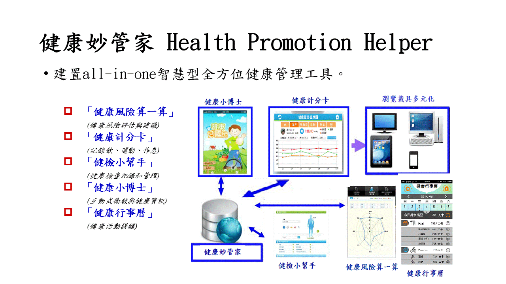
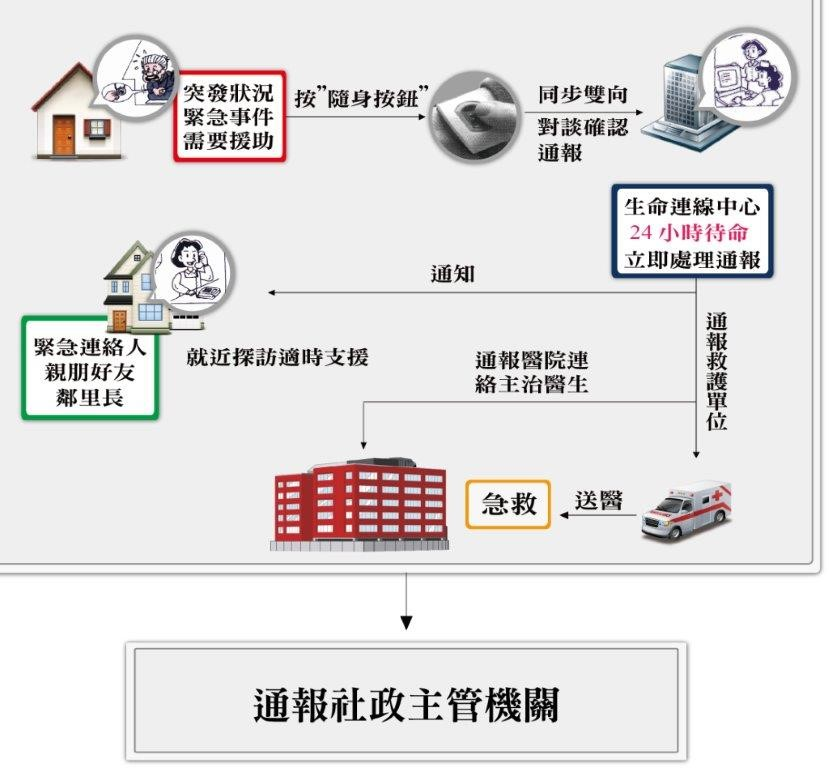

# 智慧健康照護行動計畫
#壹、背景分析
####為改善醫療服務體系，提升醫療品質、促進病人安全、降低成本、改善服務之可近性、公平性與效率，世界各國都積極投入健康資訊科技(Health Information Technology，簡稱Health IT或HIT)之發展。世界衛生組織(WHO)把eHealth定義為「應用資通訊技術(information and communication technologies, ICT)在醫療及健康領域，包括醫療照護、疾病管理、公共衛生監測、教育和研究」。WHO認為eHealth可以增進醫療的可近性和降低醫療成本，尤其對開發中國家和弱勢群族有更深遠的影響。
####為了落實「全人、全程健康照護」的政策目標，依公共衛生三段五級概念，將智慧健康照護規劃智慧健康行為促進、智慧醫療/醫院、智慧樂齡生活、智慧照護與健康存摺五大項目。
##一、智慧健康行為促進
####102年國人主要死因中，癌症(29.0%)、心血管疾病(22.1%)、糖尿病(6.1%)、慢性下呼吸道疾病(3.9%)及腎臟病(2.9%)等慢性病，佔國人死亡原因六成以上，慢性病防治為我國當前公共衛生的重要課題。
####國家發展委員會102年度數位機會調查顯示，12歲以上民眾上網率已達76.3%，使用行動裝置上網率亦達58.5%，行動化服務已成為民眾獲取資訊的來源之一 。因此，健康促進服務將以國人健康管理結合資通訊科技，落實於民眾之日常生活，並逐步朝向提供全人全家之健康服務發展。
####自2007年智慧型手機出現後，越來越多新式的無線穿戴型電子裝置開始蓬勃發展；2014年被譽為「穿戴元年」，各種新穎的穿戴式產品紛紛上市，整體市場在2014年約達3,170萬台。2014~2016年預估將是穿戴式裝置發展最為蓬勃的三年，2015及2016這兩年的成長率預估將突破100%。此一快速的發展趨勢，除已帶動Google、Apple、Samsung等科技巨頭全面投入開發外，而專注發展健康穿戴、藍牙音響與藍牙耳機的 Jawbone 與主打運動健康管理的 Adidas miCoach等廠商亦如火如荼地展開穿戴性電子裝置的研發。
####智慧型的個人化健康管理系統除提供民眾個人專屬的健康管理服務外，並可協助政府推動健康介入措施，以增進民眾實踐健康行為，改善民眾疾病自我管理，或採取健康促進行為等（NCDs Promotion），期有助於預防疾病。例如:藉由健康飲食與規律運動之健康行為來保持民眾健康體重，以降低心血管疾病及糖尿病等疾病的風險；對吸菸民眾，可以協助戒菸來減少罹患肺癌及心血管疾病的風險；對於糖尿病病人，良好的血糖控制及預防性檢查(Control)，可以防止心血管疾病、慢性腎臟病、視網膜病變及截肢等糖尿病併發症發生。另外，政府提供民眾定期疾病篩檢(Prevention)，並適時給予衛教訊息，有助於民眾儘早發現慢性疾病與進行健康評估工作。
####近年來，我國雲端科技與行動化服務快速發展，本部在符合資安規範及確保使用者資料安全下，結合雲端科技建置「健康妙管家」健康管理系統，以提供衛教訊息、健檢服務及健康風險評估等個人化服務資訊，冀望能促進民眾健康行為與選擇健康生活型態，並提升罹患慢性疾病患者之自我管理效能，同時增進及活絡我國健康產業之發展。
####「健康妙管家」是提供民眾便捷的all-in-one智慧型全方位健康管理工具，民眾可經由此工具獲得個人化互動式的衛教資訊、個人健康生活紀錄及管理(如運動、飲食、作息等)、個人健康檢查紀錄及管理、個人健康風險評估及建議，以及預防保健與健康資訊提醒等；期能提升國民健康知識技能，協助個人養成健康行為，增加疾病篩檢認知與自我控制，落實全人全民健康的目標。健康管理系統提供5大健康管理服務：
####(一)健康計分卡：提供民眾每天記錄自己的運動、飲食、作息等生活習慣資訊以及身高、體重、血壓、血糖、血脂等健康指標，以自我管理個人健康資訊。
####(二)健檢小幫手：整合民眾健康檢查紀錄(包括曾做過國民健康署所提供的免費健康檢查結果)，並提供民眾查詢與自我管理。
####(三)健康小博士：依據民眾的年齡、性別、前項健康計分卡資料及健康檢查結果紀錄，提供相對應的個人化互動式的衛教資訊，以及各地成人預防保健、癌症篩檢、孕婦產前檢查及兒童預防保健相關健康促進資源及醫療院所的服務查詢服務。
####(四)健康風險算一算：依據個人的生活習慣及健康檢查紀錄，提供個人健康風險評估及相關建議。
####(五)健康行事曆：提供民眾登錄自己的健康活動，並主動提醒國民健康署提供的免費健康檢查服務資訊，以及各地衛生機關的健康活動訊息。
##二、智慧醫療/醫院
####當病人接獲醫院通知辦理出院時，病人及家屬往往因為擔心返家後沒有足夠的照顧能力，而要求延後出院，甚者，還動用民代關說，造成醫院困擾事小，排擠疾病急性期病人就醫權益事大；況且，當醫院通知病人出院，代表疾病已穩定，持續住院只剩復健、服藥、換藥……等專業醫護依賴度較低的照護工作，所延長之住院天數，不僅增加醫院及健保負擔，也讓醫療人力不足問題更雪上加霜，連帶影響醫療品質和病人安全。
####再者，病人出院後，若缺乏有效的延續照護機制，醫療團隊未能及時了解病人服藥、傷口、飲食、情緒或各種病情進展等相關情況，便無法適時提供病人衛教或發現病情變化。若病人因未遵從醫囑或照顧方式不正確導致再入院，甚至病情更惡化，不僅影響病人健康及生活，使醫療團隊受挫，亦增加醫療資源的耗用，以及增加家屬照顧負擔。
####讓病人安心回家，需考量基層醫療3C2A (comprehensiveness, coordination, continuity, accessibility, accountability)，透過資訊科技將醫療延伸至社區，建立民眾健康需求與醫療網絡間之資訊連結，讓智慧醫療照護成為病人及家屬的後盾，可創造民眾健康、醫療資源及醫療人力之三贏局面。
##三、智慧樂齡生活
####我國人口結構呈現快速老化趨勢，82年9月底，臺灣地區65歲以上的老年人口為148萬5,200人，占總人口7.09%，已達聯合國世界衛生組織所訂的高齡化社會指標；截至104年1月底達282萬2,889人，占總人口12.04％。國發會推估將於107年超過總人口14%，成為高齡（aged）社會。114年達432萬6千人（占20%），149年更達746萬1千人（占39.4％）。
####隨著平均壽命增長，青壯年人口外移等人口結構變化，獨居老人逐漸增加，且獨居老人特別容易受到貧窮、社交隔離及健康等因素影響自立生活功能，世界衛生組織並將其定為高危險群。基此，透過網路科技的應用及產學合作，從長輩食衣住行育樂等生活面向的需求，提供研發各項智慧人性化服務，讓獨居老人生活得更安全、更健康與有尊嚴，亦可提升照顧服務效率與專業，享受智慧生活之便利性，強化其社會支持體系。
##四、智慧照護
####近年來我國已邁向社會高齡化、少子化，疾病型態慢性化，轉以強調預防保健及健康照護體系發展；又資通訊科技與雲端技術精進，結合醫療照護服務應用成熟，提供遠距智慧照護服務，民眾於家中使用遠距生理量測設備(例如血壓/血糖生理量測)，量測結果經網路傳輸至雲端照護資訊平台儲存，透過App進行即時查詢與自我健康管理；對於異常警示則以簡訊或mail電子資訊即時回饋至民眾或家人，並藉後端遠距照護單位與醫護團隊，提供即時性視訊互動照護指導或緊急支援服務，以使民眾於熟悉的社區與居家獲得健康照護與生活照護，達成健康永續與在地老化目標。
##五、健康存摺
####全民健保自84年實施，隨著民眾就醫可近性提高，以及醫療專業次專業化，分工越來越精細，就愈易發生醫療服務重複的問題。因此，為推廣「自我健康管理」之觀念，提供民眾及時完整之健康資訊及就醫時醫師之參考，健保署自103年9月推出「健康存摺」系統，期藉為保險對象儲存自身醫療紀錄，使其更重視自身健康，並負起自我健康增進責任。

#貳、具體目標
####為增進我國國民之智慧生活體驗，並同時強化我國相關產業競爭力，本章將探討智慧健康照護之具體目標。
##一、智慧健康行為促進
###(一)擴增「健康妙管家」功能10項以上。
###(二)健康妙管家平台使用人次：104年底前達1萬人次以上，107年底前超過10萬人次。
###(三)可連結健康妙管家平台之生理量測工具:104年底達3種品牌以上，107年底前超過10種品牌。

####圖1　健康妙管家Health Promotion Helper
##二、智慧醫療/醫院
###(一)短期目標：醫院與病人的連結更順暢。
###(二)中長期目標：
####1.增加病人的自我照顧能力，減少病人再住院比率、縮短住院天數。
####2.讓醫療照護延伸至家庭、社區
####3.增加病人、家屬、社區的參與
###4.連結社群，提升家人及朋友的支持
##三、智慧樂齡生活
###(一)降低獨居老人的意外風險：
####老人最怕跌倒，超過半數之跌倒意外事件均發生在居家，緊急救援系統即為簡單便利之緊急醫療救援服務，專門設計用來降低老人獨居的意外風險，當跌倒意外等緊急狀況發生時，只要按下隨身發射器，即可啟動立即自動連線至系統中心，並建立雙向的語音溝通，中心人員(護理或社工人員)檢視個人檔案，評估提供協助。104年服務目標5,000人以上獨居老人安裝緊急救援系統。
###(二)強化獨居老人關懷與照顧：
####透過緊急救援系統中心定期派員至獨居老人家中居家訪視，提供關懷、健康狀況評估，服務內容包含意外事件及緊急事件通報、救護車緊急救護通報、緊急事件聯絡人之通知、不活動狀態自主監控、社會福利資源諮詢及器材維護等服務，系統中心並將服務內容作成紀錄保存，以強化獨居老人關懷與照顧。104年服務目標關懷獨居老人30萬人次以上。
##四、智慧照護
###(一)短期目標
####1.建立慢性病社區遠距智慧照護服務模式，促進民眾自我健康監測與管理行為建立，服務目標：主要目標族群預計10萬人、次要目標30萬人。
####2.建立普及性社區遠距智慧照護服務據點，預計至少1,000個服務據點；建置150個社區日照銀髮智慧屋。
####3.建立雲端個人化健康照護資料庫，促進資訊互通共享。
###(二)中長期目標
####1.促進醫療與照護服務整合合作，達成全人照護服務，降低醫療照護費用支出。
####2.建構社區長照智慧照護屋服務，達成智慧健康與照護生活。
####3.促進智慧健康加值應用，提供多元化服務，永續健康照護發展。
##五、健康存摺
###(一)資料更豐富
####陸續新增牙科健康存摺、過敏、檢驗(查)結果、預防接種、器官捐贈和安寧緩和醫療意願註記等醫療資料。
###(二)下載更方便
####未來研擬以「健保IC卡」確認身分、增加臨櫃或據點當場下載等方式，持續提升民眾使用本系統之意願。
###(三)應用更廣泛
####持續提供open data，可結合穿戴裝置、壽險業、電信業和健康產業等加值服務應用。

#參、推動策略
####為增進國內國民之智慧生活體驗，並同時強化我國相關產業競爭力，本章將從分別就智慧健康照護項目之推動策略進行探討之。
##一、智慧健康行為促進
####健康妙管家已完成主體建置，目前正逐步驗測微調，104年1月至3月相關推動事項如下:
####(一)平台測試，包含整體測試、壓力測試及無障礙網頁測試。
####(二)公有雲環境架構規劃與雲端特性測試。
####(三)針對平台首頁介面設計以及平台功能架構進行微調，並增加健康落點分析功能(BMI落點分析)。
####(四)各業務單位教育訓練與實機操作。
####(五)推動與三個以上政府機關平台資料介接工作(台北市健康雲、食品藥物管理署食品雲、台南市健康雲、新竹市健康雲)。
####(六)進行平台推廣工作: 
####1.媒體露出:辦理記者會，介紹與展示健康妙管家平台，現場提供健康妙管家與無線生理量測裝置(含身高體重、體溫、血壓、心跳)整合之服務示範站供試用，以鼓勵民眾加入使用。
####2.社群網路訊息露出:透過國民健康署之網站與FB、各熱門社群網站、部落格等平台公告，歡迎大家使用訊息。
####3.結合縣市衛生單位進行教育訓練，於各社區中推廣健康妙管家平台，鼓勵社區民眾加入使用。
####4.透過健康職場輔導，請各事業單位雇主鼓勵員工使用。
####5.透過教育體系於大專院校推廣教職員及學生使用。
####6.辦理健康妙管家成果發表記者會，介紹與展示健康妙管家平台，並於現場提供健康妙管家與無線生理量測裝置(含身高體重、體溫、血壓、心跳)整合之服務示範站供試用，推廣民眾加入會員，並鼓勵業者投入更多健康促進之商品開發及應用。
####7.與公益團體合作，於各地之血壓、體重量測站，推動結合健康妙管家系統，共同推廣使用。
####健康妙管家將於104年4月1日至107年12月31日進行後續擴充工作，主要以功能擴充與平台端點布建為主，主要項目如下：
####(一)持續進行平台推廣工作:運用媒體傳播、社群網路訊息露出，並持續與各縣市衛生單位、健康職場、大專院校教育體系、公益團體等合作，以及與各地之血壓、體重量測站結合，推廣社區民眾、員工、教職員生踴躍參與使用健康妙管家系統。
####(二)持續與公益團體合作，廣設各地血壓、體重量測站，提供友善便捷的健康量測儀器，並結合健康妙管家系統進行健康管理，鼓勵民眾養成規律的健康量測習慣及自我管理健康，以期及早發現異常健康警訊，俾能採取健康促進行為。
####(三)滿足各族群需求，新增自我健康評量項目，例如提供兒童族群生長曲線紀錄，管理生長狀況；新增如阿姆斯勒方格表(AMSLER GRID)，以自我檢查老年黃斑部病變的方式等。
####(四)新增其他健康管理功能，例如生理量測管理(女性生理週期管理等)、體適能量測管理以及家族健康史之擴充事項。
####(五)其他專屬平台額外擴充功能，將規劃如下功能:
####1.健康小秘書:每次登入時提供量測異常或預保相關訊息等提醒，增加互動性。
####2.即時新聞及外部單位衛教資訊RSS接收，並針對健康焦點類別提供RSS訂閱功能:接收各縣市衛生局新聞及衛教資訊，民眾可透過RSS訂閱取得資訊。
####3.健檢資料介接:訂定共同格式，提供各醫療院所上傳加值會員之檢驗報告，並提供相關的衛教資訊。
####4.增加健康落點分析項目:使用健康妙管家之民眾，能立即瞭解個人生理量測值與全國民眾平均量測值之落點比較，以百分比呈現。
####5.新增Facebook登入功能。
####6.與戒菸醫療院所、戒菸社區藥局合作，推廣吸菸者使用健康妙管家提供之戒菸服務資訊。
####7.新增使用健康妙管家能集點換贈品活動，相關活動包括本署與各地衛生單位辦理之健康管理相關活動(如健康講座、健康促進活動等) ，期能鼓勵全民參與。
##二、智慧醫療/醫院
###(一)以使用者經驗導向，由疾病管理延伸至全民健康管理
####初期聚焦延續照護需求較高之病人導入照護模式，例如：心衰竭、中風復健、末期腎臟疾病、氣喘及糖尿病；中期將依使用者意見建立大部份出院病人適用之延續性照護模式；長期將擴展至全民自主健康管理模式。
###(二)以資訊科技提供智慧化的出院後延續性醫療照護模式：
####1.透過網路互動溝通平台，使病人或家屬學會居家照顧的技巧，減少出院後的焦慮害怕，也可提高其對醫療照護的滿意程度，減輕病人及其家屬的經濟與精神上的負擔。
####2.多元化互動病情管理機制：病人可至社區量測站（例如藥局、衛生所）、租賃或購買居家型、穿戴式裝置，檢測生理數據、拍攝傷口影像、登錄飲食及用藥情況、測量血糖值或血氧濃度、或將病情相關疑問上傳至病情管理系統。而此系統將設定參數，當病人之檢測數據異常時，甚至可在病況危急時，即時通知醫療團隊與病人或家屬聯絡，系統同時自動回饋相關衛教或是就醫建議訊息，醫療團隊（如個案管理師）亦可透過病人上傳之數據或影像，評估病人的病情進展、恢復進度或回覆病人提問，讓病人出院後，亦能獲得適當的持續性照護。
###(三)建立信息交換平台：
####結合社群網路平台，使病人或家屬交流學習照護的技巧，提升病人自我照顧能力，並透過分享平台及互助網路，讓家屬取得建議緩和情緒及壓力；社群中亦可提供轉介及諮詢之醫病溝通服務，讓醫療照護延伸至家庭、社區。
###(四)全民推廣教育：
####1.結合醫療保健社群，以健康資訊分享、互動，如運動APP、運動網站、健康護照等，可再配合相關集點贈好禮活動，提升民眾自我健康意識、強化預防勝於治療的概念。
####2.病人、民眾之相關健康量測數據，整合至醫療紀錄，或是藉由相關健康軟體做自我健康管理，同時也可讓家人了解被照護者之身體狀況，讓量測數據不只是監測健康，而是個人健康護照。
##三、智慧樂齡生活
###(一)定期清查列冊獨居老人：
####加強獨居老人關懷與照顧，督請各縣市政府針對列冊關懷獨居老人，應每半年至少進行1次名冊清查。
###(二)訂定獨居老人之服務計畫：
####督請各縣市訂定獨居老人加強關懷照顧計畫，並納入中央對地方政府老人福利績效考核指標。指標內容包含針對獨居老人進行清查、建立名冊與更新、獨居老人服務之鄉鎮市區涵蓋率等。
###(三)建構獨居老人照顧體系：
####督導各地方政府積極結合民間單位、志工、社區資源及社會役人力等，提供轄內獨居老人電話問安、關懷訪視、陪同就醫、餐飲服務等。
###(四)結合科技提供緊急救援服務：
####緊急救援系統其居家主機具有高敏感度雙向通話麥克風功能，聲波受訊距離可達30公尺，老人若因疾病發作或突發意外，只要按下隨身配帶之無線遙控鈕，可發出求援訊號，立即與中心社工員或護理人員通話，中心視情況轉報就近的緊急聯絡人或直接通報119，使老人獲得即時救援。目前各縣市政府主要透過緊急救援連線(流程圖如圖2、消防局或警察局(警民連線)、或結合民間單位辦理24小時老人緊急救援服務，建置獨居老人安全網。

####圖2 緊急救援連線流程圖
##四、智慧照護
###(一)建構智慧整合性糖尿病(DM)共同照護網：
####由健保署DM給付改善方案醫療院所(704家)經評估轉介之個案，提供遠距智慧照護服務，服務內容包括提供糖尿病個案行動照護裝置設備(血壓血糖量測設備)，建立24小時全天候一般健康與疾病管理之監測照護訊息回饋機制，連結個案原有照護醫療團隊，提供即時性視訊互動醫療照護服務；另發展民眾個人化需求之健康或生活照護服務，例如飲食雲端分析控制等。
###(二)建立社區遠距智慧照護服務：
####為讓長照失能民眾於社區或居家獲得持續性照護服務，促進民眾自我健康監測與管理，將於社區日照中心建立銀髮智慧屋，提供遠距智慧照護服務，內容包括具身分識別功能之生理量測器、安全感測器、活動電子化設備；紀錄電子化、資訊系統、感測器之標準及整合；健康照護、活動、飲食營養等規劃、後端醫療團隊之4G健康諮詢或緊急支援服務；雲端個人資料庫、巨量資料決策分析等。
###(三)結合縣市政府於轄區公共服務場所設置社區遠距生理量測服務據點，結合後端遠距照護服務者及醫療院所，提供前項遠距智慧照護服務。
###(四)個人健康照護雲端資料庫建立：
####為提升民眾查詢健康照護服務資訊之可近性，整合社政、衛政照護資訊系統，建置個人專屬的健康照護資訊雲端資料庫，提供查詢或整合服務之用，且藉由巨量資料提供分析，可促進多元與個人化照護服務之開發。
##五、健康存摺
###(一)推廣期(103-104年上半年)：鼓勵民眾自行下載。
####1.104年第一季：發表健康存摺
####(1)健康存摺宣導作業：透過YouTube、大型企業或人壽產業等管道鼓勵民眾下載。
####(2)新光人壽自104年2月3日起提供會員查詢健康存摺服務，為國內首家啟用。
####(3)鼓勵照護機構協助民眾以健康存摺進行健康管理。
####2.104年第二季：發展多元下載方式，除自然人憑證外，增加臨櫃或據點當場下載等方式，並研擬以健保IC卡為身分確認，擴大「健康存摺」服務取得之便利性。
###(二)精進期(104年下半年)：擴大資料範圍、提升便利性
####1.104年第三季：員工一日健康管理應用案例發表
####(1)院所檢驗(查)結果、出院病摘資料自行下載帶著走。
####(2)擴大資料涵蓋範圍，新增牙科健康存摺、過敏資料、預防接種、器官捐贈或安寧緩和醫療意願註記、檢驗（查）結果及出院病歷摘要等醫療資料。
####(3)強化資料使用規範，消弭各界對於資料應用之疑慮。
####2.104年第四季：健康管理、健康檢查應用案例發表
####(1)促進科技、醫療健康及壽險業多元發展，納入企業及科技創新，提供更人性化使用介面，成為異業創新動力。
####(2)透過大數據分析，回饋民眾及提升照護效率。
###(三)廣泛應用期(105年之後)：將健康資訊還予民眾，提供多元應用，擴大照護，創造機會
####1.動態而即時的照護資訊分享及回饋。
####2.民眾健康自主及照護產業發展之持續提升。