# 智慧城鄉行動計畫
#第一章　背景分析
####臺灣地區人口平均密度高，且人口過度集中於都會區，為提升都市治理效率，並有效縮小城鄉差距達到均衡永續發展，智慧城鄉必須運用新科技來轉換及管理系統，以最佳方式善用有限的資源，必須提高基礎設施的使用壽命，讓下一代系統變得更有效率、有彈性、有適應力。
####因應未來網路智慧發展，將融入各項ICT 技術應用，包含雲端應用服務、政府開放資料(Open Data) 模式等，提升都市管理效率、均衡城鄉發展、降低能耗及碳排放，朝向結合低碳生活、增進民眾身心健康促進城鄉永續，經研擬出智慧城鄉五大面向：智慧型建築管理、智慧型社區安全、智慧型國土環境監測、智慧型土地資料流通應用及智慧型道路管線，使城鄉更有智慧且更具效率。
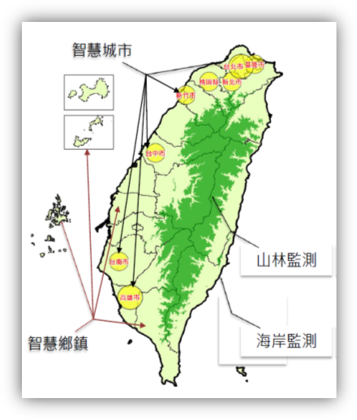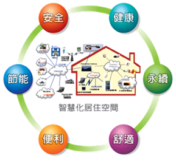
##一、國際趨勢
####參考國際智慧城市之發展案例以及近年來各國對於智慧城市之相關定義，整合分析國際智慧城鄉趨勢：
####(一) 跨政府部門、企業、教育機構、民眾參與之發展型態
####(二) 將智慧科技導入公共服務系統
####(三) 資料共享及商業模式
####(四) 低碳、永續、生態之宜居城鄉為目標
####(五) 發展智慧綠建築、社區與城市
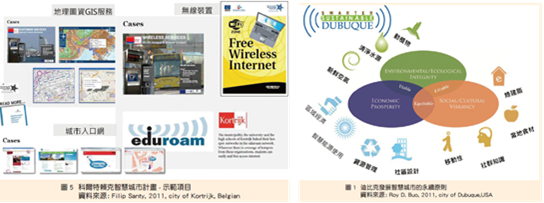
##二、國內現況與檢討
###(一) 我國智慧綠建築推動現況與檢討
####為因應全球暖化及氣候變遷問題，高齡少子化及產業發展等課題，行政院於民國90年開始將綠建築納入發展重點，核定實施「綠建築推動方案」，其後於97年擴大實施「生態城市綠建築推動方案」，而後行政院更於98年12月「行政院重大政策進度報告」會議院長裁示：為有效運用我國ICT產業優勢，以創造經濟價值，爰由經濟部、內政部就智慧綠建築產業，提出「智慧綠建築推動方案」，並於99年12月奉行政院核定實施。
####另由於近年來歐美及亞太地區等國紛紛提出智慧綠建築、智慧社區及智慧城市等創新規劃理念與對策方案，而我國推動之智慧綠建築成果雖頗獲各界肯定，惟仍多侷限於單體建築物，較缺乏對於整體社區及城市之規劃落實案例。
####因此，內政部刻正研提「智慧綠建築、社區與城市推動方案」（草案）報院核定中，期望除延續智慧綠建築現有發展基礎外，並能進一步擴大推展範疇至社區、城市，迎合國際發展趨勢發揮更大整合效益，同時達到促進產業發展及創新產業價值之目的。
###(二)我國建築管理現況與檢討
####內政部營建署依據「發展優質網路社會計畫（2008~2011年）」，自97年起規劃「建築管理資訊深化服務計畫」，並奉納入優質網路政府旗艦7安適ｅ家園計畫之項下辦理，將系統推廣至鄉（鎮、市）公所使用，務期使建築管理業務服務層面更加便捷與寬廣，並推動建築物公共安全網路申報之無紙化作業及建築圖電子化繳交作業，以利朝向未來無紙化之節能減碳目標。並自101年起推動第二代智慧化建築管理系統，建立好宅數位資料庫供應系統，強化各項便民服務。
###(三)我國165反詐騙諮詢
####內政部警政署「165反詐騙諮詢專線」（下稱165專線）於93年成立，並設立電信服務專碼「165」，民眾可隨時隨地以各種電話系統撥打165，由專線人員提供全天候反詐騙諮詢、檢舉及報案等服務，並分析最新詐欺犯罪態樣與趨勢，以及落實相關案件紀錄、查核與管制，使偵防工作得以結合，擴大打擊效能，以保護民眾財產安全
####鑒於智慧型手機日益普及，為因應社會環境變遷，有效規劃科技、便捷報案方式，規劃運用行動設備於民眾報案服務，102年12月18日啟用「雲端視訊報案系統」，藉由 WIFI、3G之連網設備，以高解析視訊方式，即時回傳現場影像，同時利用文字對談方式輔助雙向資訊傳遞，提供民眾更為多元報案管道。另透過智慧型手機標準內建的GPS系統，系統持續更新報案者所在位置，可協助快速指派最近警力到場處理。
####依我國警察職權行使法第10條規定：「警察對於經常發生或經合理判斷可能發生犯罪案件之公共場所或公眾得出入之場所，為維護治安之必要時，得協調相關機關(構)裝設監視器，或以現有之攝影或其他科技工具蒐集資料。」現行錄影監視系統(Closed-circuit television, CCTV)(以下簡稱錄監系統)，已成為各先進國家運用來協助警方偵查、逮捕與預防犯罪的主要利器。
###(四)我國國土保育保安查報現況與檢討
####全球經濟快速發展，帶動能源與自然資源大量消耗，打亂自然環境系統的碳循環，導致全球暖化與氣候變遷現象。臺灣因土地資源不當使用，自然環境遭受破壞，造成複合性災害事件明顯增加，又因地理與地質因素，地震及颱風發生頻繁，除增加了民眾住與行的安全風險外，也使得政府投入於緊急撤離、救災及復建等成本逐年增加，突顯土地資源利用的安全性及重要性。
####而防杜土地違規使用開發，一直是國土保育保安重要課題，然土地違規查報工作繁重加上人情壓力等問題，導致基層查報人員流動率高，人力嚴重不足。衛星影像因具大範圍及週期性獲取地表資料的特性，已廣泛應用於環境監測與地形地貌資訊蒐集，臺灣擁有自主性福爾摩沙系列之高解析衛星，對於全島之涵蓋及監測應用特別具優勢。因此，國內各目的事業主管機關如內政部營建署與行政院農業委員會水土保持局及經濟部水利署等機關，近年來持續利用衛星影像與變遷偵測技術輔助土地違規查報，藉以杜絕人情關說，大幅改善傳統人工查報及回報方法，提升土地違規查報工作效率。
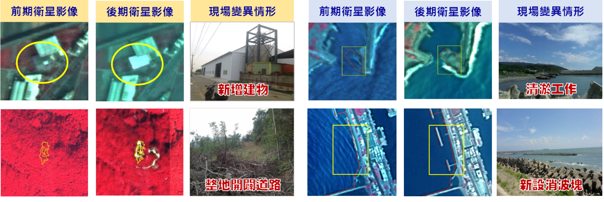
######圖1.4 前後期衛星影像變異點偵測示意圖
###(五)我國環境資源資料庫現況與檢討
####配合行政院組織改造，環保署與未來將併入「環境資源部」的附屬機關，共同合作推動「環境資源資料資料庫建置計畫」（環境雲計畫），自102年3月開始，著手規劃彙集散置各機關的環境資訊，彙集環境資源相關資料集(datasets)，建構「環境資料交換系統(Central Data eXchange, CDX)」，將原有「多對多」的資料交換模式，改為集中分享式的「多對一對多」交換模式，同時採取資料發布(publish)及資料訂閱(subscribe)的作業機制，加速環境資料共用共享。
####彙集的環境資料主要運用主題導向(subject-oriented)概念及群眾外包(crowd sourcing)等技術，激發協同合作的創意，未來可望藉此提昇並擴增資料整合質量。目前已就中央氣象局、經濟部水利署、行政院農業委員會水土保持局及環保署等機關，統整332項資料集。
####配合行政院的開放資料政策，環保署在102年10月間完成「環境資源資料開放平臺(opendata.epa.gov.tw)」，目前已累計155項資料集，內容涵括全國各地的空氣品質及紫外線的即時監測值、全國河川及水庫水質監測值、列管污染源基本資料、環境影響評估案件摘要等，已有超過1,400萬次的下載引用紀錄。
####藉由擴增環境開放資料，環保署已發行「環境即時通」APP，除了提供環保署生產的環境資料外，並將不同部會所生產的環境資料做整合應用，包括大雨特報、淹水警戒等防災訊息，達到即時服務的目標。環境即時通APP提供適地性服務(location-based service)，系統會根據使用者所在的位置，提供當地的環境相關資訊。
####環保署為激發民間運用環境資料的能量，將持續擴增開放資料的範圍及數量，供公眾串聯其他政府開放資料，共創資料價值。另為因應網路、行動通訊和社群網站的快速發展，以及公民參與意識興起，環保署亦規劃建立實體世界跟網路世界的平台與橋樑，透過多元管道廣泛納入外界意見。此外，由於新興資訊科技的發展，使的分析巨量資料具備可行性，環保署亦規劃藉由探究巨量資料內涵的意義，據以進行政策的調整，期使政策更貼近民意，施政效能更為優化。
###(六)我國國土基礎圖資服務現況與檢討
####國土資訊系統是一項全面提升政府部門空間決策品質與行政效率之利器。各級政府機構隨時都有許多影響我國經濟發展及生活品質的空間決策行為，從大到五輕、六輕是否興建？在那裡興建？海埔工業區之發展、高速公路、鐵路之興建、捷運系統、水利及防洪設施、國民住宅等之興建、以致小到各級地方政府公共建設之推動、垃圾掩埋場之選址及興建等，均牽涉到區位之選擇問題。而區位選擇是一項十分複雜的空間規劃決策過程，好的區位將可收事半功倍之效，而不好的區位可能未見其利反受其害，糾紛困擾無窮，推動不易。而要達到區位決策科學化之境界，則需要引進「地理資訊系統」才有可能實現。地理資訊系統的觀念及應用已經深植於各級政府部門內，其發揮的功效如決策之透明化、決策之品質提升、行政效率之提高，均有目共睹，深受政府、學術及企業界之肯定。
####現今資訊社會的發展端賴社會中不同資訊的傳遞，資訊的彙集進一步產生知識，流動的知識直接或間接地影響人類社會生活及國家經濟，是以資訊的製造、處理、散布成為世界各國主要的經濟活動之一。國家與其政府機關憑藉著財政收入與握有的社會資源，成為資訊的最大擁有者及創造者。為了確保人民知的權利，落實民主制度，以及追求資訊時代下知識力量散布、創造與發揮，政府將本身所製造之資訊公開、政府機關間串連供應進而提供相關便民施政業務所需，如此便民供應資訊之流通可推動資訊社會追求知識經濟的需要，為能發揮其資訊價值，供民眾掌握知識的力量，應推動對資訊有效的再利用方式並促其發揮資訊潛而未顯的內蘊價值。
####在國土資訊系統推動方面，地籍資料向來為國土資訊系統中之重要核心圖資，如何優質提供地籍資料攸關者國土資訊發展品質與否。而地籍資料來源係由地政事務所蒐集產製，直轄市、縣(市)政府則將所轄地政事務所之地政資料，透過傳輸機制建立同步異動資料庫，再由內政部地政司透過應用程式，以排程方式將各直轄市、縣(市)地政資料透過全國地政資訊網路傳遞到「全國土地基本資料庫」，進而運用該資料庫提供各行政機關進行各項政策制定、政策推動或相關資料統計分析，在此機制架構下因應知識經濟特性，應予以提升資料品質、進而創造可再利用之相關資訊服務供應機制，以活化資訊運用之價值。
####除地籍資料外，內政部國土測繪中心辦理國土資訊系統核心及基礎圖資測繪工作，其中為提供我國國土資訊系統高度共用之基本底圖，自96年起辦理通用版電子地圖建置，為政府機關首度產製的電子地圖，內容以最基礎且經常使用的地理資訊為主，較一般市面上電子地圖測繪精度提高甚多、測繪內容更完整。為有效整合管理各類圖資，並使圖資得以被流通應用，自95年起整合處理陸測、海測、空照（衛星）三度空間測繪資料，建置國土測繪空間資料庫，以「國土測繪資訊整合流通倉儲服務網站」將整合處理後測繪資料透過資訊流通共享機制，提供政府及民間使用，並發展「國土測繪圖資網路地圖服務系統」，發布WMS、WMTS及Web Map API，方便各界介接應用。未來為配合資料開放及雲端技術發展，將推動測繪資料標準化及建立雲端管理維護與流通機制，以多元網路發布方式作為資料交流與供應管道，迅速提供各界正確之測繪資料，作為國家建設施政基礎，協助國家邁向現代化與科學化，成就智慧家園。
###(七)我國公共管線資料庫管理供應現況與檢討
####內政部營建署自民國97年度起，分年分期推動「公共管線資料庫管理供應系統及擴充建置計畫」，補助各機關逐步執行公共設施管線調查及其資訊管理系統之建置，以加強管線管理。至103年度止已陸續補助21個地方政府道路主管機關進行整體規劃作業、公共設施管線調查、管線資料庫及管理供應系統建置暨監審作業，目前各機關均藉由分年分期之推動計畫積極進行公共設施管線資料庫之建置作業。而其配套之道路挖掘案件管理系統，至目前22個地方政府道路主管機關均已建置完成並依其推動區域陸續上線運作。
####目前各地方政府挖掘案件管理系統之管理作為已逐步進展，故相關案件資訊的完整性、正確性及即時性係為下一階段推動之重點，因民眾對於管線施工管理之作為大為重視，有必要將此基礎資料建置作業之成果轉化為民眾有感之資訊，爰擬建置「市區道路管線挖掘工程資訊整合發布平台」，提供民眾多管道之管線工程施工資訊及加值應用。
####目前各管線機關及地方政府道路主管機關於各自之道路挖掘平台上進行施工申請、審核、發證及管制，並於各自便民資訊網站上發布施工訊息（但無跨縣市之資訊，應用上仍有所受限），因需透過特定建置之網站查詢，故施工之相關資訊仍須大眾至網站查詢才能明瞭，資訊雖有公開，但仍無法迅速及普遍讓民眾瞭解相關之施工資訊及影響，故尚無法達到便民之積極目的及成效。故須進一歩更強化便民之具體措施，並與各機關現有資源合作，達到以有效經費運用來獲取最大之使用效益。
####目前市區道路管線施工資訊尚待整合之課題如圖1.5所示。
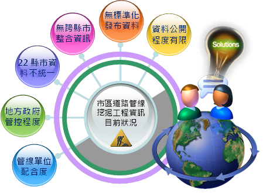  
######圖1.5　市區道路管線施工資訊整合課題

#第二章  具體目標
####綜觀國內城鄉發展現況，因應智慧城鄉之永續發展策略，建議五大面向具體目標如下:
##(一)建築智慧管理化服務
###1.	短期目標：創新資訊多元化，提升建管服務價值
####(1)整合系統包含建築執照申請書表系統、建築物地籍套繪系統、建築圖影像管理系統、施工管理系統、建築物公安檢查及申報系統、公寓大廈組織報備、昇降機械停車設備及違章建築管理系統等，含括多種建築管理資訊。
####(2)制定建築物公開資料格式，提供政府開放資料(open data)
###2.	中長期目標： 
####(1)建構建築管理資訊共構機房系統，促進建築資訊透明化。
####(2)整合跨機關建築物相關資訊，例如消防安全、商業登記、目的事業設立許可等資訊，提供民眾公共建築物關心資訊
##(二)推動智慧綠建築、社區與城市
####為使我國推動之智慧綠建築能與4G智慧寬頻應用城市結合，以進一步提升智慧綠建築推動效益及發揮我國ICT產業優勢，實有賴深化推動智慧綠建築與進行智慧綠社區創新實證，方能達此一目的。
####所謂「智慧綠社區」主要是以建置節能低碳、生態環保之社區環境為基礎，並以使用者需求為出發點，利用資通訊科技及雲端技術等，使社區可以達到節能永續並提供符合使用者需求的優質生活環境。至於社區的範圍與規模，則採用較為彈性的界定，基本上可以是數棟建築物的組合、一個或數個街廓、校區、工業園區或甚至是一個鄉鎮，將視未來實證計畫之規劃及整體計畫之目標與實施範圍而定。本項整體目標有以下三項：
###1.	加強節能減碳，促進環境永續發展。
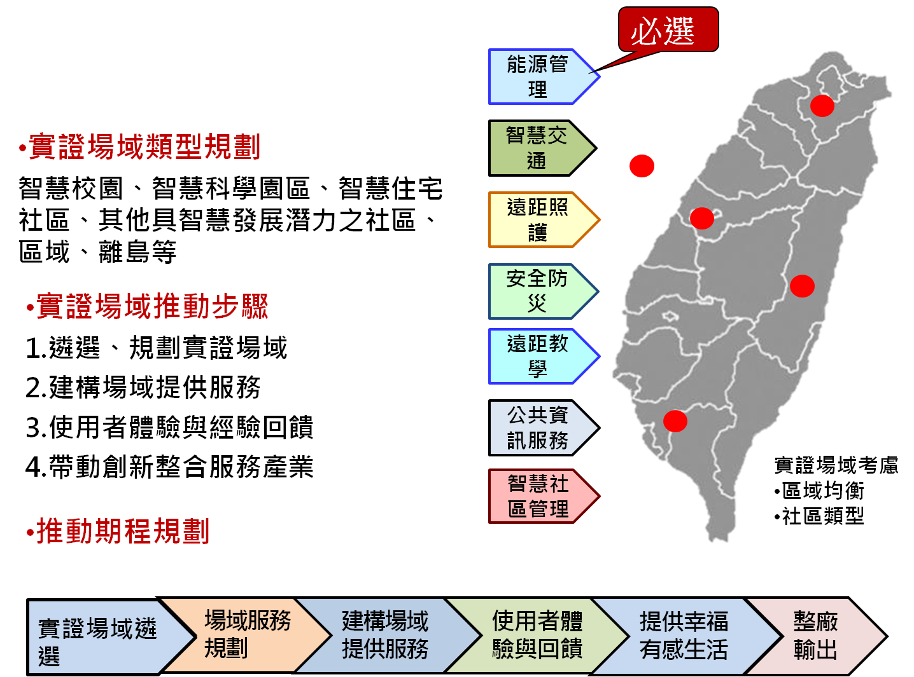
######圖2.1　智慧綠建築社區實證計畫
###2.提供符合民眾需求的優質服務，提升人民幸福感受。
###3.擴大產業整合及技術提升，促進產業競爭力。	
##(三)社區居住安全監控機制
###1.多元全民反詐騙及網路購物安全作為
####(1)建構優質民眾諮詢與報案，防範詐騙發生：
####以優質服務為導向，成為詐欺犯罪諮詢與報案專責窗口，接獲民眾來電時提供詐騙問題解惑、防騙建議及同理關懷，並協助被害民眾轉介至轄區派出所快速完成報案手續，提升民眾服務品質。
####(2)擴大參與合作，與超商建立聯防機制
####詐騙集團經常詐騙民眾至超商轉帳、傳真接收假公署公文、購買遊戲點數，為因應遊戲點數衍生之詐騙犯罪問題，165專線積極整合協調國內四大超商（統一、全家、萊爾富、OK）配合注意民眾可能遭遇之受騙徵候，適時關懷提醒民眾，如發現詐騙車手則撥打165或110通報警方到場緝捕，防範民眾遭受詐騙。
####(3)強化網路詐騙聯防機制，減少網路案件發生
####駭客入侵盜取個資事件層出不窮，個資外洩已成為詐騙關鍵源頭，除協請主管機關經濟部加強電子商務交易安全管理外，並與網路相關業者建立情資交換平臺，蒐集分析業者發現異常資訊，可快速通報業者加強監控，達到預警效果，防止詐騙事件擴大。
####(4)強化金融機構臨櫃關懷機制，結合金融聯防體系
####金融機構依照165專線所提供最新反詐騙徵候資訊，強化臨櫃關懷提問工作，如發現民眾異常匯款及提領大量現款時，利用填寫「臨櫃作業關懷客戶提問表」，藉以拖延提(匯)款時間，並通知轄區派出所進行護鈔，結合線上警力及時攔阻詐騙款項遭到提領，防範詐騙集團趁虛而入。
####(5)利用社群強化反詐騙宣導，落實全民反詐騙工作
####為提升反詐騙宣導廣度，165專線除建置專屬網站公布防騙資訊、協請電信業者發送宣導簡訊及利用公開場合設攤宣導外，並自103年起陸續成立165反詐騙諮詢專線之LINE官方帳號及Facebook粉絲團，透過時下最普遍之網路力量宣導反詐騙訊息，與民眾互動交流。
####(6)建構詐騙感知地理情資系統，提供最新詐騙情報
####未來適度公布最新詐騙手法、活動網站、詐騙電話與金融資訊，提供民眾具體了解生活中相關詐騙地理情資，並透過社群分享與宣導概念，提供民眾最新詐騙情報，提升民眾反詐騙認知。
###2.提供便捷智慧報案快速管道
####「雲端視訊報案系統」，可將民眾手機衛星定位（GPS）顯示於e化勤務指管系統中地理資訊系統（GIS），受理員警不僅更快知道報案者所在位置，同時結合雲端視訊功能，立即瞭解現場狀況，並迅速派遣警力前往救援，使民眾獲得最安心、最即時的協助；經統計100年至103年，員警平均到達現場時間，均能在本署規定10分鐘內抵達報案現場。
###3.建置治安錄影監視器系統
####(1)各地方警察機關依據警察職權行使法及本署所訂頒基本規範與注意事項，選定適當地點建置錄監系統。各地方警察機關建置錄監系統後，對於錄影資料依地方權責及相關法律管理運用。
####(2)由於錄監系統鏡頭若無所不在，部分國人擔心個人隱私受到侵犯，出現加強對錄監系統進行管理的聲浪。因此，如何兼顧社會治安和個人隱私，一直是需審慎面對處理的議題。
##(四)國土利用監測資訊整合
####鑒於營建署、水保局及水利署等機關運用衛星影像及遙測技術協助辦理業務職掌範圍土地利用監測工作時，因業務需求不同，而有重複購置衛星影像，或監測頻率不同及使用衛星影像解析度不一等情形，造成資源無法共享應用。為妥善運用跨部會行政資源，內政部爰自103年度起交由內政部國土測繪中心辦理整合營建署、水保局及水利署等機關監測工作，透過整合各機關監測資源，減少政府資源重複投入，擴大使用效益。短期及中長期具體目標如下：
###1.短期（1~2年）︰
####為能讓國土監測資源及成果能相互共享及流通，經整合營建署、水保局及水利署等機關國土監測行政資源，自103年起，提升各機關監測頻率至每2個月1次及統一監測使用衛星影像解析度為1.5公尺至2.5公尺，全面辦理臺澎金馬地區土地利用監測工作，同時滿足水利署提高部分地區監測頻率（每1個月或2週）頻率需求，相較營建署以往監測頻率為3至4個月1次，或水保局以往使用解析度為8公尺至10公尺衛星影像辦理監測工作，更擴大整體使用效益。
####另103年已完成規劃國土利用監測整合通報查報系統架構及運作機制，預計104年完成監測整合通報查報系統開發，未來各機關可透過整合系統接收變異點資訊及回傳查報結果，並提供跨機關間變異點移轉及資訊傳遞溝通之有效平臺，減少以公文方式傳遞時間及行政程序；另新加入監測整合機關亦可直接加盟使用整合系統執行查報回報工作，無須再各自開發通報查報系統，各土地管理機關也可透過整合系統接收變異點資訊提供業務管理需求。
###2.中長期（4年）︰
####國土資訊系統對於土地動態變遷資訊之提供向來是較欠缺的一環，為因應現今國土整體規劃發展趨勢，除持續且定期從事土地利用監測工作外，並將建置完整的監測時態資料庫，讓全面性及持續性土地變遷資訊納入國土資訊系統，提供國土規劃、國土復育、國土保安、國土監測及防救災所需基本圖資，並因應各土地管理機關業務需求，提供對政府有用的決策資訊及技術服務支援。
####未來除持續辦理常態性國土監測工作外，並將配合相關機關之業務需求，以衛星影像為基礎辦理加值應用，並逐步整合各機關通報查報系統，同時積極邀請義務志工與民間團體共同參與，讓各界一同為家園齊盡心力，減少土地違規使用情形，達成國土永續發展的目標。
##(五)環境資料整合共享
####參酌資通訊科技發展及應用趨勢、環境治理業務特性，並檢視公共政策與網路族群之聯結關係，規劃3項短期（1~2年）策略構面：1.擴大資料開放2. 深化資料加值3.促進公眾參與，以達成「整合環境資料，共享多元環境資訊服務」之目標。
###1.擴大資料開放
####政府資訊公開是公共政策溝通的基礎工作，而開放資料(opendata)是運用網路科技落實資訊公開及提升資料價值的具體手段。藉由各類環境資料開放，讓公眾便捷取閱，有助於凝聚環境保護施政共識。未來在現有環境資源資料整合計畫（環境雲計畫）基礎上，除需加強業管資料蒐集及提升資料品質外，必須將資料轉化成公開的標準格式，供網路社群擷取運用。
###2. 深化資料加值
####環境資料具有數量龐大且格式異質的特性，未來宜運用新的資料處理方法，及適當的計算資源，尋求資料分析的新型態詮釋方式，並且探究跨越原始資料項目的交叉分析，可能得出資料原始目的以外的解讀意涵，期能提出契合科學論據之環境治理政策措施。
###3.促進公眾參與
####因應網路世界意見表達方式的多元及聯結特性，各項環境政策必須善用網路工具，徵集公眾意見，掌握民意取向。未來除配合國家發展委員會「公共政策參與平臺」相關作業，以廣納民意，同時必須適當運用工具，蒐集網路社群輿論並進行情資探勘，作為政策研擬推動之參考。

 
##(六)土地基礎圖資流通應用服務
####根據聯合國2010年全球電子化政府調查報告顯示，電子化政府的兩大重點在於「以民為本」及「電子化服務發展」，換言之，世界各國政府認知電子化政府對於企業、社會和民眾的重要性，莫不大力推動改善網路基礎建設、普及線上服務、以民眾為核心提供客戶導向服務。茲從策略、服務提供與技術3面向綜整政府服務發展趨勢：
###1.策略層面
####(1)以跨機關流程整合、服務簡化與創新策略，推動政府資訊資源整併共用及民眾服務導向服務。
####(2)以基礎長期深化策略，推動基礎建設、互通與標準等重點工作。
###2.服務提供
####(1)從主動及全程服務觀點，強化對於非地政行政機關資料提供。
####(2)應社會經濟發展趨勢，透過資料鍊結強化公民社會參與深度、提高民眾生活便利性。
###3.技術層面
####(1)運用雲端運算與無線寬頻等新興技術增加互動式服務。
####(2)資訊安全、互通性服務、單一識別與數位認證等基礎服務持續深化及扮演地政資訊服務關鍵角色。
####土地基礎圖資流通應用服務短、中長期目標如下。
###1.短期（1~2年）︰
####(1)強化全國土地基本資料庫同步機制
####按各機關需求地政資訊之需求量不僅越來越多，其應用範圍亦越來越廣，使得全國土地基本資料庫不勝負荷，因而在服務及資安的考量下，優化土地基本資料庫同步機制，並提升各直轄市、縣(市)政府至全國土地基本資料庫的傳輸、接收及對外提供資料之基礎環境設備。
####(2)建構地籍資料交換平臺
####全國土地基本資料庫為因應需用圖籍機關多元化的地政資料需求，規劃建置地政資料交換流通服務，運用網際網路結合自然人憑證認證，將地籍圖籍及加值後之圖資批次提供政府機關或民眾線上申請、申請核准通知、資料產製進度查詢、處理結果通知及自動下載所申請之地政資料，提供便利地政e資料批次檔案提供服務。惟現行配合行政院推動政府資料開放（OPEN DATA）政策及各行政機關越來越多系統間線上介接服務的需求，整體地籍圖資對外提供將加強擴充整合為「地政資料交換流通平臺」，並研擬規劃每半年發布一份全國「地籍圖」開放資料(open data)，提供民眾或產業界應用需求。
####(3)建立資料分析決策管理服務平臺
####地政事務所之登記、測量、地價、地用、案件管理等作業乃為最重要之基層地政業務，地政單位所建置及含括之地籍相關資料實為政府各部會決策之重要資訊資源，近來各部會施政執行相關業務需求，例三七五耕地租約、機場週邊土地權屬、歷年夫妻財產聯合申報案件、特定機關公有土地權屬、不動產實價買賣趨勢與奢侈稅關係等需求，因「全國土地基本資料庫」資料量龐大，如無相關資訊技術輔助，無法因應現今決策管理之需求，提供有效的資料收集、過濾並發現問題。又面對突發多變的業務統計需求時，常需花費大量人力、時間彙整資料，爰此將規劃建置統計分析決策管理服務平臺，結合系統在大量資料之查詢與快速資料運算及分析能力的優勢，協助決策人員在面臨問題時，能有效獲取足夠資訊進行良好的決策。
####(4)修正「不動產成交案件實際資訊申報登錄及查詢收費辦法」
####爲符合Open Data之不可撤銷性，將修正「不動產成交案件實際資訊申報登錄及查詢收費辦法」，排除僅當期發布之新增實價登錄批次資料為免費下載之規定。
####(5)整合處理國土測繪資料，建立時態綜整機制
####為確保資料本質之正確性、豐富性及完整性，整合處理與檢核各類國土測繪成果及作業過程產出之測繪資料，將部分資料雲端化，並落實時態資料的綜整機制，以有效管理國土測繪空間資料庫，並有助於圖資服務的多元性及即時性。
####(6)提升「通用版電子地圖」維護效率
####「通用版電子地圖」是政府機關首度自行產製的電子地圖，涵蓋貼近民眾生活的各類空間地理資訊，故為使地圖內容能即時反映現況，將規劃以納入行政流程之方式輔助更新通用版電子地圖，提升維護效率。
####(7)強化使用者溝通反映管道，共同維護圖資內容
####內政部國土測繪中心存管之測繪圖資眾多，而圖資之對外發布必須經對位、坐標轉換或屬性資料連結等各項處理作業，所耗費之時間、經費、精力、人力皆龐大，因此將於各圖台加入圖資問題反映專區，期能透過各使用者力量共同檢核圖資內容，確保圖資正確性。
####(8) 智慧門牌應用推廣
####全國門牌地址定位服務於98年建置完成後，多年來均持續檢視整體服務優缺點及各界使用者的回饋，並與時俱進不斷地維持滾動式調整，讓定位服務能夠更貼近使用者的需求，目前主要服務項目有地址查詢坐標位置、坐標查詢鄰近門牌、門牌清單查詢及批次比對功能等4種，而在103年導入了雲端科技後，使以往的技術瓶頸能有效改善，得以開發及擴充線上服務，為定位服務注入更多能量，藉由本服務協助建立國土資訊系統所需的圖資資料，促進政府機關提昇決策環境品質及民間業者對應用系統的開發，並提供民眾簡易便捷的服務；同時也期待能加速各項空間圖資的加值應用，俾利國內空間資訊系統產業升級及其研發能力，開創更大的加值效益，並協助政府的各項決策研擬與提升施政品質，讓民眾真正地享受到便利的服務。
###2.中長期（4年）︰
####(1)建構地政整合資訊服務共享協作平台
####「地政整合資訊服務共享平台」以服務共享為基礎所建置，其提供的地籍資料相關服務基礎為前述工作項目全國土地基本資料庫中記載土地完整登記及圖形的資料，深受各機關單位所信賴並已供應許多應用系統介接使用，惟鑑於各機關對地籍資料的應用方式皆因業務的差異而有所不同，也受限於服務查詢的方式而必須採用大批資料查詢的作法來滿足需求，未來發展上將強化地籍服務API以及建構協作平台提供流程設計、組裝的概念來賦予服務創新的能力，以達能提供更精準的資料給予各類應用使用，提供民眾或產業界API介接服務，活化地籍圖資加值應用。
####(2)推動不動產交易資訊服務
####橫向結合其他機關提供「不動產說明書」應註記的資訊及一般民眾對於不動產標的物所需的其他資訊；提供民眾或產業界API介接服務，促進業界活化不動產交易資訊，進一步提昇民眾獲得更多元豐富的交易標的相關資訊。
####(3)打造全方位圖資網路商城 
####為強化圖資流通供應，將完善圖資相關系統之資料檢索及瀏覽機制，提供更為人性化、簡潔化之圖資展示及申購環境，成就全方位圖資網路商城。
####(4)發展多元圖資網路加值服務
####針對測繪資料加值應用領域，分析測繪資料市場潛力，並分析測繪資訊加值內容、加值應用運作模式，規劃測繪資料各項加值網路服務，利用多元檔案類型、國際通用格式標準及雲端運算技術，快速滿足各介接平台需求，強化網路服務豐富度。
####(5)促進圖資三維化，提升空間運算能力
####為展現各圖資擬真效果，改善二維地圖展示平台僅能平面展示或藉由影像圖片表達實地情況之缺憾，將辦理二維圖資三維化，並運用跨單位協作機制，提供高立體、高擬真、高空間運算能力之網路地圖服務。
##(七)市區道路管線挖掘工程資訊整合
####本項市區道路管線挖掘施工資訊可做為彙集資料的供應端，即建立發布平台將由地方政府彙集之施工資訊，透過地理資訊平台發布，例如提供予交通部之全國交通即時路況資訊，應用於交通分析及導航設備。除此之外，可進一步強化市區道路管線施工資訊之應用，透過建構全國市區道路管線施工智慧網即時資訊，強化與各地方政府之合作，透過網頁、郵件、App等不同管道及載具，主動發布予訂閱民眾最新之施工資訊及警示訊息，以避開施工路段，以達到管線結合施工資訊之智慧化通報之便民目的為執行目標。故擬定之具體目標如下︰
###1.短期（1~2年）︰
####評估 22 個縣市之市區道路管線施工資訊管制情形，建構全國「市區道路管線施工資訊便民服務平台」之基礎軟硬體環境，依縣市轄區管制狀態及進度，提供一般性靜態施工案件（如施工期程、施工單位及管理單位等）資訊予民眾查詢及利用。
###2.中長期（4年）︰
####考量各地方政府之管理系統發展成熟度、資料庫建置完整度、管線施工案件管控程度、管線單位之配合度及民眾需求殷切度等，分年分區逐步完成與全國 22 個地方政府施工即時資訊之介接工作，提供民眾一站式查詢全國統一之市區道路管線挖掘施工即時資訊，並透過與交通部之跨單位合作，將資訊交換至交通部提供全國之交通即時路況資訊進行統一發布，以應用於交通分析及導航設備之服務。
####故整體計畫之5年具體目標為 105 至109 年分期分區完成全國市區道路管線挖掘資訊之介接及發布。整體平台之應用情境示意如圖2.1所示。
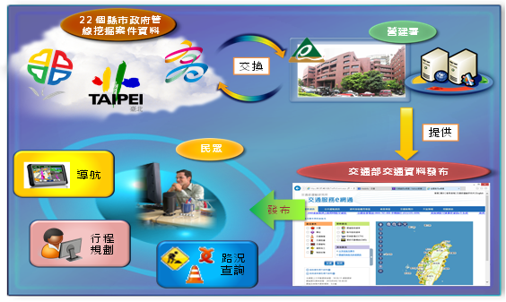 
######圖2.2　市區道路管線施工資訊之應用情境示意圖

#第三章  推動策略
####五大面向依據目標擬定之推動策略內容如下︰
##(一)	建築智慧管理化服務
###1.短期（1~2年）:
####(1)建立全國「安心建築」數位資料庫供應系統
####建立全國「安心建築」數位資料庫供應系統、推動建築管理智慧化審核系統、發展智慧化綠建築分析評估系統推廣、輔導上線、人員訓練、作業流程規範等電腦化作業，並建立「好宅」資料庫數位化及相關設備維護。
####制定建築物公開資料格式、資料發布及查詢標準，推展建築物資訊公開及應用服務，藉由建築物公開資料(Open Data)，提供分眾服務(開放予民眾、住宅政策擬訂機關、住宅補貼執行機關、房仲業、銀行業等查詢或加值應用)，結合民間資源，健全加值運用和連結，以利資料交流及資源共享。
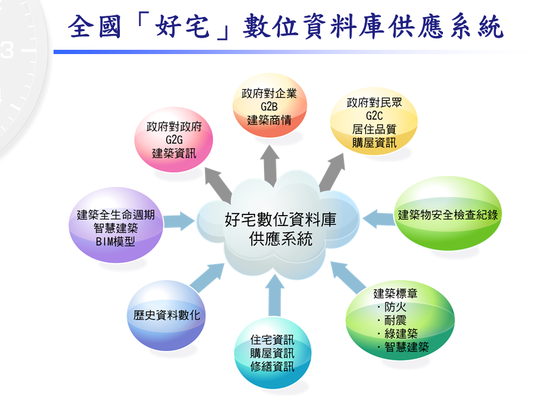](5031.png)
######圖3.1　全國「安心建築」數位資料庫供應系統

###2.短期（1~2年）:
####(1)建構建築管理資訊共構機房系統
####建置建築管理應用導向服務系統，包含資安檢查層、硬體架構層、應用系統層及儲存服務層等層面，整合各縣市政府之建築管理資訊，使建管服務人員、其他政府部門、建築行為人、一般民眾及民間業者均得透過建築管理資訊共構機房系統取得所需資料。
####(2)整合跨機關建築物相關資訊
####整合跨機關建築物相關資訊，提供民眾對建築物關心的資訊。
|建物合法安全|1.使用執照　2.室內裝修合格證明　3.土地使用分區管制　4.消防安全　5.公安申報　6.營業範圍標識圖與緊急逃生路線圖　7.公共意外責任保險 |
| -- | -- |
|商業合法 | 1.商業登記　2.目的事業設立許可[醫院/補習班/飯店…]　3.特許職業登記(醫師/藥師/按摩技術士/…) |
######表3.1　民眾對建築物關心的資訊
####依據上述具體目標及推動策略將能獲致之預期效益包含︰
###1.擴大建築管理資訊應用：
####促進建築資訊透明化及服務多元化。
###2.提升建築管理業務革新：
####藉由建築管理智慧化電腦輔助審核推動，提升服務簡化、制度創新及流程再造。
###3.強化便民服務：
####提供民眾更即時透明化建管資訊，以提升服務滿意度、使用率及主動、互動服務等各項便民服務措施。
###4.達成節能減碳環境：
####建構全國建管資訊共構機房系統，減低系統維護成本、機器設備成本及能源使用成本等，達到節能減碳目標。
##(二)推動智慧綠建築、社區與城市
###1.進行創新技術研發以提升產業競爭力
####為更進一步提升建築物節能效率，進行智慧化節能創新科技及相關產品研發，並研擬制訂相關系統及設施標準與規格，以期能研發出更具智慧化、節能效率更佳系統技術及設備產品，以促使建築環境能更符合節能減碳目標。
###2.健全法制規範以消弭產業發展限制
####為全面推動智慧綠建築產業發展，進行檢討評估相關法制、規範、機制及措施內容，針對有危害、限制產業發展部分，或對於推動產業發展有不足部分，均進行研修訂。
###3.培訓專業人才以滿足產業發展所需
####為推動新興產業政策，首要需求之一即為相關專業人才，藉由進行講習培訓、相關產業技術應用輔導及產學研合作機制等，以促使相關領域範疇之人員能有更進一步之認知，有助於落實政策及滿足產業發展所需。
###4.辦理示範應用推廣以帶動產業發展
####藉由掌握智慧生活環境發展需求，發展於建築物導入綠建築設計、智慧型自動感測、居家安全、能源監控、省水、保全、消防及健康照護系統等高科技產品設備情境概念與試辦建置等示範應用推廣，以普及智慧綠建築概念並帶動相關產業發展。
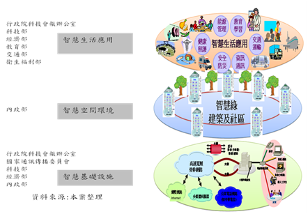
######圖3.2　推動智慧綠建築、社區與城市整體策略架構
##(三)社區居住安全監控機制
###1.多元全民反詐騙及網路購物安全作為
####(1)橫向強化跨部會合作，建構詐騙防制網絡：
####整合現有「反詐騙聯防平臺會議」、「電信技術諮詢小組會議」、「金融治安聯繫會報」、「防制網路詐欺犯罪工作小組會議」等跨部會平臺力量，並結合電信業者、網路業者、金融機構等跨單位組織，形成一防制詐騙犯罪網路體系，並制定賡續執行「警示帳戶聯防機制」、「電信聯合服務平臺」相關運作，以強化防制詐騙犯罪功能。
####(2)建置數位資料庫，提升偵防效能：
####建置受話諮詢報案記錄資料庫、被害筆錄資料庫、停話資料庫、人頭資料庫、警示帳戶個資交換資料庫，有效處理每日民眾檢舉的大量資訊，並予以數位化紀錄與歸類，分析發話源頭、帳戶關聯性及犯罪態樣，提升165反詐騙專線服務效能。
####(3)協調電信監理單位，有效阻斷非法話務：
####快速停話作業：停話作業全面採電子化作業方式，透過「快速停話作業系統」通報電信業者將詐騙電話立即停話，有效縮短作業程序並杜絕歹徒犯案。
####增加犯罪困難度：針對詐騙電話實施停話且限制預付卡門號申請及販售數量，使歹徒不易取得人頭電話而增加犯罪困難度，以減少詐騙電話。
####彙整民眾所舉報165專線之詐騙電話號碼，針對國際詐騙來話進行特徵值分析，並提供各電信業者於國際交換機實施白名單過濾攔阻機制，以降低民眾接獲詐騙電話之機會。
####(4)警示不法帳戶，阻斷非法資金流通：
####規劃建立「警示帳戶聯防機制」並以165專線為聯絡中心，主動發掘詐騙犯罪金融工具，並透過圈存止扣方式，即時追回民眾被騙款項，使匯（轉）入詐騙帳戶設定警示，阻斷被騙款項流出，防杜被害發生擴大。
####(5)與網路業者建立異常情資交換機制，提早預防詐欺犯罪發生
####網路交易與社群媒體活動已成為許多民眾日常生活之重心，然詐騙犯罪發生常肇因於網路業者個資安全管理漏洞，而衍生網拍詐騙或解除分期付款詐騙案件，為減少此類案件發生，達到預警效果，165專線正積極透過國內各社群與網路平臺業者合作，定期分享最新詐欺情資，並透過交流與加強聯防合作機制，有效預防網路犯罪發生。
###2.提供便捷智慧報案快速管道
####(1)內政部警政署為加強宣導民眾使用智慧手機「雲端視訊報案系統」，將持續要求各警察機關加強民眾宣傳，並於該署「健全勤指功能督考」檢核，俾廣收成效。
####(2)提供便捷智慧報案快速管道，建立資訊分享平臺，加強透過網路媒體與民眾增強互動，結合各網路平臺強化聯防與通報機制。
###3.建置治安錄影監視器系統
####(1)目前各直轄市、縣(市)政府設置錄監系統位置、數量、方向、拍攝範圍均由各直轄市、縣(市)政府警察局依轄區特性、治安狀況、交通流量等狀況與需要，應經實地會勘評估後設置。
####(2)各直轄市、縣(市)政府訂定治安要點錄影監視系統管理規定，規範錄影資料管理事項，遇有個人資料之利用，應依「個人資料保護法」等相關規定辦理，以確保民眾權益。
####(3)建置兼顧治安與隱私權之錄影監視系統，廣納民眾意見，減少民眾疑慮，強化偵查效能。
##(四)國土利用監測資訊整合
###1.短期（1~2年）:
####(1)定期監測土地利用
####運用高解析衛星影像及遙測技術，以2個月1次監測頻率辦理臺澎金馬地區土地利用變遷偵測及通報作業，同時配合水利署業務需求提高部分監測頻率，並每年辦理2期海岸線及海域區變遷偵測及通報作業，掌握國土變遷動態資訊，遏阻國土破壞行為。
####(2)監測資訊整合管理與應用
####更新維護衛星影像光譜樣區資料，有效提升衛星影像自動化判釋，縮短變遷偵測作業時程。
####建置國土利用監測整合通報查報系統，並啟動整合通報查報系統與各機關現有通報查報系統並行上線機制，逐步整合各機關通報查報系統。
####建置監測時態資料庫，並配合國土測繪中心測繪空間資料庫整體規劃匯入資料庫管理，提供各目的事業主管機關應用。
####辦理衛星影像加值應用工作，滿足各機關國土管理業務需求。
####辦理緊急應變及相關業務需求之影像拍攝、處理及成果分析，提供各機關應用參考。
####(3)成果宣導及應用系統教育訓練
####辦理成果宣導及應用系統教育訓練，強化查報人員衛星遙測概念及熟悉系統填報程序，並適時發布訊息，宣導監測整合計畫執行效益。
##二、中長期（4年）︰
####(1)定期監測土地利用
####持續運用高解析衛星影像及遙測技術，以2個月1次監測頻率辦理臺澎金馬地區土地利用變遷偵測及通報作業，同時配合水利署業務需求提高部分監測頻率，並每年辦理2期海岸線及海域區變遷偵測及通報作業，掌握國土變遷動態資訊，遏阻國土破壞行為。
####(2)監測資訊整合管理與應用
####持續更新維護衛星影像光譜樣區資料，有效提升衛星影像自動化判釋，縮短變遷偵測作業時程。
####擴充及維護國土利用監測整合通報查報系統，便利各機關網路通報作業。
####研擬國土利用監測變異點資料標準，促進國土資訊資料流通共享
####維護監測時態資料庫，並應用大數據分析功能，提供歷年監測時態資料潛在決策資訊，供各目的事業主管機關決策參考。
####持續辦理衛星影像加值應用工作，並研議增列衛星影像運用可能性，擴展遙測資料應用層面，滿足各機關國土管理業務需求。
####持續辦理緊急應變及相關業務需求之影像拍攝、處理及成果分析，提供各機關應用參考。
####(3)成果宣導及應用系統教育訓練
####持續辦理成果宣導及應用系統教育訓練，強化查報人員衛星遙測概念及熟悉系統填報程序，並適時發布訊息，宣導監測整合計畫執行效益。
####推廣義務志工參與，促進各單位經驗交流分享。
####本項整合工作配合單位涵蓋中央機關及地方政府，而計畫推動策略有賴於各個參與機關（單位）間之緊密配合，才能達成推動之最終目標，國土利用監測整合工作推動目標及策略藍圖如圖3.3所示。
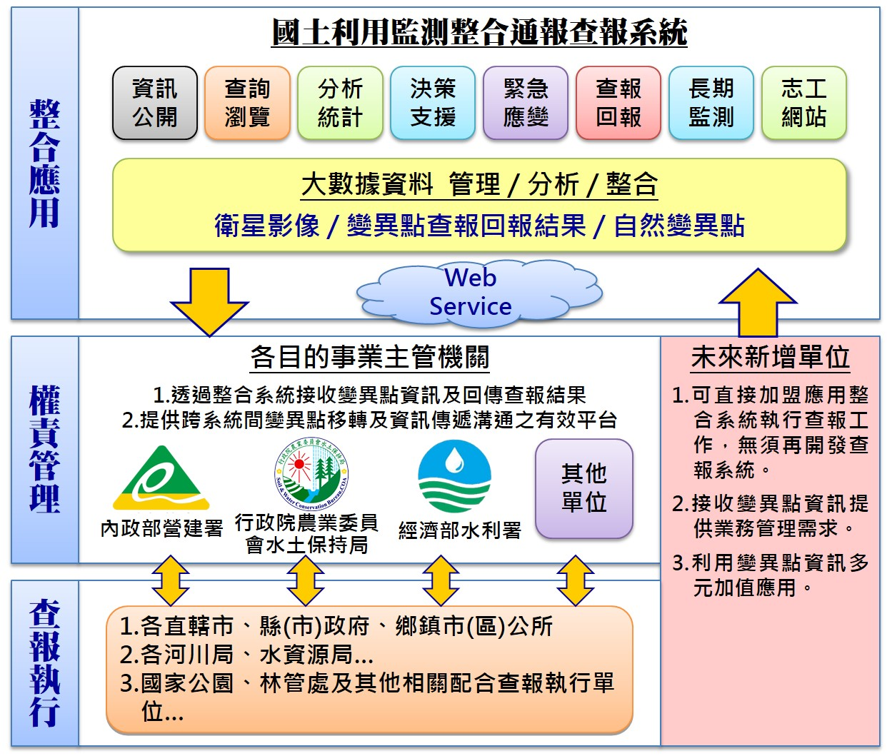
######圖3.3  國土利用監測整合工作推動目標及策略藍圖
####依據上述具體目標及推動策略將能獲致之預期效益包含︰
####1.落實國土計畫法（草案）第18條意旨，定期從事國土資源調查及土地利用監測，提供國土規劃、土地管理、監測機制、生態保育、環境保護、林地維護等政策所需基本圖資。
####2.維護更新衛星影像光譜樣區資料庫，提高衛星影像自動化判識，縮短變遷偵測作業的時程，減輕查報人員工作負荷。
####3.運用高解析衛星影像及遙測技術，辦理臺澎金馬地區土地利用變遷偵測及自然海岸線變遷分析作業，掌握國土變遷動態資訊。
####4.建置及更新維護監測時態資料庫，並應用大數據分析功能，提供歷年監測時態資料潛在決策資訊，供各機關業務應用及防災管理工作決策參考。
####5.建構完整及時通訊化之監測整合通報查報系統，快速掌握土地資源利用現況及變遷資訊，防杜國土破壞行為，達成國土永續發展的目標。
####6.辦理計畫宣導及應用系統教育訓練講習，加強查報人員衛星遙測概念及熟悉系統填報程序。
####7.推廣義務志工與民間團體共同參與，讓各界一同為家園齊盡心力，減少土地違規使用情形。
##(五) 環境資料整合及共用共享
####為實踐3項策略構面，研擬下列短期（1~2年）工作計畫並持續滾動修正：
###1.強化環境資料蒐集整合
####根據現行「環境資源資料庫建置計畫」（環境雲計畫）基礎及作業機制，加強歷史性資料之蒐集、整理及資料化(datafication)，規劃導入群眾外包(crowd sourcing)及物聯網等工具，擴大資料徵集層面。研訂妥適之資料品質管控機制及相關工具，提升資料品質。
####其次，運用適當的彈性工具儲存管理資料，以加速資料處理時效，強化與其它公部門之資料介接應用。針對環境資料進行主題式分類，導入類Yahoo查詢及類Google查詢介面技術，開發便捷之查詢工具，提供公眾利用。整體架構如圖3.4。
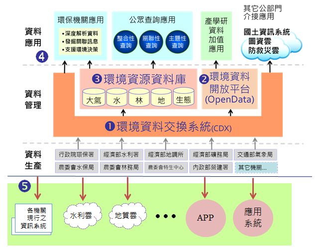
######圖3.4 環境資源資料庫建置計畫整體架構圖
###2.擴大環境開放資料規模，提升開放資料品質
####各項業務資料，依政府資訊公開法規定，以開放為原則，並兼顧質量。所有開放資料集轉化製成機器可讀方式(machine readable)格式，提供公眾下載利用。另規劃妥為運用開放資料改善治理，促成創新施政作為，提升開放資料之質與量，強化開放資料品質運作機制，促成實現以資料為主（data-centric）的開放政府。積極向環保社群團體、民眾辦理推廣說明會，並徵集網路輿情蒐集機制，擴大公眾參與，針對民眾需求之資料集積極辦理開放。此外，定期與業務單位檢視開放資料現況、討論開放執行策略、績效及工作進程，就資源統整運用等課題進行協調。
###3.發行「我的環境」圖資整合查詢服務
####依據公眾需求為中心，提供公眾有興趣或關心地點有關的跨域環境資訊，透過友善的使用者介面，包括各式行動裝置，展示多種來源的環境資訊。包含地理圖資、即時空氣品質及歷史統計資料、環境水質資料、土地、廢棄物、能源健康等多種不同主題的環境資訊，使民眾有效掌握客製化的「在地」環境資料。此外，藉由提供給公眾多元的資訊查詢及資料下載格式，便利資料取得與應用，可有效率輔助其個人的環境決策，以增強環境意識，促進環境保護及資源永續利用。
###4.建構環境治理巨量資料分析平臺
####規劃以開源軟體(open source)為主，評估導入適當軟體工具，包括資料蒐集、資料儲存、資料分析、視覺化等，建構巨量資料分析工具共享平臺，避免資源重置，並使作業程序一致化。為完善資料蒐集機制，設計環境相關資料（如研究調查報告）之蒐集、清理、統合等應用流程，實現資料可追蹤性(traceability)及可重複利用資料(data reuse)。
####針對環境治理各項業務需求主題，由業務單位以任務導向方式，利用工具或徵集學術研究單位提案，委由領域專家，深化資料分析，藉以輔助施政。
###5.加強網路社群聯結，掌握環保議題民意取向
####透過網站社群聯結的擴散力量，運用網路互動機制，讓民眾透過網路多元參與政策討論及反映意見。導入適當工具，擴大蒐集網路輿論資訊，辦理「公民會議」擴大公眾參與等活動，以提早掌握民意取向，凝聚環保政策共識。
####妥適利用社群媒體，設立專用帳號，針對民眾有興趣的環保議題或話題，在社群媒體發表訊息，讓網友推播及轉載，達到環保政策宣傳功效。另擴大公務網站與各式社群網站連結，以分享社群認同與支持，使施政朝向透明、參與、網路政策行銷方向發展。
##(六)土地基礎圖資流通應用
####1.強化全國土地基本資料庫同步機制，加速將各直轄市、縣市政府之地籍資料庫同步至中央，進一步針對資料庫管理、備份、備援與效能加以有效監控。
####2.建構地籍資料交換平臺，統一對外資料交換窗口，並針對不同地籍圖資需求建立不同分眾服務、結合驗證機制、建立標準交換規格，有效達成資料分享。
####3.建立資料分析決策管理服務平臺，運用商業智慧技術，萃取分眾資訊，依資料特性建置小型不動產資料超市（data mart），方便業務單位應用擷取資料及產生營運報表；另整合資料庫，提供大型統計數據，發掘資料核心價值，強化智慧決策應用。
####4.建構地政整合資訊服務共享協作平台，運用流程設計、組裝、分享等概念，讓地籍資料透過各機關使用者的參與、回饋，共同賦予地籍資料服務更多元的使用方式，並提昇地籍資料應用價值。
####5.強化資安維運及線上監控機制，掌握資安事件應變情形，提升機關資安通報與應變能量。建立惡意程式偵測規則及強化資安監控及防護；持續強化資訊安全教育，精進資訊安全職能評量與個人資料保護安全宣導。
####6.強化測繪資料整合處理，針對國土測繪資料重新整合資料架構，以縮短產製供應時程及品質，完善核心及基礎圖資資料更新作業。並整理具有歷史價值之圖資如典藏舊地籍圖、地籍藍晒底圖及官有林野圖等，建立各時間點序列組合，加強國土資訊之歷史紀錄維護。
####7. 提升通用版電子地圖資料維護效率，除以兩年為週期定期更新外，亦將持續蒐集及整合各機關各項資訊，以納入行政流程方式輔助更新通用版電子地圖，並針對全國重要道路、重要地標、重大工程及使用者反應局部區域變動部分進行快速更新，以符合各界對圖資時效性需求。
####8.評估建立「巨量空間資訊雲儲存運算中心」，以透過迅速的資料傳輸儲存及智慧管理，來有效率存放不斷成長的各類各期國土測繪圖資空間資料，並藉雲端服務優化圖資網路地圖服務，並產製發布多元圖資網路服務，促進圖資流通共享。
####9.提升「國土測繪資訊整合流通倉儲服務網站」服務效能，整合內政部國土測繪中心多個測繪成果顯示系統之Web GIS圖台至本網站，並強化本網站及各項子系統之操作介面，建立圖資供應網路社群，結合群眾外包力量彙整與吸納民意，提供更親民、更簡便化的圖資展示及申購環境，走向智慧圖資網路商城。
####10.發展專業測繪資料智慧雲端加值服務，將有別於一般單項圖資作為底圖或套疊應用之加值授權服務，而導入跨單位協作機制，針對各機關業務特殊需求，建置客製化專業測繪資料加值應用服務，如應用程式介面（Application Programming Interface, API）及圖資發布套件等，使圖資服務亦能滿足專業客群。
####11.於「國土測繪資訊整合流通倉儲服務網站」推動歷史測繪圖資保存及測繪圖資知識專區，將圖資與歷史記憶結合，推廣及應用測繪歷史資料，拓展資料更多的價值。
####12.將各類國土核心圖資予以三維化及蒐集建置三維建築模型，發布3D地圖API服務，建立三維圖資瀏覽服務，給予使用者立體擬真瀏覽圖資之視覺效果，開創豐富且多元之圖資加值應用領域。
####13.智慧門牌應用推廣:為實踐3項策略構面，研擬下列工作計畫並持續滾動修正：
####(1)落實各縣市門牌位置資料定期更新機制
####確保已加入內政部「門牌位置資料管理維護系統」的14縣市落實每月更新機制，針對其它未參與之8個縣市，配合內政部定期收納門牌位置檔之作業需求，由現行每季一次調整為每月一次，協助進行門牌資料檔的收納及轉入系統資料庫作業，以縮短定期更新的週期，落實定期更新機制。
####(2)提升服務能量，提高比對服務筆數限制
####調整門牌定位服務主機為負載平衡架構，並善用雲端服務可彈性擴充之特性，提升服務能量，預計至少將現行每日500筆/每月50,000筆之限制提調為每日10,000筆/每月300,000筆，以提供更便捷的使用環境。
####(3)納入歷史門牌資料，提升智慧(模糊)門牌比對率
####逐步納入歷次更新的歷史門牌資料庫為服務比對基準，以提升智慧(模糊)門牌比對率，並持續檢視整體服務優缺點及各界使用者的回饋，與時俱進不斷地維持滾動式調整，讓定位服務能夠更貼近使用者的需求。
##(七)市區道路管線挖掘工程資訊整合
###1.短期（1~2年）︰
####(1)軟、硬體設備購置及環境建立
####未來須提供穩定及較大流量之服務，故須先架構基礎之軟、硬體設備及備援機制，以符合未來進行資料發布及因應民眾服務需求之負荷。
####(2)提供民眾市區道路管線挖掘工程靜態資訊查詢服務平台
####配合各地方政府轄區內之推動進度及管制狀況，取得各直轄市及縣（市）授權後並進行目前靜態施工資訊之介接，短期先提供靜態之施工資訊，並至少完成15個以上之縣市資料介接及提供民眾查詢。
###2.中長期（4年）︰
####(1)提供市區道路管線挖掘即時工程便民資訊服務平台
####配合各地方政府轄區內之推動進度及管制狀況，取得各直轄市及縣（市）授權後，逐年分各直轄市及縣（市）進行挖掘案件即時施工資訊之介接工作，並訂定各縣（市）介接資料之標準規範及格式，以確保資料的正確傳輸。對外之服務平台則需介接包含TGOS、Google Map等之通用底圖，設計符合民眾使用習慣之地圖查詢模式，以利民眾查詢及利用。服務平台介接資料順利運行及穩定後，開始提供民眾之訂閱服務，提供民眾生活化之施工應用資訊，由被動查詢擴大為主動提供服務，以提升民眾對政府施政內容的了解並使用供應之服務。
####(2)建立市區道路管線挖掘工程資訊發布平台
####市區道路管線挖掘工程便民資訊服務平台之目標係提供跨直轄市及縣（市）之市區道路管線挖掘工程案件資訊，故會完整收納目前各縣（市）市區道路之管線挖掘即時施工及禁挖資訊，故與各直轄市及縣（市）介接完成後會成為收納完整即時管線挖掘施工及禁挖資料之平台。為使各需求單位能取得本項寶貴資料，以擴大其加值及服務之層面，故擬建立此資訊發布平台，使其他需求單位可透過此一平台，取得即時之挖掘工程資訊，提供跨單位間之整合資訊應用。
####如交通部近年已建立「交通服務e網通」，有發佈即時交通訊息，惟其中影響重大之市區道路管線施工訊息之資料仍相當缺乏，故未來本平台建置完成後，即可透過平台統一供應此訊息予需求之政府單位，如提供予「交通服務e網通」統一發布即時交通訊息及提供各項載具之即時交通資訊運算，以擴大資料的使用及應用範疇。
####計畫推動策略有賴於各個參與單位間之緊密配合，並透過標準之交換格式進行資料之透通，才能達成推動之最終目標。整體計畫推動之階段策略及目的如圖3.5所示。
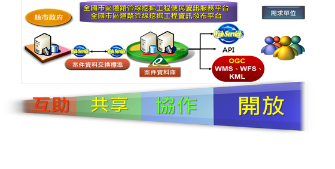 
######圖3.5　整體計畫推動之階段策略及目的示意圖
####依據上述具體目標及推動策略將能獲致之預期效益包含︰
####1.對外提供市區道路管線挖掘工程便民資訊服務平台，促使民眾可藉由公開透明之施工資訊了解中央政府–地方政府–管線單位間，各司其職之行政管理、施工運作程序及公開之內容資訊。
####2.建立市區道路管線挖掘工程資訊發布平台，將彙整之管線挖掘施工資訊，發布並供應予其他智慧國土工作群，進行加值應用及分析。
####3.透過長期之介接運作模式，促使各地方政府持續建置管線資料庫並透過強化管線挖掘施工案件之管理作為，達成管線資料庫永續更新及建置之目的。
####4.建立民眾專屬之市區道路管線挖掘施工資訊應用服務，使施工資訊與民眾之生活環境產生關聯，提供民眾有感之服務。

