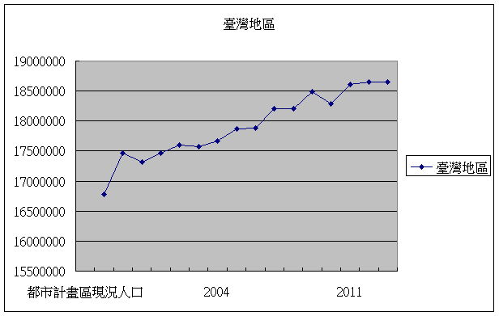

# 智慧城鄉行動計畫
#第一章　背景分析
臺灣地區人口平均密度高，且人口過度集中於都會區，為提升都市治理效率，並有效縮小城鄉差距達到均衡永續發展，智慧城鄉必須運用新科技來轉換及管理系統，以最佳方式善用有限的資源，必須提高基礎設施的使用壽命，讓下一代系統變得更有效率、有彈性、有適應力。
因應未來網路智慧發展，將融入各項ICT 技術應用，包含雲端應用服務、政府開放資料(Open Data) 模式等，提升都市管理效率、均衡城鄉發展、降低能耗及碳排放，朝向結合低碳生活、增進民眾身心健康促進城鄉永續，經研擬出智慧城鄉五大面向：智慧型建築管理、智慧型社區安全、智慧型國土環境監測、智慧型土地資料流通應用及智慧型道路管線，使城鄉更有智慧且更具效率。

##一、國際趨勢
####參考國際智慧城市之發展案例以及近年來各國對於智慧城市之相關定義，整合分析國際智慧城鄉趨勢：
####(一) 跨政府部門、企業、教育機構、民眾參與之發展型態
####(二) 將智慧科技導入公共服務系統
####(三) 資料共享及商業模式
####(四) 低碳、永續、生態之宜居城鄉為目標
####(五) 發展智慧綠建築、社區與城市

##二、國內現況與檢討
###(一) 我國人口發展概況
####我國人口密度高居全球第二，7成以上人口集中都市，且依國內發展趨勢，國內人口仍有持續往都會區發展之現象(詳圖1.1)。在台灣，居住在六都的人口即將突破七成，民眾對城市基礎設施的需求越來越高，智慧城市的推動發展已是城市發展的關鍵課題。

圖1.1 都市計畫區人口數量成長趨勢圖
資料來源：整理自中華民國統計資訊網

####另外相對於歐美亞洲等國家，我國老化速度極快，和日本並列第三名，僅次於新加坡與韓國，老化速度指標數值為24年(詳圖1.2)，意指一個國家達65歲以上人口之比率，從7％所謂高齡化社會（Aging Society）爬升至14％高齡社會（Aged society）所花費的時間。我國在1993年有7%的人口為年滿65歲以上之長者，依國發會預估，在2017年長者人口將成長至14％，因此我國的倍化期間為24年。但反觀美國經過73年，法國甚至花費115年才達成倍化比率的成長，可知我國的老化速度極快；尤其，依據國發會預估，我國高齡人口將在2025年達到20％，所謂超高齡社會（Super Aged Society），成長速度更將達到第二名(詳圖1.3)。

 圖1.2 世界各國由高齡化至高齡社會所需時間

 圖1.3 世界各國由高齡至超高齡社會所需時間
 資料來源：國家發展委員會
 
### (二) 我國智慧綠建築推動方案
####為因應全球暖化及氣候變遷問題，高齡少子化及產業發展等課題，行政院於民國90年開始將綠建築納入發展重點，核定實施「綠建築推動方案」，其後於97年擴大實施「生態城市綠建築推動方案」，而後行政院更於98年12月「行政院重大政策進度報告」會議院長裁示：為有效運用我國ICT產業優勢，以創造經濟價值，爰由經濟部、內政部就智慧綠建築產業，提出「智慧綠建築推動方案」，並於99年12月奉行政院核定實施。
####另由於近年來歐美及亞太地區等國紛紛提出智慧綠建築、智慧社區及智慧城市等創新規劃理念與對策方案，而我國推動之智慧綠建築成果雖頗獲各界肯定，惟仍多侷限於單體建築物，較缺乏對於整體社區及城市之規劃落實案例。
####因此，內政部刻正研提「智慧綠建築、社區與城市推動方案」（草案）報院核定中，期望除延續智慧綠建築現有發展基礎外，並能進一步擴大推展範疇至社區、城市，迎合國際發展趨勢發揮更大整合效益，同時達到促進產業發展及創新產業價值之目的。
###(三)我國建築管理資訊深化服務計畫
####內政部營建署依據「發展優質網路社會計畫（2008~2011年）」，自97年起規劃「建築管理資訊深化服務計畫」，並奉納入優質網路政府旗艦7安適ｅ家園計畫之項下辦理，將系統推廣至鄉（鎮、市）公所使用，務期使建築管理業務服務層面更加便捷與寬廣，並推動建築物公共安全網路申報之無紙化作業及建築圖電子化繳交作業，以利朝向未來無紙化之節能減碳目標。並自101年起推動第二代智慧化建築管理系統，建立好宅數位資料庫供應系統，強化各項便民服務。
###(四)我國165反詐騙諮詢專線
####內政部警政署「165反詐騙諮詢專線」（下稱165專線）於93年成立，並設立電信服務專碼「165」，民眾可隨時隨地以各種電話系統撥打165，由專線人員提供全天候反詐騙諮詢、檢舉及報案等服務，並分析最新詐欺犯罪態樣與趨勢，以及落實相關案件紀錄、查核與管制，使偵防工作得以結合，擴大打擊效能，以保護民眾財產安全
####鑒於智慧型手機日益普及，為因應社會環境變遷，有效規劃科技、便捷報案方式，規劃運用行動設備於民眾報案服務，102年12月18日啟用「雲端視訊報案系統」，藉由 WIFI、3G之連網設備，以高解析視訊方式，即時回傳現場影像，同時利用文字對談方式輔助雙向資訊傳遞，提供民眾更為多元報案管道。另透過智慧型手機標準內建的GPS系統，系統持續更新報案者所在位置，可協助快速指派最近警力到場處理。
####依我國警察職權行使法第10條規定：「警察對於經常發生或經合理判斷可能發生犯罪案件之公共場所或公眾得出入之場所，為維護治安之必要時，得協調相關機關(構)裝設監視器，或以現有之攝影或其他科技工具蒐集資料。」現行錄影監視系統(Closed-circuit television, CCTV)(以下簡稱錄監系統)，已成為各先進國家運用來協助警方偵查、逮捕與預防犯罪的主要利器。
###(五)我國國土保育保安查報系統
####全球經濟快速發展，帶動能源與自然資源大量消耗，打亂自然環境系統的碳循環，導致全球暖化與氣候變遷現象。臺灣因土地資源不當使用，自然環境遭受破壞，造成複合性災害事件明顯增加，又因地理與地質因素，地震及颱風發生頻繁，除增加了民眾住與行的安全風險外，也使得政府投入於緊急撤離、救災及復建等成本逐年增加，突顯土地資源利用的安全性及重要性。
####而防杜土地違規使用開發，一直是國土保育保安重要課題，然土地違規查報工作繁重加上人情壓力等問題，導致基層查報人員流動率高，人力嚴重不足。衛星影像因具大範圍及週期性獲取地表資料的特性，已廣泛應用於環境監測與地形地貌資訊蒐集，臺灣擁有自主性福爾摩沙系列之高解析衛星，對於全島之涵蓋及監測應用特別具優勢。因此，國內各目的事業主管機關如內政部營建署與行政院農業委員會水土保持局及經濟部水利署等機關，近年來持續利用衛星影像與變遷偵測技術輔助土地違規查報，藉以杜絕人情關說，大幅改善傳統人工查報及回報方法，提升土地違規查報工作效率。

圖1.4 前後期衛星影像變異點偵測示意圖

###(六)我國環境資源資料資料庫建置（環境雲計畫）
####配合行政院組織改造，環保署與未來將併入「環境資源部」的附屬機關，共同合作推動「環境資源資料資料庫建置計畫」（環境雲計畫），自102年3月開始，著手規劃彙集散置各機關的環境資訊，彙集環境資源相關資料集(datasets)，建構「環境資料交換系統(Central Data eXchange, CDX)」，將原有「多對多」的資料交換模式，改為集中分享式的「多對一對多」交換模式，同時採取資料發布(publish)及資料訂閱(subscribe)的作業機制，加速環境資料共用共享。
####彙集的環境資料主要運用主題導向(subject-oriented)概念及群眾外包(crowd sourcing)等技術，激發協同合作的創意，未來可望藉此提昇並擴增資料整合質量。目前已就中央氣象局、經濟部水利署、行政院農業委員會水土保持局及環保署等機關，統整332項資料集。
####配合行政院的開放資料政策，環保署在102年10月間完成「環境資源資料開放平臺(opendata.epa.gov.tw)」，目前已累計155項資料集，內容涵括全國各地的空氣品質及紫外線的即時監測值、全國河川及水庫水質監測值、列管污染源基本資料、環境影響評估案件摘要等，已有超過1,400萬次的下載引用紀錄。
####藉由擴增環境開放資料，環保署已發行「環境即時通」APP，除了提供環保署生產的環境資料外，並將不同部會所生產的環境資料做整合應用，包括大雨特報、淹水警戒等防災訊息，達到即時服務的目標。環境即時通APP提供適地性服務(location-based service)，系統會根據使用者所在的位置，提供當地的環境相關資訊。
####環保署為激發民間運用環境資料的能量，將持續擴增開放資料的範圍及數量，供公眾串聯其他政府開放資料，共創資料價值。另為因應網路、行動通訊和社群網站的快速發展，以及公民參與意識興起，環保署亦規劃建立實體世界跟網路世界的平台與橋樑，透過多元管道廣泛納入外界意見。此外，由於新興資訊科技的發展，使的分析巨量資料具備可行性，環保署亦規劃藉由探究巨量資料內涵的意義，據以進行政策的調整，期使政策更貼近民意，施政效能更為優化。
###(七)優化國土基礎圖資服務供應機制
####國土資訊系統是一項全面提升政府部門空間決策品質與行政效率之利器。各級政府機構隨時都有許多影響我國經濟發展及生活品質的空間決策行為，從大到五輕、六輕是否興建？在那裡興建？海埔工業區之發展、高速公路、鐵路之興建、捷運系統、水利及防洪設施、國民住宅等之興建、以致小到各級地方政府公共建設之推動、垃圾掩埋場之選址及興建等，均牽涉到區位之選擇問題。而區位選擇是一項十分複雜的空間規劃決策過程，好的區位將可收事半功倍之效，而不好的區位可能未見其利反受其害，糾紛困擾無窮，推動不易。而要達到區位決策科學化之境界，則需要引進「地理資訊系統」才有可能實現。地理資訊系統的觀念及應用已經深植於各級政府部門內，其發揮的功效如決策之透明化、決策之品質提升、行政效率之提高，均有目共睹，深受政府、學術及企業界之肯定。
####現今資訊社會的發展端賴社會中不同資訊的傳遞，資訊的彙集進一步產生知識，流動的知識直接或間接地影響人類社會生活及國家經濟，是以資訊的製造、處理、散布成為世界各國主要的經濟活動之一。國家與其政府機關憑藉著財政收入與握有的社會資源，成為資訊的最大擁有者及創造者。為了確保人民知的權利，落實民主制度，以及追求資訊時代下知識力量散布、創造與發揮，政府將本身所製造之資訊公開、政府機關間串連供應進而提供相關便民施政業務所需，如此便民供應資訊之流通可推動資訊社會追求知識經濟的需要，為能發揮其資訊價值，供民眾掌握知識的力量，應推動對資訊有效的再利用方式並促其發揮資訊潛而未顯的內蘊價值。
####在國土資訊系統推動方面，地籍資料向來為國土資訊系統中之重要核心圖資，如何優質提供地籍資料攸關者國土資訊發展品質與否。而地籍資料來源係由地政事務所蒐集產製，直轄市、縣(市)政府則將所轄地政事務所之地政資料，透過傳輸機制建立同步異動資料庫，再由內政部地政司透過應用程式，以排程方式將各直轄市、縣(市)地政資料透過全國地政資訊網路傳遞到「全國土地基本資料庫」，進而運用該資料庫提供各行政機關進行各項政策制定、政策推動或相關資料統計分析，在此機制架構下因應知識經濟特性，應予以提升資料品質、進而創造可再利用之相關資訊服務供應機制，以活化資訊運用之價值。
####除地籍資料外，內政部國土測繪中心辦理國土資訊系統核心及基礎圖資測繪工作，其中為提供我國國土資訊系統高度共用之基本底圖，自96年起辦理通用版電子地圖建置，為政府機關首度產製的電子地圖，內容以最基礎且經常使用的地理資訊為主，較一般市面上電子地圖測繪精度提高甚多、測繪內容更完整。為有效整合管理各類圖資，並使圖資得以被流通應用，自95年起整合處理陸測、海測、空照（衛星）三度空間測繪資料，建置國土測繪空間資料庫，以「國土測繪資訊整合流通倉儲服務網站」將整合處理後測繪資料透過資訊流通共享機制，提供政府及民間使用，並發展「國土測繪圖資網路地圖服務系統」，發布WMS、WMTS及Web Map API，方便各界介接應用。未來為配合資料開放及雲端技術發展，將推動測繪資料標準化及建立雲端管理維護與流通機制，以多元網路發布方式作為資料交流與供應管道，迅速提供各界正確之測繪資料，作為國家建設施政基礎，協助國家邁向現代化與科學化，成就智慧家園。
###(八)我國公共管線資料庫管理供應系統及擴充建置計畫
####內政部營建署自民國97年度起，分年分期推動「公共管線資料庫管理供應系統及擴充建置計畫」，補助各機關逐步執行公共設施管線調查及其資訊管理系統之建置，以加強管線管理。至103年度止已陸續補助21個地方政府道路主管機關進行整體規劃作業、公共設施管線調查、管線資料庫及管理供應系統建置暨監審作業，目前各機關均藉由分年分期之推動計畫積極進行公共設施管線資料庫之建置作業。而其配套之道路挖掘案件管理系統，至目前22個地方政府道路主管機關均已建置完成並依其推動區域陸續上線運作。
####目前各地方政府挖掘案件管理系統之管理作為已逐步進展，故相關案件資訊的完整性、正確性及即時性係為下一階段推動之重點，因民眾對於管線施工管理之作為大為重視，有必要將此基礎資料建置作業之成果轉化為民眾有感之資訊，爰擬建置「市區道路管線挖掘工程資訊整合發布平台」，提供民眾多管道之管線工程施工資訊及加值應用。
####目前各管線機關及地方政府道路主管機關於各自之道路挖掘平台上進行施工申請、審核、發證及管制，並於各自便民資訊網站上發布施工訊息（但無跨縣市之資訊，應用上仍有所受限），因需透過特定建置之網站查詢，故施工之相關資訊仍須大眾至網站查詢才能明瞭，資訊雖有公開，但仍無法迅速及普遍讓民眾瞭解相關之施工資訊及影響，故尚無法達到便民之積極目的及成效。故須進一歩更強化便民之具體措施，並與各機關現有資源合作，達到以有效經費運用來獲取最大之使用效益。
####目前市區道路管線施工資訊尚待整合之課題如圖1.5所示。

圖1.5　市區道路管線施工資訊整合課題

#第二章  具體目標
####綜觀國內城鄉發展現況，因應智慧城鄉之永續發展策略，建議五大面向具體目標如下:
##(一)建築智慧管理化服務
###1.	短期目標：創新資訊多元化，提升建管服務價值
####(1)整合系統包含建築執照申請書表系統、建築物地籍套繪系統、建築圖影像管理系統、施工管理系統、建築物公安檢查及申報系統、公寓大廈組織報備、昇降機械停車設備及違章建築管理系統等，含括多種建築管理資訊。
####(2)制定建築物公開資料格式，提供政府開放資料(open data)
###2.	中長期目標： 
####(1)建構建築管理資訊共構機房系統，促進建築資訊透明化。
####(2)整合跨機關建築物相關資訊，例如消防安全、商業登記、目的事業設立許可等資訊，提供民眾公共建築物關心資訊
##(二)推動智慧綠建築、社區與城市
####為使我國推動之智慧綠建築能與4G智慧寬頻應用城市結合，以進一步提升智慧綠建築推動效益及發揮我國ICT產業優勢，實有賴深化推動智慧綠建築與進行智慧綠社區創新實證，方能達此一目的。
####所謂「智慧綠社區」主要是以建置節能低碳、生態環保之社區環境為基礎，並以使用者需求為出發點，利用資通訊科技及雲端技術等，使社區可以達到節能永續並提供符合使用者需求的優質生活環境。至於社區的範圍與規模，則採用較為彈性的界定，基本上可以是數棟建築物的組合、一個或數個街廓、校區、工業園區或甚至是一個鄉鎮，將視未來實證計畫之規劃及整體計畫之目標與實施範圍而定。本項整體目標有以下三項：
####1.加強節能減碳，促進環境永續發展。
####2.提供符合民眾需求的優質服務，提升人民幸福感受。
####3.擴大產業整合及技術提升，促進產業競爭力。	
##(三)社區居住安全監控機制
###1.多元全民反詐騙及網路購物安全作為
####(1)建構優質民眾諮詢與報案，防範詐騙發生：
####以優質服務為導向，成為詐欺犯罪諮詢與報案專責窗口，接獲民眾來電時提供詐騙問題解惑、防騙建議及同理關懷，並協助被害民眾轉介至轄區派出所快速完成報案手續，提升民眾服務品質。
###(2)擴大參與合作，與超商建立聯防機制
####詐騙集團經常詐騙民眾至超商轉帳、傳真接收假公署公文、購買遊戲點數，為因應遊戲點數衍生之詐騙犯罪問題，165專線積極整合協調國內四大超商（統一、全家、萊爾富、OK）配合注意民眾可能遭遇之受騙徵候，適時關懷提醒民眾，如發現詐騙車手則撥打165或110通報警方到場緝捕，防範民眾遭受詐騙。
###(3)強化網路詐騙聯防機制，減少網路案件發生
####駭客入侵盜取個資事件層出不窮，個資外洩已成為詐騙關鍵源頭，除協請主管機關經濟部加強電子商務交易安全管理外，並與網路相關業者建立情資交換平臺，蒐集分析業者發現異常資訊，可快速通報業者加強監控，達到預警效果，防止詐騙事件擴大。
###(4)強化金融機構臨櫃關懷機制，結合金融聯防體系
####金融機構依照165專線所提供最新反詐騙徵候資訊，強化臨櫃關懷提問工作，如發現民眾異常匯款及提領大量現款時，利用填寫「臨櫃作業關懷客戶提問表」，藉以拖延提(匯)款時間，並通知轄區派出所進行護鈔，結合線上警力及時攔阻詐騙款項遭到提領，防範詐騙集團趁虛而入。
###(5)利用社群強化反詐騙宣導，落實全民反詐騙工作
####為提升反詐騙宣導廣度，165專線除建置專屬網站公布防騙資訊、協請電信業者發送宣導簡訊及利用公開場合設攤宣導外，並自103年起陸續成立165反詐騙諮詢專線之LINE官方帳號及Facebook粉絲團，透過時下最普遍之網路力量宣導反詐騙訊息，與民眾互動交流。
###(6)建構詐騙感知地理情資系統，提供最新詐騙情報
####未來適度公布最新詐騙手法、活動網站、詐騙電話與金融資訊，提供民眾具體了解生活中相關詐騙地理情資，並透過社群分享與宣導概念，提供民眾最新詐騙情報，提升民眾反詐騙認知。
###2.提供便捷智慧報案快速管道
####「雲端視訊報案系統」，可將民眾手機衛星定位（GPS）顯示於e化勤務指管系統中地理資訊系統（GIS），受理員警不僅更快知道報案者所在位置，同時結合雲端視訊功能，立即瞭解現場狀況，並迅速派遣警力前往救援，使民眾獲得最安心、最即時的協助；經統計100年至103年，員警平均到達現場時間，均能在本署規定10分鐘內抵達報案現場。
###3.建置治安錄影監視器系統
####(1)各地方警察機關依據警察職權行使法及本署所訂頒基本規範與注意事項，選定適當地點建置錄監系統。各地方警察機關建置錄監系統後，對於錄影資料依地方權責及相關法律管理運用。
####(2)由於錄監系統鏡頭若無所不在，部分國人擔心個人隱私受到侵犯，出現加強對錄監系統進行管理的聲浪。因此，如何兼顧社會治安和個人隱私，一直是需審慎面對處理的議題。
##(四)國土利用監測資訊整合
####鑒於營建署、水保局及水利署等機關運用衛星影像及遙測技術協助辦理業務職掌範圍土地利用監測工作時，因業務需求不同，而有重複購置衛星影像，或監測頻率不同及使用衛星影像解析度不一等情形，造成資源無法共享應用。為妥善運用跨部會行政資源，內政部爰自103年度起交由內政部國土測繪中心辦理整合營建署、水保局及水利署等機關監測工作，透過整合各機關監測資源，減少政府資源重複投入，擴大使用效益。短期及中長期具體目標如下：
###1.短期（1~2年）︰
####為能讓國土監測資源及成果能相互共享及流通，經整合營建署、水保局及水利署等機關國土監測行政資源，自103年起，提升各機關監測頻率至每2個月1次及統一監測使用衛星影像解析度為1.5公尺至2.5公尺，全面辦理臺澎金馬地區土地利用監測工作，同時滿足水利署提高部分地區監測頻率（每1個月或2週）頻率需求，相較營建署以往監測頻率為3至4個月1次，或水保局以往使用解析度為8公尺至10公尺衛星影像辦理監測工作，更擴大整體使用效益。
####另103年已完成規劃國土利用監測整合通報查報系統架構及運作機制，預計104年完成監測整合通報查報系統開發，未來各機關可透過整合系統接收變異點資訊及回傳查報結果，並提供跨機關間變異點移轉及資訊傳遞溝通之有效平臺，減少以公文方式傳遞時間及行政程序；另新加入監測整合機關亦可直接加盟使用整合系統執行查報回報工作，無須再各自開發通報查報系統，各土地管理機關也可透過整合系統接收變異點資訊提供業務管理需求。
###2.中長期（4年）︰
####國土資訊系統對於土地動態變遷資訊之提供向來是較欠缺的一環，為因應現今國土整體規劃發展趨勢，除持續且定期從事土地利用監測工作外，並將建置完整的監測時態資料庫，讓全面性及持續性土地變遷資訊納入國土資訊系統，提供國土規劃、國土復育、國土保安、國土監測及防救災所需基本圖資，並因應各土地管理機關業務需求，提供對政府有用的決策資訊及技術服務支援。
####未來除持續辦理常態性國土監測工作外，並將配合相關機關之業務需求，以衛星影像為基礎辦理加值應用，並逐步整合各機關通報查報系統，同時積極邀請義務志工與民間團體共同參與，讓各界一同為家園齊盡心力，減少土地違規使用情形，達成國土永續發展的目標。
##(五)環境資料整合共享
####參酌資通訊科技發展及應用趨勢、環境治理業務特性，並檢視公共政策與網路族群之聯結關係，規劃3項短期（1~2年）策略構面：1.擴大資料開放2. 深化資料加值3.促進公眾參與，以達成「整合環境資料，共享多元環境資訊服務」之目標。
###1.擴大資料開放
####政府資訊公開是公共政策溝通的基礎工作，而開放資料(opendata)是運用網路科技落實資訊公開及提升資料價值的具體手段。藉由各類環境資料開放，讓公眾便捷取閱，有助於凝聚環境保護施政共識。未來在現有環境資源資料整合計畫（環境雲計畫）基礎上，除需加強業管資料蒐集及提升資料品質外，必須將資料轉化成公開的標準格式，供網路社群擷取運用。
###2. 深化資料加值
####環境資料具有數量龐大且格式異質的特性，未來宜運用新的資料處理方法，及適當的計算資源，尋求資料分析的新型態詮釋方式，並且探究跨越原始資料項目的交叉分析，可能得出資料原始目的以外的解讀意涵，期能提出契合科學論據之環境治理政策措施。
###3.促進公眾參與
####因應網路世界意見表達方式的多元及聯結特性，各項環境政策必須善用網路工具，徵集公眾意見，掌握民意取向。未來除配合國家發展委員會「公共政策參與平臺」相關作業，以廣納民意，同時必須適當運用工具，蒐集網路社群輿論並進行情資探勘，作為政策研擬推動之參考。
