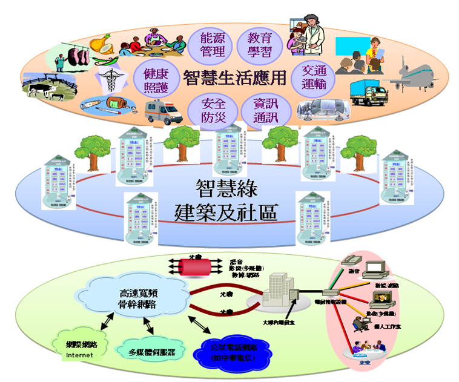

## 推動智慧綠建築、社區與城市

####由於近年來歐美及亞太地區等國紛紛提出智慧綠建築、智慧社區及智慧城市等創新規劃理念與對策方案，而我國推動之智慧綠建築成果雖頗獲各界肯定，惟仍多侷限於單體建築物，較缺乏對於整體社區及城市之規劃落實案例。因此，內政部刻正研提「智慧綠建築與社區推動方案」（草案）報院核定中，期望除延續智慧綠建築現有發展基礎外，並能進一步擴大推展範疇，迎合國際發展趨勢發揮更大整合效益，同時達到促進產業發展及創新產業價值之目的。
####隨著網路、雲端與物連網等技術快速發展與普及應用，利用智慧科技與網路整合建築內部、社區空間、城市服務系統，即時偵測並回應調整，並藉由網路提供各項生活服務及提升城市治理效率，以建構安全健康並兼顧永續發展，同時提供符合使用者需求之各項服務的建築、社區與城市。

#####*圖 5.3.2.1 智慧綠社區場域架構*
####1.如何利用智慧科技提供安全、健康、舒適、便利的社區與建築環境？
####2.您認為理想的智慧社區應該提供哪些生活服務？
####3.您所居住的住宅與社區有哪些智慧化應用設施設備？
####4.有哪些是您常常用到的城市資訊？
主責機關：內政部建研所