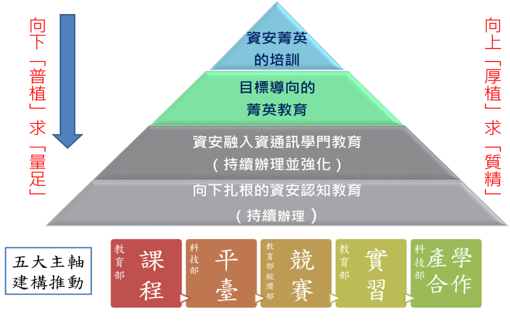
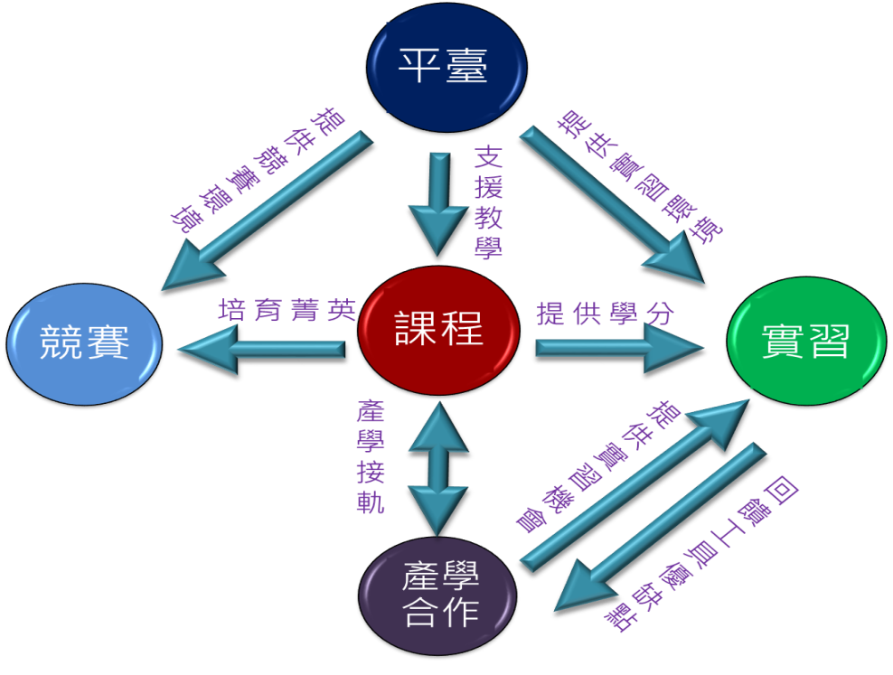

# 網路資安隱私行動計畫

####第一章　背景分析
廿一世紀資訊科技運用普及與網際網路蓬勃發展，已改變人類生活模式，伴隨而來的網路犯罪及個資保護等課題，也逐漸成為各國政府關注焦點。為因應大量個人隱私資料被竊與金融詐騙事件頻傳，進階持續威脅(Advanced Persistent Threat，APT)加劇等資安威脅情勢，先進國家均在資安防護政策與隱私保護較諸以往投入了更大量的資源。例如美國於2009年歐巴馬總統上任後，除宣布將資安提升至國家安全的層次，2016會計年度資安預算更高達140億美元，較2013年的103億美元快速成長了將近四成。而日本政府在2015年初通過了網路安全基本法(Cybersecurity Basic Act)，也宣示了資訊安全與隱私保護將是一個國家在數位時代發展的最重要基石。 
 為提升台灣成為全球智慧生活創造者之目標，我國將著眼虛擬世界法規鬆綁，打造台灣成為「亞太網路中心」，並強化資通訊環境整備，推動台灣成全球物聯網創新聚落。此「智慧」的核心是利用新一代網路與資訊技術，透過具備智慧聯網設備與感應器布建到智慧城市每個角落的供電系統、供水系統、交通系統及家戶建築等關鍵基礎設施中，使其形成物聯網，透過雲端運算與巨量資料應用與網際網路相連，實現智慧城市與物理系統的整合，使企業與民眾能以更加精細和動態的方式管理生產和生活的狀態。 
 上述願景之成功，必須奠基在採用新興與開放資訊技術之關鍵資訊基礎設施，能夠提供令企業與民眾安全與信任的保障之上。當我國朝向網路智慧新台灣的方向發展，新興智慧聯網與網際網路之連接，將為所謂「第五領域」的網際空間擴大浩瀚的「數位國土」，並進而帶動「智慧生活」與「網路經濟」之快速發展。有鑒於我國長期遭受網路駭侵威脅，針對此新興資訊技術與應用之發展，更應當在規劃與建置之初便將資訊安全與隱私保護設計與置入。 
 然而回顧網路時代數十年的發展，常可看到資訊產品與服務供應商在研發新科技與創新服務時，並未把周全的安全設計考量進來，因而產生許多「資訊安全漏洞」。當這些產品與服務之規模與價值日益龐大，便會成為組織化犯罪覬覦的對象，進而使得消費者成為整個產業價值鏈的受災戶。政府應該以明確的資安立法、產業政策、行政手段及資訊安全標準等不同方式，引導智慧網路與應用建設及營運的資源流向，使資訊安全與法規遵循成為製造商與運營商應負起的社會責任之一。 
 此外，政府還應加強網路犯罪的防治與執法能量，以充分保障企業與消費者的福祉與權益。透過此智慧網路生態系統與基礎環境的建立，也能夠產生充沛的資安產業發展需求，進而帶動新興資安產業的發展，使資安產業具備未來的競爭力，並達成關鍵資訊基礎設施防護與強化數位智慧國土安全之戰略目標。 

####第二章　具體目標
為因應網路智慧新台灣之發展，進而確保民眾數位生活福祉、新興資安產業發展及數位國土國家安全，我國應打造安全的網際生態體系，建立法制化且受信任之智慧聯網空間，吸引全球頂尖資安人才與資源，達成保障智慧生活與網路經濟自由發展之願景，並以下列目標為努力之方向。 
 一、提升資安治理與法規遵循強度，使資訊安全成為企業社會責任的一環 
 政府應透過法令規範，使資訊安全標準與法規遵循成為資通訊製造商與服務運營商應負起的社會責任之一。唯有資訊安全內化為製造商與運營商企業文化與企業社會責任，使企業進行商業活動時亦考慮到資安對各相關利益者造成的影響，我們才能避免資安最弱的環節，打造上下游完整的資安價值鏈。 
 二、強化網路犯罪預防、偵查及起訴能量，充分保障企業與消費者之權益 
 網路世界不易分辨疆界，在網路上環遊世界輕而易舉，這也造成網路犯罪具有跨國犯罪及跨國管轄的特性，致使網路犯罪不易偵查，甚至無法偵辦。但我國作為世界公民的一員，仍應持續強化打擊網路犯罪能量，避免我國成為網路罪犯的庇護所。 
 三、促進資安供需平衡，創造產業發展契機，使資安產業具備國際競爭能力 
 資安與隱私為新興智慧聯網與智慧商務成長之關鍵因素，因此我國應以明確的資安立法、產業政策、行政手段及資訊安全標準等不同方式，引導智慧網路與應用建設及營運的資源流向以創造資安需求，同時培植新興資安產業能量與人才，使資安產業能與智慧應用領域之產業攜手，創造具國際競爭力之技術、產品及服務。 
 四、落實數位智慧國土安全，達成關鍵資訊基礎設施防護之國家安全戰略目標 
 鑑於新興智慧聯網與網際網路之連接，將使所謂「第五領域」的網際空間更形擴大，並進而帶動「智慧生活」與「網路經濟」之快速發展。我國應將網際虛擬空間視為數位國土，新興的智慧聯網系統視為關鍵資訊基礎設施，政府與民間在關鍵資訊基礎設施防護的協調及合作。 
####第三章　推動策略
 我國長期遭受網路駭侵威脅，基於「資安即國安」的理念，我國自民國90年即成立行政院國家資通安全會報(以下簡稱資安會報)統籌推動關鍵資訊基礎設施之安全防護。關鍵資訊基礎設施防護目標在於確保攸關國家安全、政府治 理、公共安全、經濟與民眾信心之基礎設施與資產的安全。資安會報目前正推動第四期(102-105年)國家資通訊安全發展方案(以下簡稱資安發展方案)，由強化國家資安政策、完備資安防護管理、奠基資安技術能量及擴大資安人才培育等四大方向，逐步實現「建構安全資安環境、邁向優質網路社會」之願景。 
 而因應網路智慧新台灣之發展，我國應於第四期資安發展方案推動之基礎上，針對智慧國土、智慧生活及網路經濟發展所需之資安基礎建設，包括法令規範、認驗證標準、犯罪執法、人才培育、技術研發及公私協同合作等進行策略性的規劃與推動。此舉除了可以確保民眾數位生活的福祉外，更可利用此一新興資訊技術與應用之發展契機，培植國內資安人才與資安產業具備未來的競爭力，達成關鍵資訊基礎設施防護與數位國土國家安全之戰略目標。 
 ####一、短期策略
 (一)健全資安法令標準 
資訊安全領域常引用木桶理論來說明資安問題常發生於整體最脆弱之一環，只要有小地方疏失就會造成整個系統的危害。因此推動資安最基礎的策略，是要使系統中的每個環節起碼都能達到最低安全要求。而要達到此目的，便需要定義可供遵循的資安標準，輔以資安法令與法規確保標準在任何狀況下都能夠被遵守。 
 目前政府中央部會、金融及電信等產業多已建立組織與企業的資安管理系統，並通過國際標準ISO 27001的認證，但仍有相當多的民間產業因為對資安認知不足與欠缺法令強制力而忽略對自身企業建立資安治理與管理的責任。更不用說有許多資通訊產品與服務供應商在研發新科技與創新服務時，並未依照資安技術標準把周全的安全設計與防護功能考量進來，因而產生許多資訊安全漏洞。 
 因此我國應加速讓各產業領域的企業與組織導入資安治理與管理標準，更必須制定資通訊產品與系統的安全設計與認驗證標準。而為降低相關標準推動之阻力，可規劃設計分級獎勵與處罰機制，並由目的事業主管機關修訂資安法令落實之。具體做法包括： 
 1.依循國際資安治理標準或資安治理機制，規劃適合我國之資安治理架構，提升政府與企業內部資訊安全之效率與效度，並符合外部法律、法規及契約之要求。 
 2.建構適用於我國之資安治理成熟度評估機制，提供政府機關評估資安治理成熟度情形，進而了解我國資安治理成熟度分布情形。
 3.策劃國家長程資訊及資安發展策略，帶動民間資通訊產業發展，積極研議我國資安作用法並推動立法，亦可參照「教育基本法」與「教育經費編列與管理法」之模式，將預算與經費編列之比例與作法，則透過作用法的方式來進行規定。 
 (二)強化網路犯罪執法
 除了組織與企業必須遵循資安法令與標準，建立更主動的資安預防措施，政府也必須更有效地強制執行網路犯罪防治法律，遏止網路犯罪的發生。具體作法包括： 
 1.持續擴大現有科技偵查組織架構與人才進用，增加人員穩定性，累積專業經驗，厚植科技偵查能量，定期舉辦全國性教育訓練，加強中央與地方技術交流，擴大培植專業人才，提升司法警察網路犯罪知能及偵查技術。 
 2.整合國內警調機關，加強兩岸及跨國共同打擊犯罪，進行情資交換與案件協查，同步實施掃蕩行動，強力打擊國內及境外詐騙集團核心成員，以瓦解犯罪集團組織，減少網路詐騙犯罪發生。運用165反詐騙諮詢通報窗口，經常提醒民眾資訊安全觀念，提高警覺慎防被騙，並提高在地員警的因應處理能力，及時協助網路犯罪受害者。 
 3.使政府與組織企業的人員能注重資訊安全，提升網路犯罪證據保全能力，加強執法人員數位證據認知及採證標的與程序之訓練，使司法人員(法官、檢察 官)搜集足夠數位證據與鑑識能力，足以對抗網路犯罪，以使犯罪調查能順利進行。 
 4.加強運用現行宣導資源，結合各部會構想、行動與人力，規劃各項宣導措施，讓宣導面向得以擴大深根；針對特定容易受害的弱勢族群（學生、獨居老人）與重複被害者規劃個別宣導策略。 
 5.每年定期參與相關國際會議（如執法專業國際會議、高科技犯罪研討會等），加強與國際組織聯繫互動，積極建立國際合作交流窗口，交換網路犯罪情資與趨勢等情報，透過共同合作打擊跨境犯罪機制，建構共同打擊跨境犯罪合作平臺跨界執法及避免我國成為網路罪犯的庇護所。 

 (三)落實人才訓用合一
 資安專業工作所需要具備的知識與能力，除了在學校所累績之資訊與資安基礎知識外，資安從業人員必須隨時充實最新的資安專業智能以因應不斷演進的新興威脅。此外隨著網路與資訊化社會的蓬勃發展，不同產業領域所應用資訊技術的形式持續推陳出新，其所需之資安防護也必須要與產業的領域知識加以結合方能發揮功效。舉例來說，具備聯網設備與感應器的智慧供電系統其目前現行電網的設備、局端設備及監控裝置效能並不一定可以承受複雜的加解密技術，或是因為加解密之處理程序造成封包處理耗時太長而違反現行電力系統中通訊協定的延遲限制。要解決這些問題，未來培育的資安人才就必須具備整合資安基礎知識、創新資安專業智能及防護應用領域專屬知識的能力。由此可以預見大專院校與資安產業必須與其他不同的產業合作，落實培養教育、訓練及應用合一的次世代資安人才。而為落實資安人才訓用合一，可以思考研議由課程、平臺、競賽、實習及產學合作等五大主軸擴大資安人才培育，落實訓用合一。  
 
 1.課程部分：課程設計除應兼顧資安技術面與管理面需求，設計研究導向及實務應用之課程，更應鼓勵學校師資及業師參與資安領域的創新研究，並編纂結合應用領域知識的實務教材與實習課程。 
 2.平臺部分：根據實務教材與實習課程之需求，以雲端與虛擬化等資源集中方式建置可提供完整實務操作之工具平臺。納入此平台之工具軟體系統除了由資安業師推薦日常工作在實務上會使用之開放源軟體外，也鼓勵國內外資安業者贊助商業軟體。 
 3.競賽部分：公開競賽是驗證人才能力與標竿學習(benchmarking)的最佳方法之一，我國駭客團隊近年來也不斷在國際競賽中拔得頭籌。但如何擴大具備參加國際賽事能量的隊伍，是必須加速推動的重點。作法上除了依據國內外重要資安競賽時程，研擬培訓參賽計畫，並參照奧林匹亞 ACM模式培訓出國競賽菁英，也可以結合國內既有資安競賽活動(如金盾獎與台灣駭客年會)，在國內辦理大型且具國際曝光度的資安競賽，除可藉以選拔優勝團隊出國競賽，也能夠增加國際能見度，讓更多的國內人才能夠在國內有與國際人才競爭的機會。 
 4.實習部分：協調資安業界提供大專院校學生實習場域環境，並應設計具學分制度之實習課程制度吸引學生參與。此外應由資安業界的業師扮演實習成果的品質保證角色，使學生能夠提早熟悉資安業界工作環境與運作流程，此舉也能幫助學生印證學校教學與授課之內容，加強學習之成效。 
 5.產學合作部分：應結合資安業界與不同產業領域專家，由其定義實務上所面的資安難題與挑戰，以此作為產學合作的資安主題。且產學合作的KPI可以朝實務導向規劃，包括藉由實習課程瞭解產學合作所開發之軟硬體之優缺點等。 
 
 (四)推升智慧商務安全
 根據市場調查機構報告，2014年全球跨境電子商務產值可達3.43兆美元，2016年預估超過5兆美元，可望成為未來5到10年的各國重要出口引擎之一，並創造出口價值，帶動區域發展。台灣的電子商務產業萌芽幾乎與美國同步，從1999年的年產值新台幣16億元，至2008年一舉突破2,000億元，預估2015年會成台灣新兆元產業。但隨著電子商務的蓬勃發展，歹徒犯罪手法與管道亦不斷翻新，網路與經濟罪犯大量竊取個人隱私資料，影響電子商務與金融運作。我國新版個資法於2010年5月26日公布、2012年10月1日實施，企業為避免因資料外洩而遭求償或刑罰已提高對資安防護的重視。但隨著網路智慧新台灣的推動，未來電子商務勢必再進化為智慧商務。透過智慧聯網與智慧城市的發展與應用，不單線上商務的市場規模將更加巨大，也將更自動化與智慧化。此發展伴隨而來便是對隱私保護的進階要求，例如根據美國數位行銷公司Acquity Group在2014年所做的調查顯示，未來 5 年內，7 成受訪美國民眾打算添購智慧家電，近半數受訪者想買穿戴裝置，不過隱私問題可能是妨礙智慧聯網裝置成長的一大阻力。民眾未購買智慧聯網裝置的最大原因是認知度過低，且一旦大眾發現連網裝置會蒐集資訊後，將近60% 受訪者都說擔心資料遭駭或外洩，比較不願意購買穿戴裝置。 
 我國如欲推動網路智慧新台灣，也必須及早面對與因應智慧商務的隱私與資訊安全之議題，甚至應該策略性的思考如何整合智慧聯網與智慧商務的供應商，在隱私保護的議題上做出領先全球的示範性最佳實務與解決方案。因此我國應當盤點將會廣泛應用智慧聯網與智慧商務的關鍵資訊基礎設施領域，找出潛在或已具備全球競爭力，以及可以提升民眾數位生活福祉有感的項目，例如智慧電網、交通、家庭及醫療照護等，加強聚焦並集中產官學研的力量，落實上中下游的研發連貫性以推動系統性的創新，並透過生活實驗室(Living Lab)的形式試煉新產品循環不息的各個生命週期階段，不時改進現實世界中新創產品及服務的研展內容。同時在此流程中，最重要的由開始階段便將資安與隱私保護的設計、技術及管理制度嵌入。除發展虛實整合的關鍵資訊基礎設施防護安全(Cyber-physical security)技術，並運用開放資料(Open Date)、智慧聯網巨量資料及社群網路媒體資料等，發展民眾有感的智慧城市與智慧商務安全殺手級App。此外更應制定整體配套的法令、法規、國家標準及認驗證體系，以落實深化技術、產品及服務的資安水準。 
 (五)擴大公私協同合作
 除了落實人才訓用合一與推升智慧商務安全需要產官學研通力合作外，還需要針對資安威脅建立公私協同合作的機制，方可打造安全安心的網際生態體系。以美國為例，2014 年美國遭逢許多重大資安事件，因此歐巴馬總統在2015年初便試圖說服國會通過資安法規，強化公私協同合作，鼓勵民間企業主動提供資安情報，以交換有關網路威脅的資料與數據，並在特定情況下接收政府的機密訊息。 
 我國政府自2009年即推動成立公私協同合作的政府資訊分享與分析中心(Government Information Sharing and Analysis Center, G-ISAC)，也就是一般所說的情資融合中心(Fusion center)。G-ISAC是一個高效率與高效能的情資交換與整合分享機制，透過整合各種來源之情報資料與作業流程，擴大各類情報資源之利用價值。G-ISAC目前自動化交換預警情報分享對象包括3千多個政府機關、關鍵資訊基礎設施防護主管機關(目前包括通傳會、經濟部、國發會及教育部)、民間網路通信服務供應商、安全服務供應商、執法機關及國際資安組織與夥伴，但尚未涵蓋國內所有的關鍵資訊基礎設施領域。隨著智慧聯網與智慧城市之發展，我國除了必須訓練充沛的次世代資安人才、發展虛實整合的安全(Cyber-physical security)技術，更應加速將這些會運用新興網路資訊技術的關鍵資訊基礎設施領域主管機關、國營事業、民間運營商及電腦緊急應變團隊(Computer Emergency Response Team, CERT)納入G-ISAC之公私協同合作機制中。 
 此外，可運用我國既有之cert組織，加強與國內外各領域與各CERT間之溝通與協調機制，及處理來自企業與民間各領域之資安事件通報與諮詢。具體作法包括： 
 1.加強定義企業與民間各領域資安情資交換安全標準。
 2.與國內外各領域建立資訊共享系統或平台。
 3.進行相互依存之分析及公私部門協同資安演練等。 
####二、中長期策略
 (一) 改善政府資源配置
 2014年我國資安市場規模約317億元新台幣，預計至2016年台灣資安市場規模將突破400億元新台幣。相關策略上除了創造需求擴大市場規模外，也應當注重資安市場結構與質量之健全，以利資安產業之穩健發展。長期來看資安市場以政府市場最具指標性的意義，因此若能針對政府資安市場長期存在之結構性問題進行改善，除了能有效促進各政府機關資安業務推展，提升政府整體資安防護能量，更能讓政府成為資安市場結構改善的領頭羊與標竿學習之對象，發揮市場品質改善的槓桿效應。 
 政府資安市場長期以來面臨之核心問題是資安人力、經費及能量仍顯相對不足，且有時嚴重之資安問題具有突發性而需要緊急應變，既定之年度預算與專案通常無法有效因應，因此如何擴大與調整政府投注之資安資源，以更彈性創新之方式進行運用，是長期策略必須思考的重要議題。 	
 首先為促進各政府機關資安業務推展，強化資訊(安)業務委外之主控性與安全性，宜制定資訊發展基本法與政府資安管理作用法，並依據國家資訊發展階段及機關業務實需。 
 明訂定合理資訊(安)人力及預算配比，研議成立資安專戶或基金，以因應政府部門處理緊急或專案性資安業務所需，另可篩選業界具潛在價值與利基之資安產品予以適度扶植，以帶動整體資安產業價值鏈發展。 
 (二)建置前瞻實驗場域
 為配合資安人才培育必須具備整合資安基礎知識、創新資安專業智能及防護應用領域專屬知識的能力之需求，應考慮結合政府、學研單位、資安產業及智慧聯網應用領域廠商與公協會建置前瞻的實驗場域。該場域可以作為研究關鍵資訊基礎設施存在之弱點、模擬外來之攻擊威脅及測試驗證創新之資安防護技術與控制措施。 
 以日本為例，為強化關鍵基礎設施中工業控制系統的安全，日本經產省在2013年成立了控制系統安全中心，是由工業控制安全試驗台(testbed)與工業廠區模擬系統所組成。廠區模擬系統涵蓋了污水與排水流程自動化、大樓自動化、工廠自動化、火力發電廠、天然氣廠、化工流程自動化及智慧城市集合伺服器等工業控制模擬系統。2014年初日方便利用控制系統安全中心舉辦了電力、天然氣、大樓自動化及化工流程自動化模擬系統的演練，以紅藍軍的方式，由紅軍攻擊團隊對模擬系統發送惡意程式，由藍軍偵測應變，以驗證相關的安全應變能力與程序。 

 (三)接軌國際實務標準
 智慧聯網、智慧城市及關鍵資訊基礎設施的資安議題在全球來說都是相當前瞻的議題，我國更應及早投入這些新興應用領域的資安推動。若政府、資安產業及智慧應用的相關產業能夠攜手合作，領先發展能夠讓消費者放心與安心之技術、產品及實務標準，則資安產業與智慧應用的相關產業都更能夠建立未來之國際競爭力。不過國際競爭力的核心是技術與產品必須要能夠接軌國際標準，因此我國必須將前述的各項策略整合，除了同步接軌國際標準外，更應當鼓勵國內學研與廠商加入國際上的產業標準協會，將我國具有競爭力的產業實務標準輸出成為國際標準。 
 例如以智慧家電資訊安全為例，我國可以透過產學合作對智慧家電的安全威脅進行分析研究，再依據國內個資法的規定或相關相關法律或標準規範制定出安全需求，並參考現有國際技術或標準制訂出產業安全分級架構或機制以達到安全需求。再於前瞻實驗場域針對智慧家電的安全防護機制與控制措施進行測試，並加入「開放互連聯盟」(Open Interconnect Consortium, IOC)使相關的資安設計經驗與控制措施標準可以加入產業國際標準，或透過兩岸合作協議，以大陸市場為國際競爭籌碼，使我國的技術產品成為國際遵循之標準。 