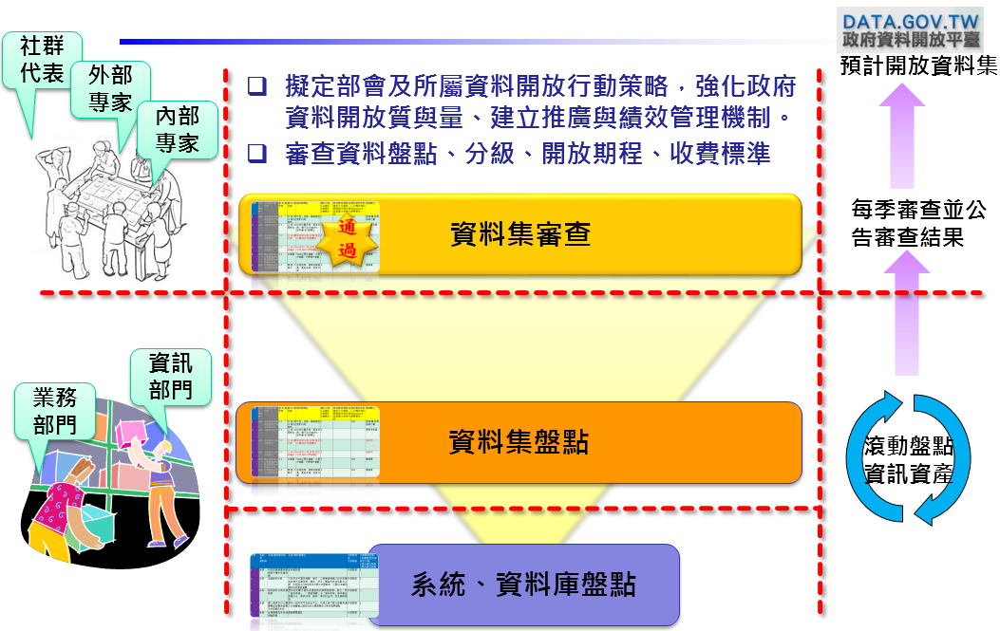
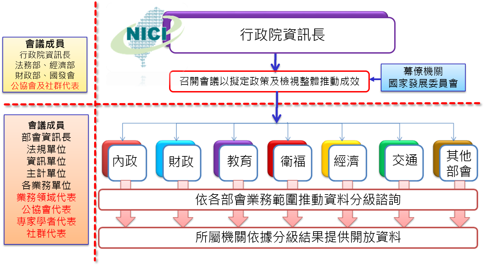
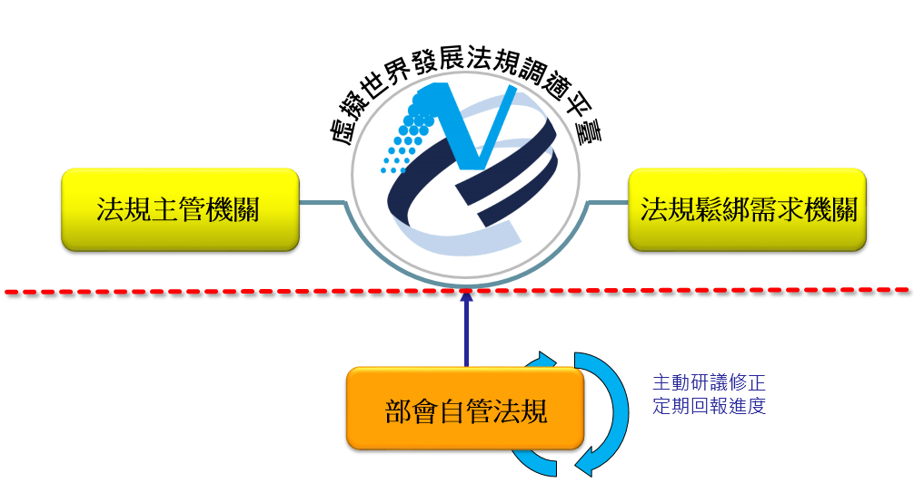

# 政府資料開放行動計畫
(本行動計畫係依據學者專家意見修正)

#第一章　背景分析
####政府資訊公開、資料開放透明，是促進公民參與的第一步，可便利民間公平共享政府資訊，可增進民間對公共事務的瞭解、信賴及監督，並促進民主參與及提高政府施政透明，同時透過開放由業界自主發揮應用，將可助益經濟發展。
####歐美主要國家及世界經濟論壇、世界銀行等國際組織近年來大力倡議及推動開放資料(Open Data)作為政府治理及服務創新之重要策略，將政府資料開放供民間自由取用，已蔚為國際趨勢，期藉由政府資料開放，將資料利用權交給民眾，期集合公共智慧與創意，提昇民主效率，改善政府施政的品質與效能，發揮協力治理之綜效。
        
##一、國際趨勢
####綜觀主要國家資料開放的發展經驗，有以下幾個主要面向：
###（一）	加速資料釋出及公民參與開放決策
####八大工業國（包含法國、美國、英國、德國、日本、義大利、加拿大、俄羅斯）於2013年簽署開放資料憲章(Open Data Charter)，以「資料預設為開放(Open Data by Default)」、「品質與數量(Quality and Quantity)」、「所有人都可使用(Usable by All)」、「釋出資料以改進治理(Releasing Data for Improved Governance)」、「釋出資料以激發創新(Releasing Data for Innovation)」五大資料開放策略原則，要求在保護資料隱私的同時，應考量民間對政府高價值資料及授權使用的需求，促進民間創新運用。英國政府於2013年發布開放資料行動計畫，改善資料的釋出、取用與再利用；並納入開放資料使用者團體意見，由公民與企業代表回應，並排序要求政府開放民間殷切需要的資料，藉由民間參與政府資料開放決策，加速政府資料開放，強化政府施政監督與課責。
###（二）	強化資料開放法制環境
####歐盟委員會於2011 發佈委員會資訊再利用規則(Rules for the re-use of Commission information)，要求委員會資訊以免申請、免費、無限制利用等方式提供民間使用；澳洲政府透過改革資訊自由法（Freedom of information）及明訂資料開放政策，要求政府資料除涉隱私保護、安全性、保密性、法律特權等限制之外，應釋出給民間使用，並提出開放資料的指導原則，以作為機關執行開放資料的指引；美國政府於2014年宣布數位權責與透明化法案（Digital Accountability and Transparency Act），要求以開放格式提供美國聯邦政府預算開銷資料等。 
###（三）	活化民間資料應用能量
####美國政府於2014年發布美國開放資料行動計畫，提出「依據回饋，創新及改善開放資料」（Support innovators and improve open data based on feedback）策略，將建立民間回饋與參與機制(如研討會、高峰座談會)、以共享服務(shared services)與開源(open source)工具分享與改善資料、促進特定部門與資料使用者共同對話，及透過競賽方式活化政府資料，使創新者、企業更容易使用政府開放資料以發展創新產品及服務。
##二、國內環境
####自2012年起，行政院所屬各機關以「資料開放民眾與企業運用」、「以免費為原則、收費為例外」、「資料大量、自動化而有系統的釋放與交換」3步驟，並配合「主動開放，民生優先」、「制定開放資料規範」、「推動共用平臺（Data.gov.tw）」、「示範宣導及服務推廣」等4大焦點策略循序推動政府資料開放工作。
####我國民間社群能量相當活躍，主動舉辦駭客松活動、應用主題開放研討會，及透過參與應用競賽等方式，運用政府資料發展創新服務。2014年開放知識基金會(OKFN)資料開放評比(Open Data Index)，我國由2013年之第36名提升至全球第11名，領先亞洲日韓等國，逐步展現我國政府資料開放國際能見度，為建立開放文化奠下良好基礎，完成階段性任務。
####為進一步提升我國政府資料開放效益，檢討我國政府資料開放推動現況與成效，及參酌國際開放政府發展趨勢，下列面向仍有待加強推動：

###(一)機關資料開放主動性及對資料價值認知不足
####截至2014年12月全國累計開放超過4,300項資料集，年增率逾157%，瀏覽超過291萬人次，下載逾75萬人次，然其整體數量尚遠低於英國、美國等資料開放先進國家；機關雖已具資料開放概念，主動開放能量尚有不足，機關內部未建立開放資料審議機制，未正視資料對機關施政之價值，未據以擬定部會利用資料之戰略計畫。
###（二）	現行法制規定未明確規範「利用」資料的權利
####「資訊公開」與「資料開放」之差異，除資料開放應著重提升資料格式可用性外，授權再利用之合宜性為另一主要課題。我國依據政府資訊公開法，規範政府資訊以主動公開為原則，保障「知」的權利，然未明確保障政府資料(raw data)開放「用」的權利，且機關對開放認知尚有不足，擔心開放有違法之虞，或對限制開放之法規解釋偶有偏於片面，或附加額外之開放條件，爰妨礙開放，民間亦不敢擴大應用。
###（三）	資料開放與民間應用鏈結較於薄弱
####2014年起以「推動供給、驅動應用」合作架構，由國發會及經濟部共同邀集相關部會與民間團體進行應用主題重點開放項目研討，並以競賽鼓勵各界創新應用開放資料。然公民參與機制未普及，資料開放決策多由機關人員自行決定，對於應用需求理由未能完全掌握，故資料雖有開放但不能滿足應用需求或鮮少被廣泛使用，民間亦尚未產出具體亮點服務案例，未產生正向循環之誘因。
#第二章　具體目標
####為達到透明公開、全民共治新局，政府必須打造為開放型政府，以網站資訊公開與開放資料雙管道提供完整（動態而即時）資訊（料），滿足民眾「知」與「用」的權利，集合公共智慧與創意，促進政府運作透明，並且讓公民可以監督政府，促進公共服務品質改善，以推動政府透明治理。短期與中長期具體目標如下:
##一、短期目標
###(一)建立政府資料開放諮詢機制，納入公民參與開放決策，加速擴大開放資料，強化施政監督與課責。
###(二)結合民間社群跨域合作，建立資料開放、運用及回饋模式，提升資料開放與應用鏈結綜效。

##二、中長期目標
###(一)建立開放文化，以公共利益、經濟價值、民眾服務及產業發展等面向，挖掘政府資料價值，強化政府施政品質。
###(二)推動法規鬆綁，建立法規調適平臺並公開法規鬆綁期程，建構符合開放文化法制環境。

#第三章　推動策略
####為了突破長期以來政府與民眾之間單向資訊傳遞的情況，透明治理推動策略首重政府資料開放，促進政府與民眾雙向溝通，政府機關尤應先思考如何利用開放資料，促進外界參與協作，產生更多的加值服務與創意，進一步，讓民間有更多的機會，善用政府的資料，以創造新的價值和平臺，共同建立開放政府。短中長期相關推動策略如下:
##一、短期策略
###(一)為達成「建立政府資料開放諮詢機制，納入公民參與開放決策，加速擴大開放資料，強化施政監督與課責」目標，策略如下:
####1.建立政府資料分級標準
####政府資料依法制規範區分為公開性、敏感性、機敏性等三級，藉由明確評估各項資料屬性，作為部會開放資料時之決策參考：
####(1)	公開性：依法應公開之公開性資料，如資訊公開法所列各項資料，以開放為原則，如預算及決算書等。
####(2)	敏感性：足以直接或間接識別個人資料且深具產業加值運用之敏感性資料，以有限度開放為原則，如健保資料等。
####(3)	機敏性：依法限制公開或不予提供之機敏性資料，以不開放為原則，如國家機密等。
####2.	健全機關資料盤點機制
####以中央二級機關為核心，統籌所屬機關(構)，參考示範部會之盤點模式，以資產盤點方式深入盤點資料資產，盤點範圍應包含部會及所屬機關(構)所有資料，並將資料分為限內部使用、可跨機關使用、可開放民眾使用三類。屬於可開放大眾再利用的資料須確保開放之適法性，避免後續衍生之法律問題；若屬於無法跨機關使用或開放民眾使用之資料，應明確描述法規限制。
####下列項目應優先盤點優先開放，並持續滾動盤點業務資料，擴大開放範圍:
####(1)	依法應公開者，以開放格式對外提供
####例如：預算及決算書、業務統計、行政院公報等
####(2)	機關法定職掌所產生之資料，無法規限制者，以開放格式對外提供
####例如：國發會-出國報告等
####(3)	優先將民眾查詢量(使用/申請)較高之資訊轉換為開放資料
####例如：空氣品質監測等
####將資料開放作業融入日常業務運作流程，於104年6月1日前參考「強化政府治理效能實施要點」規定，擬訂二級機關(含所屬)資料開放行動策略，經資料開放諮詢小組審核通過，同步公開於機關網站及政府資料開放平臺(data.gov.tw)，方案內容至少應包含執行策略、績效目標、工作期程、績效評估等面向，並逐年滾動修正。
####基於資訊公開透明、資料開放理念下，機關依法已於103年12月31日以前公開資(訊)料，優先以現行格式開放，授權民眾使用並集中列示於政府資料開放平臺，並持續精進資料品質；自104年1月1日起新增之資料，單一文件以符合ODF-CNS15251標準格式為原則，資料集應採開放格式(如JSON等)或Web服務應用程式介面(Web Service)方式，以利各界查詢與取用。資料更新週期以1個月1次為原則；若屬即時性資料，宜評估系統介接可行性，或於資料產生後適時開放。

####3.	建立資料開放諮詢小組，資料開放決策對外公開
####依據行政院資訊通信發展推動小組設置要點第九點及第十二點，於行政院及各中央二級機關設置政府資料開放諮詢小組，由行政院資訊長及各中央二級機關資訊長分別成立及推動資料開放諮詢機制，邀請民間代表參與資料開放分級諮詢會議，透過公共參與決策模式，確立機關資料開放決策之品質及資料開放優先次序，共商平衡隱私保護與開放應用解決方案。其任務分別如下：
####(1)	行政院諮詢小組
####I.	擬定資料開放推動政策。
####II.	跨域合作溝通協調平台。
####III.	督導資料開放推動成效。
####(2)	中央二級機關諮詢小組
####I.	擬定部會及所屬資料開放行動策略，強化政府資料開放質與量、建立推廣與績效管理機制。
####II.	所屬機關資料開放規劃指導，推動資料集分級、收費疑義之諮詢與協調。
####III.	建立政府與民間溝通管道，促進多元領域代表參與資料開放諮詢與協調，共商解決方案。

####各中央二級機關諮詢小組應按季檢視機關(含所屬)提報之盤點資料及民間需求之回應說明，涉機關主管法規疑義者，應會同機關法制單位檢討修正，並確認回應說明之適切性；涉機關業務流程或資訊系統問題者，應排定改善期程，定期追蹤列管；涉跨部會法規疑義者，應提報行政院諮詢小組，以促進政府主動發掘蘊藏資料與強化資料管理能力，以落實資料活化應用。
####機關應紀錄推動政府資料開放歷程(至少包含部會資料開放行動策略之訂定與修訂沿革、資料開放諮詢會議紀錄、績效達成情形與改善規劃、網站技術調整概述等)，並同步公開於機關網站及以資料集方式集中列示於政府資料開放平臺，分享資料開放經驗。
####4.	加速開放透明治理項目
####強化政府預算、政府支出及統計等資料開放，分由主責機關規劃各機關開放事宜，以強化透明治理。
####機關應至少參考美國(Data.gov)、英國(Data.gov.uk)資料開放情形、開放知識基金會(OKFN)開放資料指標(Open Data Index)、2013年八大工業國組織開放資料憲章及技術附件（G8 Open Data Charter and Technical Annex）高價值資料集項目，盤點機關業務資料，並透過公共參與機制，研商資料開放優先次序。
####機關於研擬計畫案或規劃系統維運、建置專案時，應由業務面納入資料開放需求，將計畫、系統產出資料，於結構化及去個資識別化後，採開放格式或應用程式介面方式對外開放。
####機關資料涉及著作權者，宜明確取得著作財產權及著作人格權，以無償及非專屬授權方式授予不特定對象得不限時間及地域，重製、改作、編輯、公開傳輸或為其他利用方式，開發各種產品或服務。

###(二)	為達成「結合民間社群跨域合作，建立資料開放、運用及回饋模式，提升資料開放與應用鏈結綜效」目標，策略如下: 
####政府與公民協同合作發掘及應用政府資料，由民間主動提出資料需求，說明資料應用構想，促請機關研議開放；整合民間業者及聯盟成員，分析運用政府已開放資料，產出政府資料應用亮點服務，並主動回饋機關運用成果；部會應廣泛邀請與業務領域相關之專業社會團體（如環保、衛福等團體）參與，研提各類推廣與加值創意構想，結合原有資訊技術導向之社群，擴大社群參與層面，合作落實開發具有深度之應用，建構優質網路生活，活化民間資料加值能量及強化施政監督與課責。
####激發民間資料的應用能量，以「群眾外包」的概念，鼓勵資料使用者，藉由資料之挖掘、重組、混搭出更具價值的創新應用或改善政府服務；並與民間資料中心建立良好合作模式，由政府開放既有各式資料後，由民間統合、整理政府開放資料，並回饋修正後資料與創新服務予政府資料開放平臺及政府機關應用，形成資料正向活化循環。
####協同各部會辦理資料開放之需求彙整與推廣，推動開放資料商業應用輔導，舉辦創新應用競賽，透過研習與輔導培育新創公司，鼓勵業界自主發展相關服務與改良商業模式，多元推廣宣傳促進知識擴散與學習，藉此活化產業與整體社會經濟，逐步形成我國資料經濟生態圈。
##二、	中長期策略
###(一)	為達成「建立開放文化，以公共利益、經濟價值、民眾服務及產業發展等面向，挖掘政府資料價值，強化政府施政品質」目標，策略如下: 
####1.	以領域別之需求導向、跨部會合作鏈結
####由公共利益、經濟價值、民眾服務及產業發展等面向，架構各式領域類型，由該領域所涉及之機關透過公民參與方式蒐集民間對該領域之政府資料需求，藉以協助機關思考、檢視內部蘊含之各式資料，由機關及民間共同研議領域資料開放需求，及擬訂民間產出領域服務之期程。例如與民生與國土安全相關之食、醫、住、行、育、統計等資料；與促進電子商務及經濟發展相關之物流、關務、藝文、商工等與資料。
####2.	建立政府主動開放資料文化
####促進跨機關經驗交流，邀請表現績效良好機關分享資料開放推動規劃及經驗，促成標竿學習機會，機關除辦理內部政府資料開放推動研討會之外，宜採行由下而上的方式，由業務面積極進行資料集盤點，及提供資料集特色介紹爭取資料集曝光率，並由上而下定期審查資料集健康(dataset life cycle)情形，進而辦理內部資料評比，對積極推動有功的人員予以獎勵；政府機關間資料流通，宜優先以政府資料開放方式介接應用，並深化公務同仁對資料應用之體驗與熟稔，進而善用資料強化政府決策品質，以建立政府主動開放資料文化的正向循環。
###(二)	為達成「推動法規鬆綁，建立法規調適平臺並公開法規鬆綁期程，建構符合開放文化法制環境」目標，策略如下: 
####1.	檢視及鬆綁行政命令
####配合資料及法規限制盤點結果，各機關資料因法規限制未能開放者，該法規屬機關主管者，如臺灣地區地圖及影像資料供應要點等，應檢視限制條款之必要性，主動規劃鬆綁期程並公開之；屬跨部會主管者，如政府資訊公開法、著作權法及規費法釋疑等，提報虛擬世界發展法規調適平臺，協調跨機關法規鬆綁事宜，逐步調整我國法規以符合政府開放所需之法治環境。
####2.	政府資料開放精神納入法規調適作業
####各法規主管機關於日後制(訂)定、修正法規時，除原規定可公開資料外，應參酌政府資料以開放、不收費原則，將政府資料開放應用精神納入修法考量，例如：「空難海難及陸上交通事故災害潛勢資料公開辦法」條款可適時增列:「依本辦法公開及『開放』之陸上交通事故災害潛勢資料如下：…」等，以邁向施政更加透明的公民政府。

####3.	公民參與共同調適授權條款
####為利各界整合應用多元資料，將配合國際發展趨勢及我國資料開放發展進程，協同民間參與提供建議，共同調適授權條款，強化我國政府資料開放授權條款與政府資料開放平臺使用注意事項：
####(1)	邀集相關部會，參考我國「政府資料開放平臺資料使用規範」、國際授權規範、民間授權建議等，訂定政府資料開放授權條款。
####(2)	研訂政府資料開放平臺使用注意事項，明訂公告事項、下載及連線方式等取用方式及平臺責任限制。
