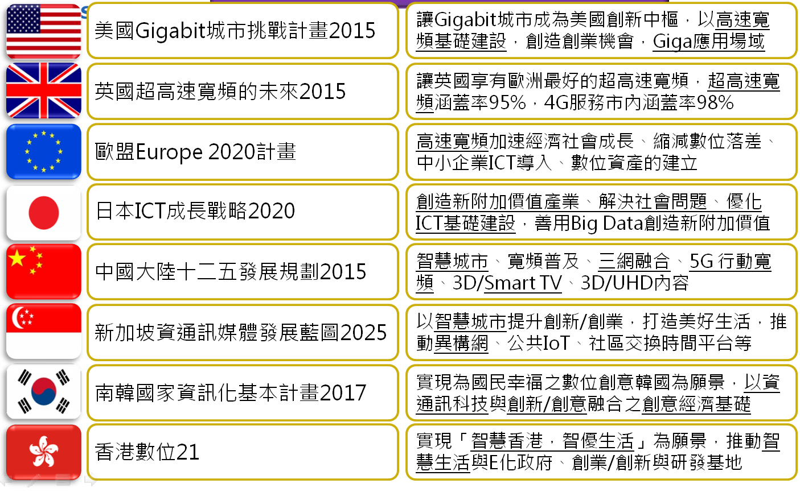

<iframe src="//www.slideshare.net/slideshow/embed_code/46246470" width="425" height="355" frameborder="0" marginwidth="0" marginheight="0" scrolling="no" style="border:1px solid #CCC; border-width:1px; margin-bottom:5px; max-width: 100%;" allowfullscreen> </iframe> 
 <strong> <a href="//www.slideshare.net/rrc5954/ss-46246470" title="基礎環境 資通訊環境整備" target="_blank">基礎環境 資通訊環境整備</a> </strong> from <strong><a href="//www.slideshare.net/rrc5954" target="_blank">rrc5954</a></strong> 

# 資通訊環境整備行動計畫
###第一章　背景分析
資通訊發展已成為各國經濟成長、社會創新的主要動能，尤其在網路國度快速擴張的新時代裡，各國也紛紛將資通訊暨網路建設列為推動重點領域。這些發展的議題包括：高速寬頻基礎建設、創造產業新附加價值、縮減數位落差、智慧城巿、智慧生活等。
####一、國際發展趨勢

世界主要國家資通訊政策重點領域，歸納如下表：

資料來源：各國政府網站；資訊整理：資策會FIND，2014年8月

在網路高度影響國家發展的新世紀，一個國家的整體資訊力量代表著資通訊基礎建設的完整度，與其對國家全球競爭力的影響力。廣義來說，資訊力不僅涵蓋一國資通訊產業對其經濟、GDP的貢獻，也代表著資通訊科技（Information and Communications Technology, ICT）應用在政府、企業、個人及社會，使其產生最大效益的能力。資訊力同時它也是一種動態能量，是藉由前瞻科技政策、創新應用服務，驅動總體國家競爭力暨民眾生活品質提升的關鍵力量。
####二、國內推動現況
根據2014年世界經濟論壇(World Economic Forum, WEF)網路整備度報告，臺灣在全球高科技製造業以及科技驅動經濟指標居優先地位，我國在基礎建設以及負擔能力等方面的持續進步獲得肯定。此外，資通訊科技對經濟的影響我國排名第12，資通訊科技對社會的影響排名第6，顯示出資通訊科技暨網路創新應用對我國來說，在經濟以及社會上有重大的影響力。在有良好之基礎以及完善的發展環境之下，我國更能夠利用資通訊暨網路科技推動各式創新建設，尤其網路創新應用對於臺灣產業型態的改變、年輕人社會創新的參與、透明化政府治理職能提升、低碳創意經濟的潮流等，更應在優化的資通訊建設基礎上，強化超聯結(Hyperconnected)的科技應用及軟實力建設。

隨著行動裝置與生活趨於緊密、4G行動網路基礎建設趨於成熟，工作、生活及休閒的生活型態逐漸轉向隨時聯網(always on)的環境，為智慧聯網（Internet of Things, IoT）發展提供有利條件。結合感測功能之智慧聯網與穿戴應用等，目前已成為國際大廠鎖定的發展重點。以智慧聯網為基礎的新世代製造業及生活應用服務，已成為資通訊科技產業的下一波發展重點。

雲端時代的來臨，加速各行業資通訊科技的使用，也創造出可觀的巨量資料。未來透過巨量資料提升了資訊應用的智慧層次，並打造資料經濟全方位的價值，將是資通訊科技應用的重要潮流；巨量資料因各項應用的實現與普及，除了將使巨量資料產業快速成長之外，更重要的是將廣泛地推動個人、企業與政府等智慧化服務，進而提升國家的生產力、競爭力及民眾的生活品質。

國家資通訊基礎建設(NICI)小組近期亦從行動寬頻的普及建設，逐步強化軟實力建設，增進創新應用與服務之發展。配合「網路智慧新臺灣」的政策規劃，期盼開創臺灣新的網路世代，啟動智慧生活應用的城鄉建設，並促進多元創新、互動關懷的社會。資通訊環境整備的願景是：
 一、 促使臺灣成為全球智慧生活的創新者；智慧政府的新典範。
 二、 促進臺灣產業成為智慧城鄉的驅動者；數位時代的創造者。

為了達到以上的願景，未來將積極推動更完善、便利、國際接軌的資通訊基礎建設及環境整備，以建構更有效率的智慧政府、更有競爭力的產業結構與安居樂業的生活環境。

###第二章　具體目標
因應未來的資通訊基礎建設多元發展，必須從軟實力的創新思維，將資通訊基礎建設提升為智慧型基礎建設(Smart infrastructure)，提供生活場域，發展讓民眾有感、產業有感之服務，並克服關鍵瓶頸，以建立成功營運典範，達到永續經營，並可輸出之整體解決方案，因此，環境整備將分由優化資通訊基礎建設及建構超聯結服務網絡，達成以下具體目標如下：

####一、優化資通訊基礎建設

資通訊基礎建設優化與環境整備，以達成下列目標：
 (一) 2016年釋出200MHz頻寬、2020年行動寬頻服務涵蓋率96%，付費上網1,500萬戶，上下行速率達100Mbps。
 (二) 建構高效能信賴網路，支持臺灣「智慧生活」、「智慧城鄉」等之軟硬體建設，產業及民眾滿意度70分以上。
 (三) 完善「數位匯流服務」、「公共資料開放」、「網路價物流通」等法規，電子商務暨網路服務產值達2兆元。
 (四) 推動國際資通訊技術、智慧聯網暨巨量資料服務標準等之參與與連結，強化資通訊產業在全球競爭力與領先優勢。

####二、建構超聯結服務網絡 
無論從透明治理(智慧政府)、智慧生活、網路經濟或智慧國土的整合應用，都將與智慧聯網科技、巨量資料運算分析技術呈現超聯結基礎層的架構關係，因此，相關的服務工程設計、巨量資料儲存分析技術、軟體模組平台等，也將配合不同領域應用，普及高寬頻建設暨軟體服務，俾達成下列目標：
 (一) 智慧聯網創新服務，由大型企業帶動製造業及服務業體系，每年平均3件。
 (二) 「創意、創新、創業」群聚發展，平均每年促成60組群聚個案，投資額達6億元以上。
 (三) 發展「智慧生活」相關創新服務應用項目，平均每年增加20項，民眾對「數位生活滿意度」達70分以上。
 (四) 發展「智慧城鄉」資通訊相關應用與建設，包括：智慧商圈、智慧社區、智慧交通等，平均每年有6個城鄉參與創新應用至少20項。
 (五) 發展「數位文化創意」整合型產業，包括：數位內容網絡，數位媒體園區等，總產值占臺灣GDP的5.0%以上。
 (六) 發展巨量雲端服務：智慧交通、防災監控、環境監控、終身學習等應用，民眾對「巨量雲端服務」之滿意度達70分以上。
 (七) 推動偏鄉數位關懷服務應用，平均每年拓展3個區鄕鎮，偏鄉民眾對「數位服務」滿意度達70分以上。

###第三章　推動策略
為將資通訊基礎建設提升到智慧型基礎建設(Smart infrastructure)，各機關將分工合作，共同推動頻譜規劃、數位匯流服務、行動寬頻服務普及、智慧聯網、巨量資料及人才培訓等資通環境整備工作，推動策略如下:
####一、推動行動寬頻基礎建設
為提升無線、有線基礎網路建設，俾建構新興多元應用、內容與服務之匯流友善環境，政府將協調解決建設遭遇之困難、調和修正法規促進公平競爭、降低資費保護消費者以及規劃釋出頻譜、號碼相關資源等。 
 (一)推動「加速行動寬頻服務及產業發展方案」（2015-2017年） 
配合我國於2013年10月行動寬頻業務（4G）釋照完成，各部會將持續積極推動「加速行動寬頻服務及產業發展方案」（2015-2017年），重點包括跨部會電磁波宣導、推動共構共站行動通訊平台、釋出公有地設置基地臺等，有助於行動寬頻網路建設普及與服務提升。

 (二)持續規劃及釋出行動通信使用之無線電頻率 
隨著行動通訊需求快速成長，產業對無線電頻譜需求日益強勁，政府將以觀察國際標準及國際組織決議（包括ITU規定及WRC會議）、先進國家行動通信使用之頻譜、技術及相關政策為標竿，規劃行動通信寬頻頻譜回收、調整、釋出之相關配套措施，此外每年推出我國頻率供應計畫，並提早進行中長期頻譜規劃。 
 (三)協助固網寬頻建設 
行政院於2011年已將固網寬頻建設列為「與國家建設有關之重要管線工程」，以適用「道路禁挖限制」之排除規定，政府也將持續協調相關路權單位配合核准挖掘道路申請。 
 (四) 光纖入戶全面化實施之檢討 
光纖入戶措施初期將推動一定規模以上之新建商辦大樓及公有建築物，其建築物起造人須依規定設置光纖設備，同時內政部營建署將配合於建築執照申請時協助查核；長期則將光纖入戶全面實施納入檢討，以確保所有民眾得享有高速寬頻使用環境。 
 (五)逐一檢視並完善資通訊發展相關法規制度 為建構資通訊多元應用發展的優質環境，提升我國軟實力及支持各項資通訊應用發展，資通訊發展相關法規制度如數位匯流法、網路中立等將進行檢視與增修，期能打造在地、透明、創新、低碳、永續、樂活、有尊嚴之資訊化社會。   
####二、接軌國際資通訊標準  
藉由產業自主整合，為臺灣建立技術標準以及相關智慧財產。透過臺灣資通產業標準協會平台，集結臺灣產業智慧結晶，形成自主產業鏈，並進軍國際，為我國的資通訊產業未來發展契機及產業價值創造優勢。
 (一)成立臺灣資通產業標準協會(TAICS)，建立國內產業技術交流暨合作共通平台

短期推動臺灣資通產業標準協會建立國內產業技術交流暨合作共通平台及產業技術標準，擴大產業影響力，並強化與區域及國際標準組織之連結，如：聯合國ITU、ISO、3GPP 及 IEEE；區域性標準組織如：中國大陸 CCSA、日本ARIB、韓國TTA、北美ATIS及歐盟ETSI等。 
 (二)建立國際合作溝通管道，結合國際業者形成下世代資通訊技術(5G)集團。

串連國內產學研單位與重要公協會，進行跨單位資源整合，建立資通訊技術產業標準國際合作溝通管道及合作框架策略等；並推動與臺灣發展方向接近的國家標準組織及研究單位結盟合作，共同形成技術集團。 
 (三)尋求與區域技術領域互補國家結盟，共同推展區域產業標準，進一步與合作夥伴共同促成國際資通訊標準項目，長期推動我國成為國際標準組織之成員。   
####三、建構智慧生活與智慧聯網環境
智慧聯網是透過高度整合的全球網路，使得所有事物與人類生活各種面向可藉由感測器和軟體連接到物流網平台，並即時傳送各種巨量資料，利用演算法改善效率，大幅提昇生產力。

智慧聯網的發展促使資通訊產業進入下一波典範轉移，結合感測功能之低功耗IoT及穿戴設備與應用，當前已是國際大廠鎖定的發展重點；因此我國未來將引導業者進行上下游垂直整合，協助業者跨業合作，以利產業在下一波典範轉移中，加速培養相關核心競爭能力，帶動整體資通訊產業之升級轉型，以及關鍵零組件業者之競爭力進一步躍升。 
 (一)規劃臺灣智慧聯網與穿戴關鍵零組件產業整合發展策略

鑒於智慧聯網與穿戴應用發展是呈現垂直整合與水平分工並行之複雜樣貌，我國業者進入門檻相對甚高，亟需進行跨領域異業整合。我國在策略上因此將先研析上、下游整合及異業結合的可行模式，以降低業者的進入門檻，並提高相關廠商投入的成功機率。 
 (二)建構智慧聯網生態系統整合與技術串接平台

為提升我國自主品牌終端產品之市場競爭力，政府將提供智慧聯網開發平台，藉此串連不同技術及設備，協助智慧聯網終端業者加速開發進程，並與國際大廠聯盟，以擴大我國智慧聯網開發平台之使用範疇。 
 (三)發展少量多樣客製化智慧聯網製造平台

為廣納新創企業的創意，促成百花齊放的產業環境，一方面鼓勵大型企業透過內部創業等機制，鼓勵開發智慧聯網創新應用；另一方面建構客製化的製造服務平台，藉此提供新創業者在設計與製造方面的專業服務，協助資通訊科技製造業者找到具潛力的創新合作夥伴，並減低雙方的交易成本。

(四)發展智慧聯網創新服務整體架構

智慧聯網創新服務將開發智慧聯網端點模組與雲端系統介接引擎，加速智慧聯網創新服務普遍化，協助整合聯網跨業解決方案，建構新興產業生態系。  
####四、推動巨量資料應用環境 

巨量資料分析為未來有助於風險預測和產業機會探索之前瞻應用，進而創造價值並提升國民生活品質，政府將藉由厚植巨量資料分析能量、建構彈性運算環境方式來推動：

(一)規劃分析重點領域應用 
巨量資料環境將以政府資源作為推動之基礎，規劃智慧政府、智慧生活、網路經濟及智慧國土等重點應用領域，透過資料市集、媒合機制、運算環境、人才培育以及資料應用的全球趨勢研究，強化我國巨量資料匯集、分析與應用之能量。 
 (二)推動政府巨量資料應用研究，活化我國巨量資料研究能量 
補助學研單位巨量資料應用研究，建立政府巨量資料共用平台與基礎設施，串連政府相關資料，並透過巨量資料深入分析，強化政府全面性、全方位之政策擘畫能力。
 
 (三)以巨量資料技術協助產業智慧化，為製造業與服務業導入智慧分析技術
結合政府政策包括政府雲、Open Data的推動，發展巨量資料分析應用的在地實證，以產業公會為推動核心，臺灣為練兵場，加速巨量分析技術深化及產業人才的培育，帶動產業結構的優化升級，並整合open source及現有分析應用技術，建構臺灣自主巨量資料分析平台，優先發展支撐智慧製造與智慧商務之整合應用方案，繼而擴散支持其它產業應用。  
####五、培育資通訊人才及創新力 
國家產業發展與轉型需有充裕之人才為基礎，人才培育與產學合作政策相連結，以推升我國大專校院前瞻資通訊技術軟體人才之專業及創新創作能力，並培養其具備「全球移動力」、「就業力」、「創新力」、「跨域力」、「資訊力」等關鍵能力。藉此提升學界與業界之合作關係，同時落實學用合一。

推動跨校跨領域資源的整合，發展行動寬頻教學量能，建構教學實作及應用驗證平台及其服務機制，並深化國際人才交流與技術接軌，以布建行動寬頻尖端技術教研環境，擴大人才培育奠基；加強大學對行動寬頻尖端技術人才之培育，並提早於大學階段養成業界發展相關尖端技術所需之實作與創新人才。 
 (一)整合跨校跨領域資源，擴大資通訊人才培育 
資通訊產業發展需要跨領域人才，政府將鼓勵大學校院整合跨領域資源，進行跨領域教學；建立尖端技術實作與創新環境，連結產學研量能，並深化國際人才交流與技術接軌，布建資通訊教研應用環境，導入問題導向(problem-based)學習模式，推動跨領域合作學習，提升資通訊人才關鍵能力。 
 (二)強化產學聯盟機制培育資通訊科技人才 
針對資通訊科技研發的產學合作計畫，政府將鼓勵獲補助之產學聯盟計畫加強與鄰近產業聚落合作，並透過大專教師的技術發展過程，對業界所需之資通訊技術人才進行培訓，以持續提升我國資通訊科技能量、培育優質的資通訊科技人才，並強化我國資通訊技術產業價值鏈。 
 (三)鼓勵多元化學習，提升資通訊人才職能 
運用政府及民間資源，以自辦、委辦或補助方式，規劃辦理各類就業導向職前訓練課程，提升工作技能及促進就業；另結合優質民間訓練單位提供多元化實務導向訓練課程，以激發在職勞工自主學習，累積個人技能，促進勞工職場穩定。  
####六、建構超聯結服務網絡

「網路智慧新臺灣」資通訊基礎建設，必須從強化軟實力建設的創新思維，提升為智慧型基礎建設(Smart Infrastructure)層次。其中最重要關鍵是要以民眾需求為導向、社會創新為方向，結合產官學研能量，推動改善民眾生活品質的生活場域實證服務，並藉由服務與維運來帶動產業發展能量。

(一)鼓勵產學研積極研究超聯結服務相關技術包括：智慧聯網匯流服務、服務工程設計、巨集資料儲存分析、軟體模組平台建構等。 
 (二)鼓勵資服業者結合國內外製造、服務企業體系，發展智慧聯網創新服務。 
 (三)鼓勵資服業者運用超聯結服務科技，結合跨領域產業共同投入智慧政府、智慧城鄉、智慧生活等建設。 
 (四)鼓勵跨領域產業，結合產官學研能量共同投入「創意創新創業」群聚發展，及偏鄕地區關懷資通建設。 
 (五)鼓勵跨產業合作共同發展「智慧城鄉」資通訊建設創新應用服務：智慧商圈、智慧社區、智慧交通等。 
 (六)推動整合型數位匯流發展方案，結合數位內容、文化創意及數位媒體園區建設，發展數位創意新經濟。 
 (七)鼓勵民間產業與政府共同發展巨量雲端服務，包括：智慧交通、防災監控、環境監控、終身學習等應用。 
####七、建構高效能信賴網絡

我國與全球其他資訊化普及國家相同，隨著資通訊科技發展均面臨高度依賴資訊環境可能引發的資安風險。政府因而規劃投入資安資源，建構高效能信賴網絡，期能強化我國整體資安應變及處理能力、提供民眾安心可信賴的網路服務，同時藉此提升我國資安產業之競爭力。

(一)建立整體性資安信賴環境，強化自建資通安全防護能力，建構國家整體性的資通安全信賴服務環境。 
 (二)完備資安防護管理，分享多元資安情報，妥善保護各機關資訊之機密性、完整性與可用性，並建立機關聯防機制，以降低資安事故之風險。 
 (三)奠基資安技術能量，整合科技實務應用，加強與企業及學研機構之資安技術研發合作，發展新一代全方位資安整體技術解決方案，研究新興資安科技應用及技術標準，掌握雲端、虛擬與行動資安防護等關鍵自主技術。 

